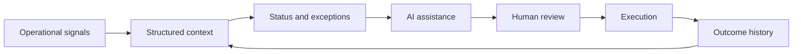

# Vision

## Purpose

This document defines the long-term vision for DOYA OS.

The vision describes the future state the platform is designed to reach. It should guide architecture decisions, product sequencing, AI boundaries, and operational documentation.

## Problem

Most restaurant systems optimize for isolated tasks.

They record transactions, schedule staff, track inventory, display reports, or automate messages. Each tool may be useful, but the restaurant still lacks a unified operating layer that understands how daily work connects.

Without a platform vision:

- Features may become disconnected utilities.
- AI may answer questions without understanding operating consequences.
- Data may be stored without preserving business meaning.
- Teams may add dashboards instead of improving execution.
- Contributors may build for the current request instead of the operating system.

## Solution

The vision for DOYA OS is to become the operating layer that connects restaurant context, decisions, workflows, and AI assistance.

In the long term, DOYA OS should:

- Maintain a structured picture of each restaurant's operating state.
- Detect exceptions that require attention.
- Explain why an issue matters.
- Recommend actions with visible evidence.
- Assign or route work to the right human owner.
- Track whether decisions were executed.
- Learn from outcomes without hiding the reasoning process.

DOYA OS should make a restaurant easier to operate because the system understands the work, not because it produces more reports.

## User

The vision is for:

- Owners who need a reliable operating view across the business.
- Managers who need fewer fragmented tools during service and close.
- Operations leaders who need repeatable standards.
- Staff who need clear tasks and expectations.
- Engineers who need a north star for architecture.
- AI agents that need stable rules for generating implementation.

## Flow

The envisioned operating loop is:

1. Restaurant activity produces operational signals.
2. DOYA OS structures those signals by location, business date, workflow, and ownership.
3. The system identifies status, exceptions, and risks.
4. AI assists with interpretation, prioritization, and recommended next actions.
5. A human owner reviews, approves, edits, or rejects the recommendation.
6. The system records the decision and execution outcome.
7. Future recommendations use the documented operating context and outcome history.

This loop defines the product direction. Implementation details belong in downstream architecture documents.

## Architecture

The vision requires a platform architecture that treats operations as stateful workflows.

Core architectural expectations:

- Data is organized around restaurant operating concepts, not only technical tables.
- AI systems use documented context and expose reasoning inputs.
- Human review is part of the workflow for material operational changes.
- Interfaces prioritize exception handling and decision support.
- APIs preserve business meaning across integrations.
- Tests validate complete operating flows, not only isolated functions.

The platform should remain modular, but not conceptually fragmented. Each domain must contribute to the operating loop.

## Future Extension

The vision can extend across:

- Multi-location operating control.
- Role-based AI assistants for managers, kitchen teams, service teams, and owners.
- Supplier and inventory decision support.
- Forecasting for staffing, purchasing, prep, and cash planning.
- Restaurant playbooks that translate documented standards into workflows.
- Cross-location learning based on comparable operating patterns.

Future extensions must keep human authority, traceability, and operational clarity intact.

## Related Documents

- [Vision Bible](./README.md)
- [Mission](./01_Mission.md)
- [Philosophy](./03_Philosophy.md)
- [Core Principles](./04_Core_Principles.md)
- [Product Goals](./05_Product_Goals.md)
- [Success Metrics](./06_Success_Metrics.md)
- [Roadmap](./08_Roadmap.md)
- [Documentation Style Guide](../STYLE_GUIDE.md)
