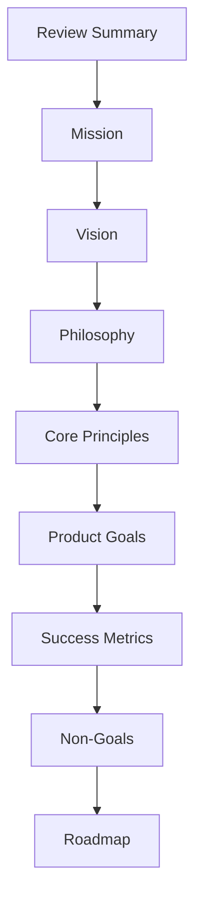

# DOYA OS Vision Bible

## Purpose

This folder defines the official vision for DOYA OS.

The Vision Bible explains why DOYA OS exists, what kind of platform it is, what it should become, and what contributors must preserve as the system evolves. It is the first source of truth for product, engineering, AI, operations, design, and documentation decisions.

## Problem

Restaurant software often treats operations as disconnected tools: point-of-sale reporting, spreadsheets, chat messages, inventory lists, staff notes, and ad hoc dashboards. AI features are frequently added as isolated assistants without a stable operating model.

That creates ambiguity for contributors:

- Product teams cannot evaluate whether a feature belongs in DOYA OS.
- Engineers cannot infer the intended operating boundaries from code alone.
- AI agents may generate behavior that is useful in isolation but inconsistent with restaurant workflows.
- Operators may receive recommendations that are not traceable, reviewable, or connected to daily work.

The platform needs a stable vision before implementation expands.

## Solution

The Vision Bible defines DOYA OS as an AI Restaurant Operating System.

It establishes:

- The mission and long-term vision.
- The operating philosophy behind the platform.
- Core principles for product and engineering decisions.
- Product goals that connect restaurant operations with AI-assisted workflows.
- Success metrics for evaluating whether the platform is working.
- Non-goals that prevent scope drift.
- A roadmap that organizes future work without prescribing implementation details too early.
- The first self-review summary for the Vision Bible v1 draft.

It also establishes the platform boundary for DOYA OS as a SaaS operating system. The product must support tenant isolation, role-aware access, location-aware workflows, AI reviewability, and operational audit trails before it expands into broad automation.

## User

This documentation is written for:

- Restaurant owners who need an operating system for decisions and execution.
- Store managers who run daily workflows and review exceptions.
- Operations teams who standardize behavior across locations.
- Product managers who define scope and prioritize platform capabilities.
- Engineers who implement durable systems from documented intent.
- AI coding agents that use the documentation as implementation context.
- Future contributors who need to understand why the platform is shaped this way.

## Flow

Read the Vision Bible in this order:

1. [Review Summary](./00_Review_Summary.md)
2. [Mission](./01_Mission.md)
3. [Vision](./02_Vision.md)
4. [Philosophy](./03_Philosophy.md)
5. [Core Principles](./04_Core_Principles.md)
6. [Product Goals](./05_Product_Goals.md)
7. [Success Metrics](./06_Success_Metrics.md)
8. [Non-Goals](./07_Non_Goals.md)
9. [Roadmap](./08_Roadmap.md)

This order moves from intent to constraints to evaluation to sequencing.

The diagram shows the dependency order for Vision documentation. Later documents should not contradict earlier documents without an explicit decision record.

## Architecture

The Vision Bible is conceptual architecture for the platform. It does not define application code, database schemas, API contracts, UI components, or prompts. It defines the constraints those domains must follow.

Downstream documentation should use this folder as source context:

- Product documentation should derive feature scope from mission, goals, and non-goals.
- Operation documentation should define workflows that match the platform philosophy.
- UX documentation should translate core principles into interface behavior.
- Database documentation should preserve the meaning of operational data.
- Backend documentation should implement platform boundaries and review flows.
- Frontend documentation should make daily operations clear and actionable.
- AI documentation should define agents that are transparent, bounded, and reviewable.
- API documentation should expose contracts that respect operating workflows.
- Prompt documentation should encode the mission and guardrails into AI behavior.
- Test documentation should validate the success metrics and non-goals.

The Vision Bible also sets early SaaS architecture constraints:

- Tenants, locations, roles, and permissions are product concepts, not only infrastructure details.
- AI assistance requires a control plane for prompts, tools, evaluations, review states, and escalation rules.
- Auditability is part of the operating model. The system should record important inputs, recommendations, approvals, corrections, and outcomes.
- Observability must explain workflow health, data freshness, AI performance, and review coverage.

## Future Extension

This folder will evolve when the platform vision changes, when new operating domains are added, or when major product decisions require clarification.

Future updates should:

- Preserve the distinction between vision and implementation.
- Add decision records for major changes in direction.
- Avoid duplicating product requirements that belong in `docs/01_Product/`.
- Avoid documenting technical contracts that belong in backend, database, API, AI, or test documentation.
- Re-run an architect review when new platform domains are added.

## Related Documents

- [Documentation Style Guide](../STYLE_GUIDE.md)
- [Review Summary](./00_Review_Summary.md)
- [Mission](./01_Mission.md)
- [Vision](./02_Vision.md)
- [Philosophy](./03_Philosophy.md)
- [Core Principles](./04_Core_Principles.md)
- [Product Goals](./05_Product_Goals.md)
- [Success Metrics](./06_Success_Metrics.md)
- [Non-Goals](./07_Non_Goals.md)
- [Roadmap](./08_Roadmap.md)
