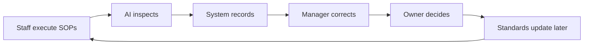

# Product Map

## Purpose

This document defines the product map for DOYA OS v1.0.

It explains the modules, role boundaries, and operating responsibilities that shape the UX architecture.

## Problem

Without a product map, the UX can collapse into a generic dashboard or task app.

DOYA OS needs a product structure that keeps staff execution simple while preserving manager review, owner decision-making, AI inspection, and system records.

## Solution

DOYA OS v1.0 is organized into seven modules.

| Module | Primary purpose | Primary roles |
| --- | --- | --- |
| Dashboard | Show role-specific operating state and next actions. | Owner, Manager, Kitchen, Hall |
| AI Manager | Summarize store health, alerts, and recommendations. | Owner, Manager |
| AI Closing | Collect closing evidence and route AI inspection failures. | Manager, Kitchen, Hall |
| Inventory Intelligence | Record stock signals and surface inventory risk. | Owner, Manager, Kitchen |
| Bonus Engine | Show store level progress, cooperation score, unlock state, and share. | Owner, Manager, Kitchen, Hall |
| SOP Library | Present today's operating standards and task instructions. | Manager, Kitchen, Hall |
| Settings | Manage staff, store, roles, bonus rules, inventory items, and localization. | Owner, Manager |

Excluded from v1.0:

- Attendance.
- Payroll.
- POS integration.
- Accounting.
- Delivery platform integration.

These exclusions protect the operating system from becoming a payroll, POS, or accounting product before core workflows are stable.

## User

The product map is for:

- Designers building information architecture.
- Product managers controlling v1.0 scope.
- Engineers defining module ownership.
- AI coding agents generating future implementation plans.
- Owners and managers validating whether the platform maps to restaurant work.

## Flow

The product operates through this loop:

1. Staff open their role-specific task surface.
2. Staff execute SOP tasks, closing evidence, inventory entries, and waste records.
3. AI inspects closing submissions and operating signals.
4. The system records task state, evidence, inspection results, and exceptions.
5. Managers correct failures and confirm exceptions.
6. Owners review store health, AI reports, inventory risk, and bonus unlock status.

## Architecture

Each module depends on shared platform context:

- `tenant`: Restaurant group boundary.
- `store`: Location boundary.
- `businessDate`: Operating date.
- `role`: Owner, Manager, Kitchen, or Hall.
- `taskStatus`: Not started, in progress, submitted, pass, fail, corrected, confirmed.
- `inspectionStatus`: Pending, pass, fail, human review required.
- `auditEvent`: Record of review, correction, approval, rejection, or decision.

The UX must never rely on visual hierarchy alone to enforce role boundaries. APIs and permissions must return role-appropriate data.

## Future Extension

Later versions may add multi-store comparison, POS data ingestion, payroll connection, accounting exports, delivery platform alerts, supplier workflows, and customer feedback operations.

Each extension must map back to a restaurant operating workflow and preserve the role-based UX model.

## Related Documents

- [UX Architecture Bible](./README.md)
- [Screen Map](./02_Screen_Map.md)
- [Navigation Model](./03_Navigation_Model.md)
- [MVP Scope](./14_MVP_Scope.md)
- [Vision Bible](../00_Vision/README.md)
