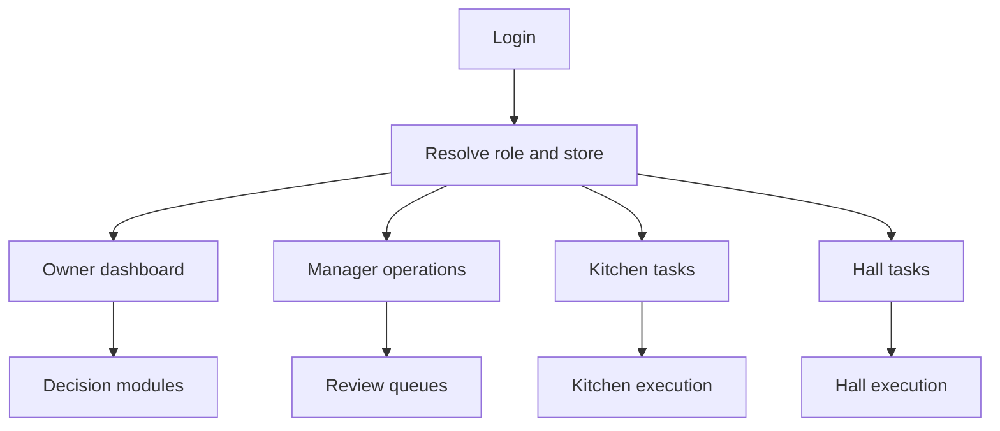

# Navigation Model

## Purpose

This document defines the navigation model for DOYA OS v1.0.

It explains how each role moves through the product and which navigation surfaces should exist.

## Problem

Restaurant staff work under time pressure. Navigation that is acceptable in office software can fail during closing, prep, or inventory entry.

The navigation model must prevent staff from searching for work, while still giving managers and owners access to review and decision surfaces.

## Solution

The navigation model is role-based.

| Role | Primary navigation | Secondary navigation |
| --- | --- | --- |
| Owner | Dashboard, AI Manager, Inventory, Bonus, Settings | Closing History, Bonus Rules |
| Manager | Today’s Operations, AI Closing, Inventory, Bonus, SOP Library, Settings | Human Review, End Day Summary |
| Kitchen | Today’s Kitchen SOP, Daily Weight, Inbound Stock, Waste Log, Kitchen Closing | Task status, Bonus share |
| Hall | Today’s Hall SOP, Review Target, Hall Checklist, Hall Closing | Task status, Bonus share |

Staff navigation should be task-first. Owner and manager navigation should be module-first.

## User

The navigation model is for:

- Designers defining app shell and role-specific menus.
- Frontend engineers implementing route guards.
- Backend engineers defining role-aware menu APIs.
- AI coding agents generating navigation and screen scaffolds later.

## Flow

Navigation entry follows this model:

Primary routes:

- `/dashboard`
- `/ai-manager`
- `/ai-closing`
- `/inventory`
- `/bonus`
- `/sop-library`
- `/settings`

Route names are documentation identifiers, not implementation code.

## Architecture

Navigation requires:

- Authentication state.
- Tenant and store context.
- Role and permission resolution.
- Business date context.
- Task counts and alert counts for role-specific badges.
- Direct URL authorization checks.

The navigation model should be generated from permissions, not hardcoded per visual shell.

## Future Extension

Future versions may add store switching, multi-store owner navigation, notification center, saved views, and approval inboxes.

These should not increase staff navigation complexity.

## Related Documents

- [UX Architecture Bible](./README.md)
- [Screen Map](./02_Screen_Map.md)
- [Owner User Flow](./04_Owner_User_Flow.md)
- [Manager User Flow](./05_Manager_User_Flow.md)
- [Kitchen User Flow](./06_Kitchen_User_Flow.md)
- [Hall User Flow](./07_Hall_User_Flow.md)
