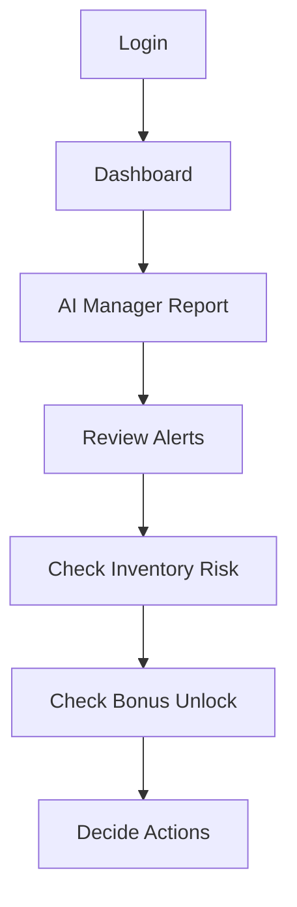

# Owner User Flow

## Purpose

This document defines the owner flow for DOYA OS v1.0.

The owner flow explains how remote decision-making works without turning DOYA OS into a KPI dashboard.

## Problem

Owners need to understand store health without being present at the restaurant.

If the owner view shows only metrics, it fails to explain operating risk. If it exposes every staff task, it creates noise. The owner needs a decision surface: what happened, what AI found, what the manager corrected, where inventory risk exists, and whether bonus conditions are unlocked.

## Solution

Owner flow:

Owner responsibilities:

- Review store health.
- Read AI Manager report.
- Check AI alerts.
- Review inventory risk.
- Review bonus unlock status.
- Make final decisions.

## User

Primary user: Owner.

Secondary users: Operations leader or authorized executive role in future versions.

## Flow

1. Owner logs in.
2. System resolves tenant, store access, and owner permission.
3. Owner lands on Dashboard.
4. Owner reviews store health and unresolved risks.
5. Owner opens AI Manager report.
6. Owner reviews alerts and recommendations.
7. Owner checks inventory risk.
8. Owner checks bonus unlock status.
9. Owner records or assigns final decision.

## Architecture

Owner flow requires:

- Store health summary by business date.
- AI Manager daily report.
- Alert list with severity and owner decision status.
- Inventory risk summary.
- Bonus unlock status and rule explanation.
- Decision record and audit event.

Required backend capabilities include role authorization, report retrieval, alert review, inventory risk retrieval, bonus status retrieval, and decision recording.

## Future Extension

Future owner flows may include multi-store comparison, trend analysis, cross-store exception review, supplier risk, and financial operations.

The v1.0 owner flow remains single-store focused unless multi-store access is explicitly documented later.

## Related Documents

- [Navigation Model](./03_Navigation_Model.md)
- [Dashboard](./08_Dashboard.md)
- [AI Manager](./12_AI_Manager.md)
- [Inventory](./10_Inventory.md)
- [Bonus](./11_Bonus.md)
- [Vision Bible](../00_Vision/README.md)
