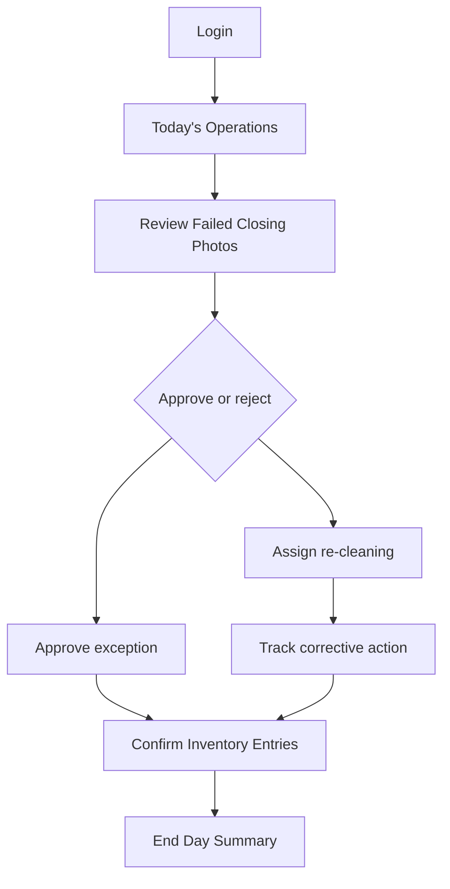

# Manager User Flow

## Purpose

This document defines the manager flow for DOYA OS v1.0.

The manager flow explains how managers review AI inspection failures, correct operational issues, confirm inventory exceptions, and close the business date.

## Problem

Managers are the correction layer in DOYA OS.

If the manager flow is buried under analytics or settings, failed inspections and inventory issues may remain unresolved. If the flow is too detailed, managers lose speed during closing. The UX must present failures, evidence, required action, and confirmation state directly.

## Solution

Manager flow:

Manager responsibilities:

- Review daily tasks.
- Handle failed AI inspections.
- Assign corrective actions.
- Check closing completion.
- Manage inventory entries.
- Confirm exceptions.

## User

Primary user: Manager.

Secondary user: Owner when acting as manager for a store.

## Flow

1. Manager logs in.
2. System resolves store, business date, and manager permission.
3. Manager lands on Today’s Operations.
4. Manager reviews failed closing photos.
5. Manager approves acceptable exceptions or rejects failed submissions.
6. Manager assigns re-cleaning when needed.
7. Staff resubmit evidence.
8. Manager confirms inventory entries and exceptions.
9. Manager reviews End Day Summary.

## Architecture

Manager flow requires:

- Task completion state by role.
- AI inspection results with evidence.
- Approval, rejection, and correction assignment actions.
- Inventory entry review state.
- End day summary composed from closing, inventory, AI alerts, and bonus state.
- Audit trail for manager decisions.

APIs must enforce that managers can review and correct within their store scope.

## Future Extension

Future manager flows may include shift planning, staff coaching, supplier issue review, and multi-day recurring issue detection.

Attendance and payroll are excluded from v1.0.

## Related Documents

- [Navigation Model](./03_Navigation_Model.md)
- [AI Closing](./09_AI_Closing.md)
- [Inventory](./10_Inventory.md)
- [AI Manager](./12_AI_Manager.md)
- [MVP Scope](./14_MVP_Scope.md)
