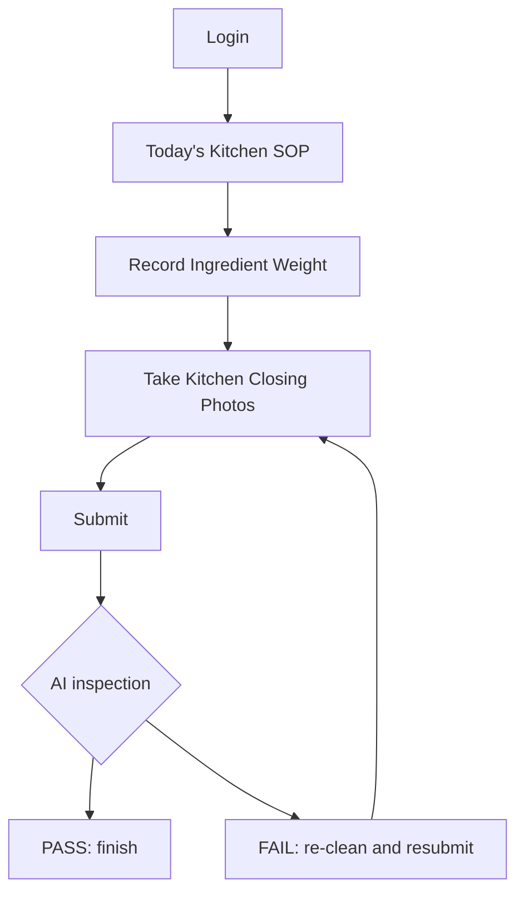

# Kitchen User Flow

## Purpose

This document defines the kitchen staff flow for DOYA OS v1.0.

The kitchen flow keeps execution simple: see today’s SOP, record required inventory signals, submit closing evidence, and respond to pass or fail status.

## Problem

Kitchen staff should not operate a complex analytics product during prep or closing.

If the kitchen UX exposes owner-level metrics, settings, or broad reports, it slows execution and creates error risk. Kitchen users need required actions, clear status, and fast resubmission when AI inspection fails.

## Solution

Kitchen flow:

Kitchen staff see only:

- Today’s SOP.
- Required actions.
- Pass or fail status.
- Store Level progress.
- Personal share percentage if applicable.

## User

Primary user: Kitchen staff.

Secondary user: Manager reviewing kitchen completion.

## Flow

1. Kitchen staff log in.
2. System opens Today’s Kitchen SOP.
3. Staff record required ingredient weights.
4. Staff record inbound stock or waste when assigned.
5. Staff take kitchen closing photos.
6. Staff submit.
7. AI inspection returns pass or fail.
8. If pass, task is finished.
9. If fail, staff see required re-cleaning task and resubmit photos.

## Architecture

Kitchen flow requires:

- Role-scoped task list.
- SOP content for the current business date.
- Ingredient weight entry.
- Inbound stock entry.
- Waste log entry.
- Photo submission for kitchen closing categories.
- AI inspection status.
- Corrective action state.

The API must not expose manager review details or owner analytics to kitchen users.

## Future Extension

Future kitchen UX may support prep forecasting, batch production, allergen tasks, equipment checks, and supplier receiving quality.

These extensions should preserve task-first staff UX.

## Related Documents

- [AI Closing](./09_AI_Closing.md)
- [Inventory](./10_Inventory.md)
- [Bonus](./11_Bonus.md)
- [Screen Map](./02_Screen_Map.md)
- [MVP Scope](./14_MVP_Scope.md)
