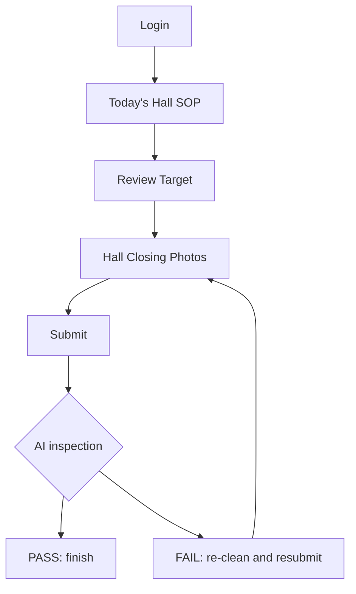

# Hall User Flow

## Purpose

This document defines the hall staff flow for DOYA OS v1.0.

The hall flow supports front-of-house SOP execution, review target visibility, checklist completion, and closing evidence submission.

## Problem

Hall staff need to complete service and closing work without interpreting operational analytics.

The product must show what needs to be done today, what status it has, and what must be corrected if AI inspection fails. It should not expose manager or owner decision surfaces.

## Solution

Hall flow:

Hall staff see only:

- Today’s SOP.
- Required actions.
- Review target.
- Pass or fail status.
- Store Level progress.
- Personal share percentage if applicable.

## User

Primary user: Hall staff.

Secondary user: Manager reviewing hall completion.

## Flow

1. Hall staff log in.
2. System opens Today’s Hall SOP.
3. Staff review target for the business date.
4. Staff complete hall checklist.
5. Staff take required hall closing photos.
6. Staff submit.
7. AI inspection returns pass or fail.
8. If pass, task is finished.
9. If fail, staff see re-cleaning task and resubmit photos.

## Architecture

Hall flow requires:

- Role-scoped task list.
- SOP content for the current business date.
- Review target data.
- Hall checklist completion state.
- Photo submission for hall closing categories.
- AI inspection status.
- Corrective action state.

The API must not expose manager review queues, inventory risk analysis, or owner reports to hall users.

## Future Extension

Future hall UX may include reservation readiness, customer recovery tasks, table turn indicators, and review response workflows.

These are not part of v1.0.

## Related Documents

- [AI Closing](./09_AI_Closing.md)
- [Bonus](./11_Bonus.md)
- [Screen Map](./02_Screen_Map.md)
- [MVP Scope](./14_MVP_Scope.md)
