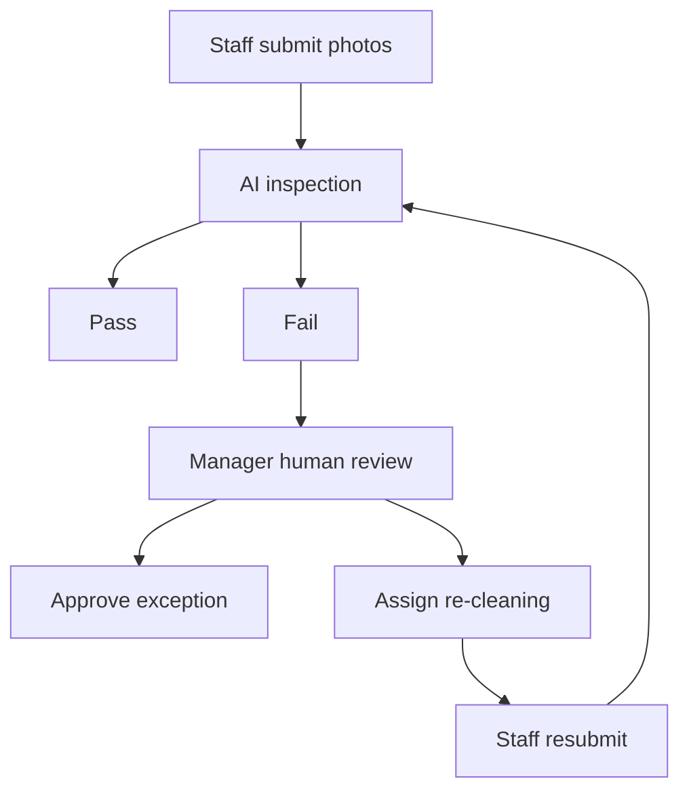

# AI Closing

## Purpose

This document defines the AI Closing screen contract for DOYA OS v1.0.

AI Closing lets staff submit closing evidence, AI inspect operations, managers review failures, and the system record outcomes.

## Problem

Closing quality is hard to verify remotely.

If closing is only a checklist, staff can mark tasks complete without evidence. If AI inspection acts without human review, it can create unfair or incorrect outcomes. The UX must combine photo evidence, AI inspection, manager review, and correction.

## Solution

### Primary User

Primary users: Kitchen, Hall, Manager.

Owner has read-only access to closing risk and history.

### Entry Point

- Staff enter from Dashboard task cards.
- Managers enter from Failed Inspections or AI Closing navigation.
- Owners enter from Dashboard or AI Manager alert context.

### Screen Layout

- Staff view: closing category list, photo capture requirement, submit status.
- Manager view: failed inspection queue, evidence comparison, approve or reject action.
- History view: business-date filter, pass or fail outcomes, correction records.

### Cards

- Kitchen Closing: Floor / Drain, Refrigerator, Stove Grease.
- Hall Closing: Tables / Chairs, Floor, Counter / POS.
- Human Review: failed items requiring manager action.
- Closing History: previous submissions, inspection results, corrections.

### Buttons

- Take Photo.
- Upload Photo.
- Submit Closing.
- Resubmit.
- Approve.
- Reject.
- Assign Re-cleaning.
- View History.

### User Actions

- Staff submit required photos.
- AI inspects evidence.
- Manager approves acceptable exceptions.
- Manager rejects failed evidence and assigns re-cleaning.
- Staff resubmit.
- System records final status.

### Empty State

Staff: show no closing tasks available until the configured closing window.

Manager: show no failed inspections for the current business date.

### Error State

Handle missing camera permission, upload failure, unsupported image, AI inspection timeout, and permission failure.

If AI inspection fails technically, route the item to Human Review instead of marking staff fail.

### Required Data

- Closing categories by role.
- Required photo count and instructions.
- Submission status.
- AI inspection result.
- Failure reason.
- Manager review state.
- Correction assignment.
- Audit history.

### Required API Endpoints

- `GET /ai-closing/tasks`
- `POST /ai-closing/submissions`
- `GET /ai-closing/submissions/{id}`
- `POST /ai-closing/submissions/{id}/inspect`
- `POST /ai-closing/reviews/{id}/approve`
- `POST /ai-closing/reviews/{id}/reject`
- `POST /ai-closing/reviews/{id}/assign-correction`
- `GET /ai-closing/history`

### Related Database Entities

- ClosingTask
- ClosingCategory
- ClosingSubmission
- ClosingPhoto
- AIInspection
- HumanReview
- CorrectiveAction
- User
- Role
- Store
- BusinessDate
- AuditEvent

### Future Extensions

Future versions may support video evidence, offline upload queue, AI confidence scoring, recurring issue detection, and equipment-specific closing rules.

## User

AI Closing serves staff execution and manager correction. Owner access is decision and history oriented.

## Flow

## Architecture

AI Closing requires photo storage, inspection orchestration, review states, correction assignment, role permissions, and audit logging.

The inspection result must not be treated as final when manager review is required.

## Future Extension

AI Closing can later become a broader operations inspection system, but v1.0 should focus on kitchen and hall closing.

## Related Documents

- [Kitchen User Flow](./06_Kitchen_User_Flow.md)
- [Hall User Flow](./07_Hall_User_Flow.md)
- [Manager User Flow](./05_Manager_User_Flow.md)
- [AI Manager](./12_AI_Manager.md)
- [MVP Scope](./14_MVP_Scope.md)
