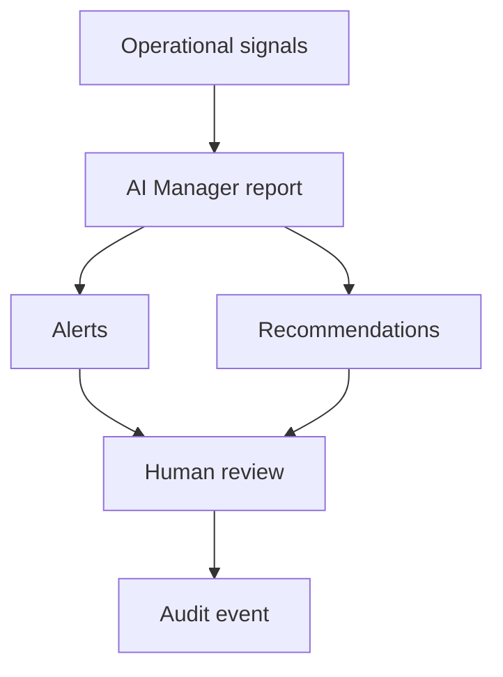

# AI Manager

## Purpose

This document defines the AI Manager screen contract for DOYA OS v1.0.

AI Manager summarizes operating state, alerts, and recommendations for managers and owners.

## Problem

AI output is not useful when it is detached from evidence, role authority, or next action.

AI Manager must not become a chatbot or generic report feed. It must explain what happened, why it matters, what evidence exists, and who should decide or correct.

## Solution

### Primary User

Primary users: Owner and Manager.

Kitchen and Hall do not access AI Manager in v1.0.

### Entry Point

- Dashboard AI alert card.
- Owner flow after Dashboard.
- Manager review queue.

### Screen Layout

- Daily Report.
- Alerts.
- Recommendations.
- Evidence Drawer.
- Decision or Correction Actions.

### Cards

- Store Health Summary.
- Daily Report.
- Critical Alerts.
- Recommendations.
- Failed AI Inspections.
- Inventory Risk.
- Bonus Risk.

### Buttons

- View Evidence.
- Accept Recommendation.
- Reject Recommendation.
- Assign Action.
- Mark Reviewed.
- Record Owner Decision.

### User Actions

- Owner reviews AI Manager report.
- Manager reviews alerts and failed inspections.
- User opens evidence.
- User accepts, rejects, or assigns action.
- System records review outcome.

### Empty State

Show that no AI alerts or recommendations require review for the current business date.

### Error State

Handle report generation failure, missing evidence, stale data, unavailable AI service, and permission failure.

If AI Manager cannot generate a report, the screen should show source data status and allow manual review.

### Required Data

- Daily report.
- Alerts.
- Recommendations.
- Evidence references.
- Severity.
- Review status.
- Assigned owner.
- Related workflow.
- AI prompt or policy version.
- Data freshness state.

### Required API Endpoints

- `GET /ai-manager/daily-report`
- `GET /ai-manager/alerts`
- `GET /ai-manager/recommendations`
- `GET /ai-manager/evidence/{id}`
- `POST /ai-manager/recommendations/{id}/accept`
- `POST /ai-manager/recommendations/{id}/reject`
- `POST /ai-manager/recommendations/{id}/assign-action`
- `POST /ai-manager/alerts/{id}/mark-reviewed`

### Related Database Entities

- AIReport
- Alert
- Recommendation
- Evidence
- AIInspection
- InventoryRisk
- BonusStatus
- Task
- User
- Role
- Store
- BusinessDate
- AuditEvent

### Future Extensions

Future versions may add conversational query, trend explanations, cross-store recommendations, and proactive owner briefings.

Those extensions must preserve evidence, review, and audit behavior.

## User

AI Manager serves owner decision-making and manager correction. It is hidden from staff in v1.0.

## Flow

## Architecture

AI Manager requires AI report generation, evidence linking, recommendation lifecycle, role-scoped actions, prompt version traceability, and audit events.

The frontend must expose evidence before decision actions.

## Future Extension

AI Manager may become the primary owner briefing surface for multi-store operations after v1.0.

## Related Documents

- [Owner User Flow](./04_Owner_User_Flow.md)
- [Manager User Flow](./05_Manager_User_Flow.md)
- [AI Closing](./09_AI_Closing.md)
- [Inventory](./10_Inventory.md)
- [Bonus](./11_Bonus.md)
