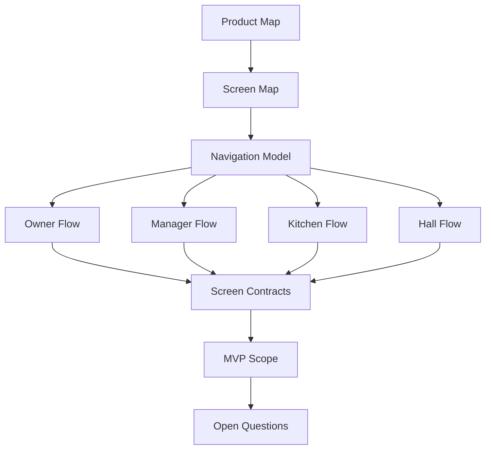

# DOYA OS UX Architecture Bible v1.0

## Purpose

This folder defines the UX architecture for DOYA OS v1.0.

It translates the Vision Bible into product structure, role-based navigation, user flows, and screen-level contracts. It is written so a UI designer can build Figma, a backend engineer can infer required APIs, and an AI coding agent can implement the product without inventing the experience model.

## Problem

Restaurant operating software often fails when it exposes the same complexity to every role.

Owners need decision context. Managers need exception handling and correction tools. Kitchen and hall staff need simple task execution during real operations. If all roles see the same dashboards, analytics, and settings, the product becomes too slow for staff and too shallow for management.

DOYA OS must also avoid becoming a KPI app, payroll app, POS, or generic admin tool. The UX must preserve the product philosophy:

- People execute.
- AI inspects.
- System records.
- Manager corrects.
- Owner decides.

## Solution

The v1.0 UX is organized around seven core modules:

1. Dashboard
2. AI Manager
3. AI Closing
4. Inventory Intelligence
5. Bonus Engine
6. SOP Library
7. Settings

The UX separates staff execution from management review:

- Staff see today's tasks, required actions, pass or fail status, store level progress, and personal share percentage when applicable.
- Managers see failed inspections, exceptions, corrective actions, inventory entries, and end-of-day state.
- Owners see store health, AI Manager reports, alerts, inventory risk, bonus unlock status, and decisions that require approval.

## User

This documentation is for:

- Product designers defining screen hierarchy and interaction flow.
- Product managers validating v1.0 scope.
- Frontend engineers implementing role-aware surfaces.
- Backend engineers defining APIs, entities, and workflow states.
- AI engineers defining inspection, recommendation, and review behavior.
- AI coding agents using this UX Bible as implementation context.
- Future contributors extending DOYA OS without changing its operating model.

## Flow

Read this UX Bible in this order:

1. [Product Map](./01_Product_Map.md)
2. [Screen Map](./02_Screen_Map.md)
3. [Navigation Model](./03_Navigation_Model.md)
4. [Owner User Flow](./04_Owner_User_Flow.md)
5. [Manager User Flow](./05_Manager_User_Flow.md)
6. [Kitchen User Flow](./06_Kitchen_User_Flow.md)
7. [Hall User Flow](./07_Hall_User_Flow.md)
8. [Dashboard](./08_Dashboard.md)
9. [AI Closing](./09_AI_Closing.md)
10. [Inventory](./10_Inventory.md)
11. [Bonus](./11_Bonus.md)
12. [AI Manager](./12_AI_Manager.md)
13. [Settings](./13_Settings.md)
14. [MVP Scope](./14_MVP_Scope.md)
15. [Open Questions](./15_Open_Questions.md)

The diagram shows how the UX documentation moves from information architecture to role behavior to screen contracts.

## Architecture

The UX architecture depends on these platform concepts:

- Tenant, store, role, and permission context.
- Business date and daily operating state.
- SOP task definitions and completion records.
- AI inspection results with pass, fail, evidence, and review status.
- Corrective actions assigned by managers.
- Inventory entries, weights, stock movements, waste records, and risk alerts.
- Bonus rules, store level progress, cooperation score, unlock state, and share percentage.
- Audit events for review, approval, rejection, correction, and final decision.

The frontend should not treat screens as independent pages. Screens are role-filtered views over operating workflows.

## Future Extension

Future UX documentation may add attendance, payroll, POS integration, accounting, delivery platform integration, supplier workflows, customer feedback, and multi-store owner views.

These are excluded from v1.0 and should not appear in the initial staff experience.

## Related Documents

- [Documentation Style Guide](../STYLE_GUIDE.md)
- [Vision Bible](../00_Vision/README.md)
- [Product Map](./01_Product_Map.md)
- [Screen Map](./02_Screen_Map.md)
- [Navigation Model](./03_Navigation_Model.md)
- [MVP Scope](./14_MVP_Scope.md)
- [Open Questions](./15_Open_Questions.md)
