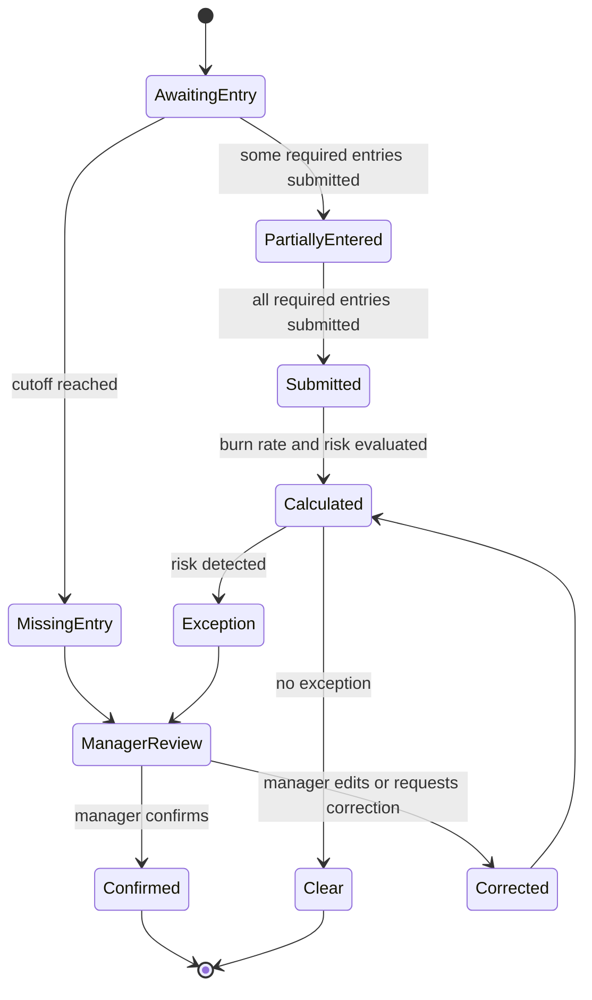
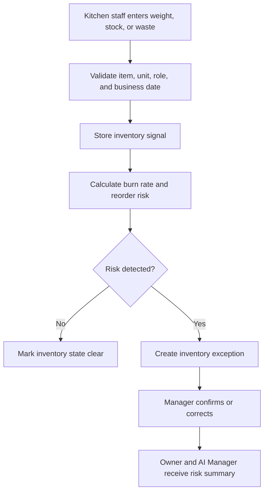

# Inventory Engine

## Purpose

The Inventory Engine records stock signals and detects inventory risk for DOYA OS v1.0.

It supports daily ingredient weights, inbound stock, waste logs, burn-rate analysis, reorder alerts, and manager confirmation.

## Problem

Restaurant inventory data is often incomplete, late, or stored outside the operating workflow.

If inventory is treated as a spreadsheet, managers cannot trust reorder risk. If it becomes accounting, v1.0 scope expands too far. The engine must support operational inventory intelligence without becoming ERP or accounting.

## Solution

The Inventory Engine converts staff entries into operational inventory state.

It accepts daily weights, inbound stock, and waste logs. It calculates burn-rate signals, missing entry risk, abnormal waste, and reorder alerts. It routes exceptions to managers and exposes summarized risk to owners.

## User

Primary users affected:

- Kitchen staff record inventory signals.
- Managers confirm entries and exceptions.
- Owners review inventory risk.
- AI Manager consumes inventory risk as report evidence.

## Inputs

- Tenant ID.
- Store ID.
- Business date.
- Inventory item ID.
- Unit of measure.
- Daily weight entry.
- Inbound stock entry.
- Waste log entry.
- Reorder threshold.
- Burn-rate configuration.
- Manager correction or confirmation.

## Outputs

- Inventory entry status.
- Missing entry alert.
- Burn-rate calculation.
- Waste variance alert.
- Reorder alert.
- Manager confirmation state.
- Inventory risk summary.
- Audit event.

## State Machine

## Business Rules

- Inventory entries are scoped to tenant, store, business date, item, and unit.
- Staff may create entries only for assigned inventory tasks.
- Managers may correct or confirm entries within their store scope.
- Owners may view risk summaries but should not perform staff entry tasks in v1.0.
- Burn rate must not be calculated when required baseline data is missing.
- Reorder alerts must expose the input records used to produce the alert.
- Corrections must create audit events.

## Algorithms

- Normalize quantities into each item default unit.
- Calculate daily consumption as prior confirmed weight plus inbound stock minus current weight minus recorded waste.
- Calculate burn rate using a configurable rolling window.
- Detect abnormal waste by comparing waste quantity against item-specific threshold and recent average.
- Detect missing entries when required entry window closes without submission.
- Generate reorder alert when projected days remaining is below configured threshold.

## Failure Cases

- Missing unit conversion.
- Duplicate entry for the same item and business date.
- Negative calculated consumption.
- Missing prior baseline.
- Late staff submission after manager confirmation.
- Stale item configuration.
- Permission mismatch between staff role and item assignment.
- Calculation service timeout.

## Database Dependencies

- Tenant.
- Store.
- User.
- Role.
- BusinessDate.
- InventoryItem.
- InventoryUnit.
- DailyWeight.
- InboundStock.
- WasteLog.
- BurnRateSnapshot.
- ReorderAlert.
- InventoryException.
- AuditEvent.

## API Dependencies

- `GET /inventory/items`
- `POST /inventory/daily-weight`
- `POST /inventory/inbound-stock`
- `POST /inventory/waste-log`
- `GET /inventory/burn-rate`
- `GET /inventory/reorder-alerts`
- `POST /inventory/exceptions/{id}/confirm`
- `POST /inventory/exceptions/{id}/correct`

## Flow

## Architecture

The Inventory Engine should be deterministic where possible. AI may summarize inventory risk, but the engine's baseline calculations must remain inspectable and reproducible.

Inventory outputs feed Dashboard, Inventory Intelligence, AI Manager, Vision Engine, Bonus Engine, Notification Engine, and Rule Engine.

## Future Extensions

- Supplier order recommendations.
- Recipe-level theoretical consumption.
- POS-linked depletion.
- Cost variance.
- Multi-store inventory comparison.
- Forecasted prep quantities.

## Related Documents

- [Engine Architecture](./README.md)
- [UX Inventory](../03_UX/10_Inventory.md)
- [AI Manager Engine](./05_AI_Manager_Engine.md)
- [Rule Engine](./08_Rule_Engine.md)
