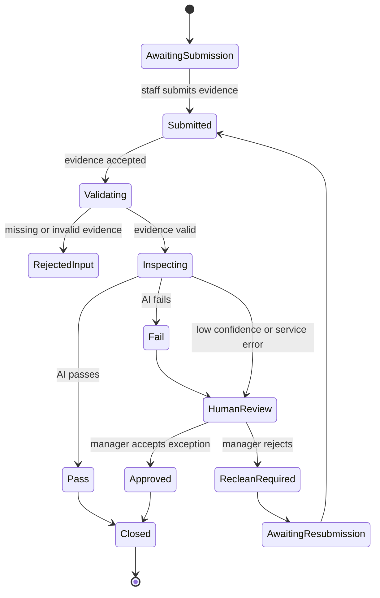
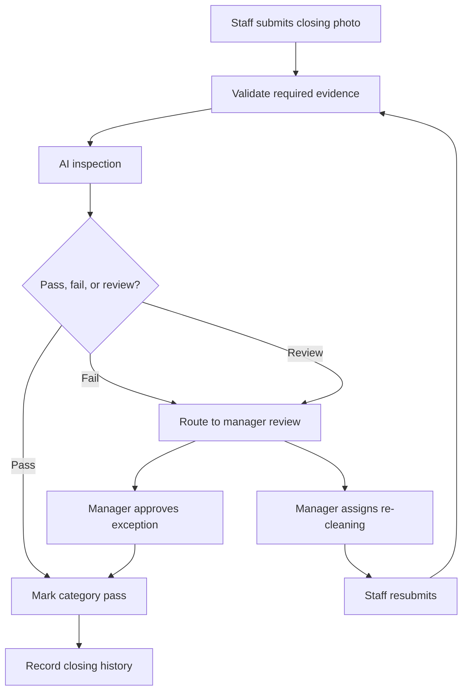

# AI Closing Engine

## Purpose

The AI Closing Engine inspects closing evidence and routes pass, fail, and human review states.

It powers kitchen closing, hall closing, corrective actions, closing history, and AI Manager evidence.

## Problem

Closing quality cannot be trusted when staff only mark tasks complete.

Photo evidence helps, but AI inspection must not become the final authority for material operational judgment. The engine must inspect, explain, record, and escalate.

## Solution

The AI Closing Engine receives closing submissions, validates required evidence, runs AI inspection, records results, and routes failures to manager review.

Staff execute. AI inspects. The system records. Managers correct. Owners can review risk and history.

## User

Primary users affected:

- Kitchen staff submit kitchen closing evidence.
- Hall staff submit hall closing evidence.
- Managers review failures and assign re-cleaning.
- Owners view unresolved risk and closing history.
- AI Manager consumes closing outcomes.

## Inputs

- Tenant ID.
- Store ID.
- Business date.
- Role.
- Closing category.
- Required evidence policy.
- Submitted photo.
- Submission timestamp.
- AI inspection prompt and policy version.
- Manager review action.
- Corrective action response.

## Outputs

- Submission status.
- AI inspection result.
- Pass, fail, or human review state.
- Failure reason.
- Evidence reference.
- Corrective action.
- Closing history record.
- Audit event.

## State Machine

## Business Rules

- Staff can submit only assigned closing categories.
- Closing evidence must be tied to business date, store, role, and category.
- Invalid evidence cannot be inspected.
- AI fail does not become final until manager review when review is required.
- Technical inspection failure routes to Human Review.
- Re-cleaning creates a corrective action assigned to the submitting role or staff member.
- Every review action creates an audit event.

## Algorithms

- Validate evidence count, file type, category, and business-date window.
- Run AI inspection against category-specific criteria.
- Classify result as pass, fail, or human review based on policy threshold.
- Generate failure reason labels for manager review.
- Group repeated failures by category and business date.
- Calculate closing completion by required categories passed or approved.

## Failure Cases

- Missing photo.
- Unsupported image.
- Upload failure.
- Duplicate submission.
- AI inspection timeout.
- AI confidence below threshold.
- Prompt or policy version unavailable.
- Manager review conflict.
- Staff resubmits after closing is already confirmed.

## Database Dependencies

- Tenant.
- Store.
- User.
- Role.
- BusinessDate.
- ClosingTask.
- ClosingCategory.
- ClosingSubmission.
- ClosingPhoto.
- AIInspection.
- HumanReview.
- CorrectiveAction.
- AuditEvent.

## API Dependencies

- `GET /ai-closing/tasks`
- `POST /ai-closing/submissions`
- `GET /ai-closing/submissions/{id}`
- `POST /ai-closing/submissions/{id}/inspect`
- `POST /ai-closing/reviews/{id}/approve`
- `POST /ai-closing/reviews/{id}/reject`
- `POST /ai-closing/reviews/{id}/assign-correction`
- `GET /ai-closing/history`

## Flow

## Architecture

The AI Closing Engine depends on storage, AI inspection orchestration, human review, corrective action, rule evaluation, audit events, and notifications.

It must expose evidence and inspection metadata to AI Manager and Vision Engine.

## Future Extensions

- Video evidence.
- Offline upload queue.
- Equipment-specific inspection policies.
- Recurring failure detection.
- Cross-store closing quality comparison.

## Related Documents

- [Engine Architecture](./README.md)
- [UX AI Closing](../03_UX/09_AI_Closing.md)
- [AI Manager Engine](./05_AI_Manager_Engine.md)
- [Notification Engine](./07_Notification_Engine.md)
