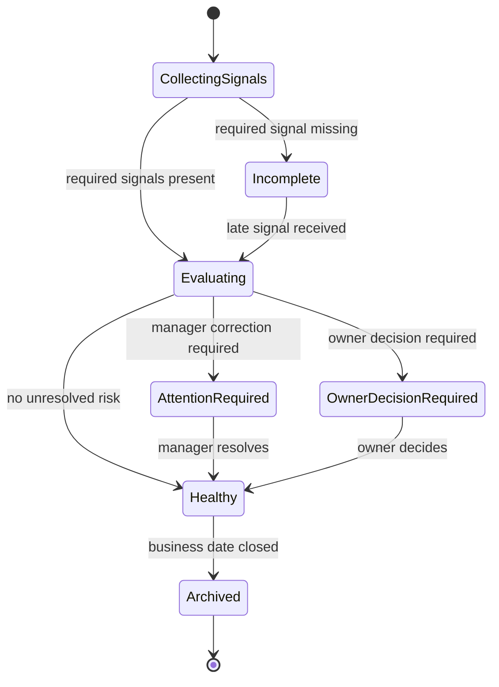
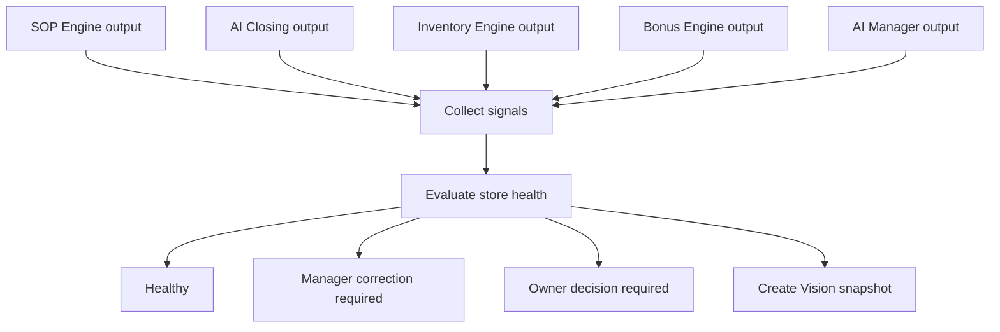

# Vision Engine

## Purpose

The Vision Engine synthesizes store operating state into a decision-ready view.

It is not the Vision Bible. It is the internal engine that produces store health, unresolved risk, daily operating status, and decision context for owners and managers.

## Problem

Owners and managers cannot make reliable decisions from isolated task, closing, inventory, and bonus records.

The platform needs an engine that assembles operating signals into a coherent state without becoming a KPI dashboard.

## Solution

The Vision Engine consumes outputs from other engines and produces store health state.

It answers:

- What is happening today?
- What is blocked?
- What needs manager correction?
- What needs owner decision?
- Which signals are stale or incomplete?

## User

Primary users affected:

- Owners review store health remotely.
- Managers review unresolved operating issues.
- AI Manager uses store state as report context.
- Notification Engine uses state changes to route alerts.

## Inputs

- Tenant ID.
- Store ID.
- Business date.
- SOP completion state.
- AI Closing state.
- Inventory risk state.
- Bonus status.
- AI Manager alerts.
- Human review outcomes.
- Data freshness state.

## Outputs

- Store health summary.
- Operating status.
- Unresolved risk list.
- Decision required list.
- Manager correction list.
- Data freshness warning.
- Vision snapshot.
- Audit event when state is manually overridden.

## State Machine

## Business Rules

- Store health is scoped to tenant, store, and business date.
- Missing required signals reduce confidence and must be visible.
- Staff users do not see Vision Engine summaries beyond task status.
- Manager corrections must be distinguished from owner decisions.
- Store health cannot be marked healthy while required human reviews remain open.
- AI-generated summaries must cite underlying engine outputs.

## Algorithms

- Aggregate engine outputs by business date.
- Assign severity from unresolved failures, stale data, and risk thresholds.
- Calculate operating status using required module completion and exception state.
- Identify owner decision requirements from high-severity unresolved risk or configured rules.
- Produce a Vision snapshot with references to source records.

## Failure Cases

- Missing engine output.
- Conflicting state between engines.
- Stale data source.
- Business date not opened or already archived.
- Role lacks permission to view snapshot.
- Source record deleted or corrected after snapshot generation.
- Snapshot generation timeout.

## Database Dependencies

- Tenant.
- Store.
- BusinessDate.
- VisionSnapshot.
- TaskCompletion.
- AIInspection.
- InventoryRisk.
- BonusStatus.
- Alert.
- Recommendation.
- HumanReview.
- AuditEvent.

## API Dependencies

- `GET /vision/store-health`
- `GET /vision/risk-summary`
- `GET /vision/decision-required`
- `POST /vision/snapshots`
- `GET /dashboard`
- `GET /ai-manager/daily-report`

## Flow

## Architecture

The Vision Engine should be an aggregator and state evaluator. It should not own source-of-truth task, closing, inventory, bonus, or AI recommendation records.

Its outputs are used by Dashboard, AI Manager, Notification Engine, and owner decision flows.

## Future Extensions

- Multi-store health comparison.
- Trend-based risk scoring.
- Owner briefing summaries.
- Cross-location pattern detection.
- Forecasted operating risk.

## Related Documents

- [Engine Architecture](./README.md)
- [UX Dashboard](../03_UX/08_Dashboard.md)
- [AI Manager Engine](./05_AI_Manager_Engine.md)
- [Rule Engine](./08_Rule_Engine.md)
