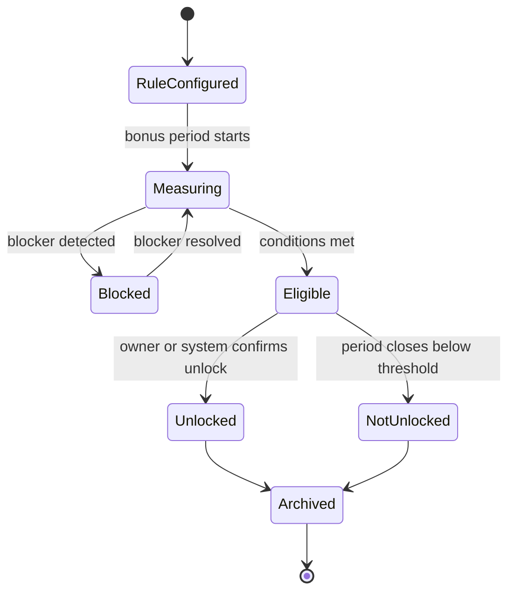
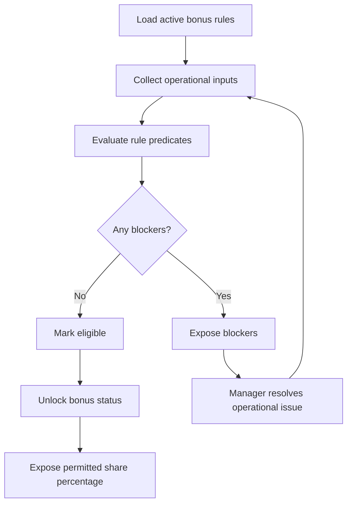

# Bonus Engine

## Purpose

The Bonus Engine evaluates store level, cooperation score, bonus unlock state, rule compliance, and personal share visibility.

It supports motivation and transparency without becoming payroll.

## Problem

Bonus logic can create disputes when staff cannot see what affects unlock state.

If bonus logic is hidden, staff do not trust it. If it becomes payroll, v1.0 scope expands beyond DOYA OS operating workflows. The engine must evaluate operational eligibility and visibility only.

## Solution

The Bonus Engine consumes task completion, AI inspection results, cooperation inputs, and configured rules.

It produces store level progress, cooperation score, unlock state, blockers, and personal share percentage where applicable.

## User

Primary users affected:

- Staff see progress and personal share when applicable.
- Managers see blockers and cooperation score.
- Owners see unlock state and rules.
- AI Manager consumes bonus risk.

## Inputs

- Tenant ID.
- Store ID.
- Business date or bonus period.
- Bonus rule set.
- Store level configuration.
- Task completion state.
- AI inspection outcome.
- Corrective action outcome.
- Cooperation score inputs.
- Staff share configuration.

## Outputs

- Store level progress.
- Cooperation score.
- Bonus unlock state.
- Bonus blockers.
- Personal share percentage.
- Rule evaluation result.
- Bonus status snapshot.
- Audit event for rule changes and confirmations.

## State Machine

## Business Rules

- Bonus Engine does not calculate payroll disbursement.
- Staff see personal share percentage only when configured and permitted.
- Store level progress must cite contributing tasks and outcomes.
- Failed closing inspections may block or reduce bonus only through configured rules.
- Rule edits apply prospectively unless an owner explicitly records an override.
- Manager corrections must be included before final unlock evaluation.
- Bonus status must be reproducible from source records and rule version.

## Algorithms

- Evaluate rule predicates against task, closing, inventory, and cooperation inputs.
- Calculate cooperation score from configured weighted components.
- Calculate store level progress as completed qualifying events divided by configured target.
- Identify blockers as failed required predicates.
- Calculate personal share percentage from active share configuration and role eligibility.
- Snapshot evaluated rule version with output state.

## Failure Cases

- Missing active bonus rule.
- Conflicting rule versions.
- Missing task or inspection data.
- Staff member lacks share configuration.
- Late correction after period close.
- Rule edit during active period.
- Permission mismatch for viewing share or rules.
- Calculation references deleted source record.

## Database Dependencies

- Tenant.
- Store.
- User.
- Role.
- BusinessDate.
- BonusRule.
- BonusPeriod.
- BonusStatus.
- StoreLevel.
- CooperationScore.
- BonusShare.
- TaskCompletion.
- AIInspection.
- CorrectiveAction.
- AuditEvent.

## API Dependencies

- `GET /bonus/status`
- `GET /bonus/rules`
- `GET /bonus/my-share`
- `GET /bonus/blockers`
- `POST /bonus/rules/{id}/confirm`
- `POST /bonus/status/{id}/override`

## Flow

## Architecture

The Bonus Engine depends on Rule Engine evaluation, SOP task completion, AI Closing results, Inventory Engine risk, and Settings configuration.

It must store evaluated rule version and source references so bonus outputs are explainable.

## Future Extensions

- Payroll export.
- Multi-period bonus history.
- Rule simulation.
- Role-specific bonus plans.
- Owner approval workflow for bonus payout.

Payroll remains excluded from v1.0.

## Related Documents

- [Engine Architecture](./README.md)
- [UX Bonus](../03_UX/11_Bonus.md)
- [Rule Engine](./08_Rule_Engine.md)
- [SOP Engine](./06_SOP_Engine.md)
