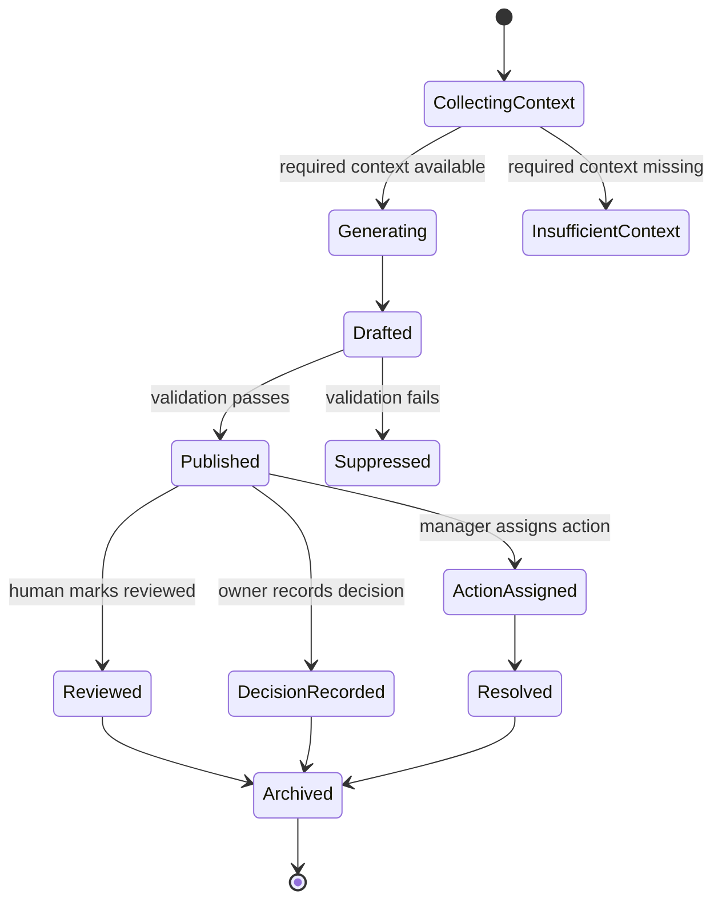
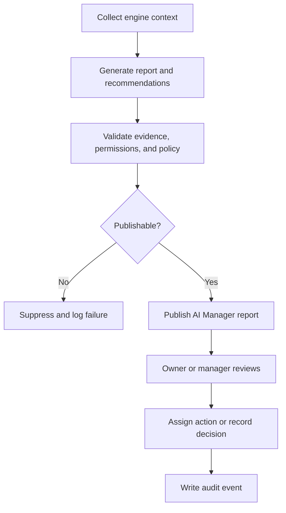

# AI Manager Engine

## Purpose

The AI Manager Engine produces daily reports, alerts, recommendations, and evidence bundles for owner and manager review.

It is the AI decision-support layer of DOYA OS v1.0.

## Problem

AI output is unsafe when it is detached from evidence, review state, permissions, or business context.

The AI Manager Engine must summarize operations without becoming a generic chatbot or autonomous operator.

## Solution

The AI Manager Engine consumes operating signals from other engines and generates reviewable outputs.

It produces daily reports, alerts, recommendations, evidence links, severity, assigned owner, and review state.

## User

Primary users affected:

- Owners review reports and final decisions.
- Managers review alerts and assign corrections.
- AI engineers define prompts, policy versions, and evaluation cases.
- Backend engineers persist AI output lifecycle.

## Inputs

- Tenant ID.
- Store ID.
- Business date.
- Vision snapshot.
- AI Closing failures.
- Inventory risk.
- Bonus blockers.
- SOP completion state.
- Rule Engine decisions.
- Prompt version.
- Model version.
- Tool permission policy.

## Outputs

- Daily AI Manager report.
- Alert.
- Recommendation.
- Evidence bundle.
- Severity.
- Assigned role or owner.
- Review state.
- Audit event.

## State Machine

## Business Rules

- AI Manager is visible only to owner and manager roles in v1.0.
- Every recommendation must include evidence references.
- AI Manager may recommend but must not apply material operational changes.
- Alerts must be scoped to store and business date.
- Recommendations must include severity and review state.
- Prompt and model versions must be recorded.
- Missing or stale context must be visible in the report.

## Algorithms

- Collect engine outputs by business date.
- Rank alerts by severity, unresolved state, and decision urgency.
- Generate daily summary using approved prompt and policy version.
- Validate that each recommendation has evidence and permitted action type.
- Deduplicate alerts from the same source record.
- Assign suggested owner based on role, module, and rule policy.

## Failure Cases

- Missing Vision snapshot.
- Prompt version unavailable.
- Model generation timeout.
- Evidence reference missing.
- Recommendation action not permitted for role.
- Duplicate alert storm.
- Stale source data.
- Human review conflict.

## Database Dependencies

- Tenant.
- Store.
- BusinessDate.
- VisionSnapshot.
- AIReport.
- Alert.
- Recommendation.
- Evidence.
- PromptVersion.
- ModelVersion.
- ReviewState.
- AuditEvent.

## API Dependencies

- `GET /ai-manager/daily-report`
- `GET /ai-manager/alerts`
- `GET /ai-manager/recommendations`
- `GET /ai-manager/evidence/{id}`
- `POST /ai-manager/recommendations/{id}/accept`
- `POST /ai-manager/recommendations/{id}/reject`
- `POST /ai-manager/recommendations/{id}/assign-action`
- `POST /ai-manager/alerts/{id}/mark-reviewed`

## Flow

## Architecture

The AI Manager Engine depends on Vision Engine, AI Closing Engine, Inventory Engine, Bonus Engine, SOP Engine, Rule Engine, and Notification Engine.

It must preserve prompt version, model version, source records, evidence links, and human review outcomes.

## Future Extensions

- Conversational owner briefing.
- Multi-store reports.
- Trend explanations.
- Proactive recommendations.
- Evaluation dashboards for AI quality.

## Related Documents

- [Engine Architecture](./README.md)
- [UX AI Manager](../03_UX/12_AI_Manager.md)
- [Vision Engine](./03_Vision_Engine.md)
- [Notification Engine](./07_Notification_Engine.md)
