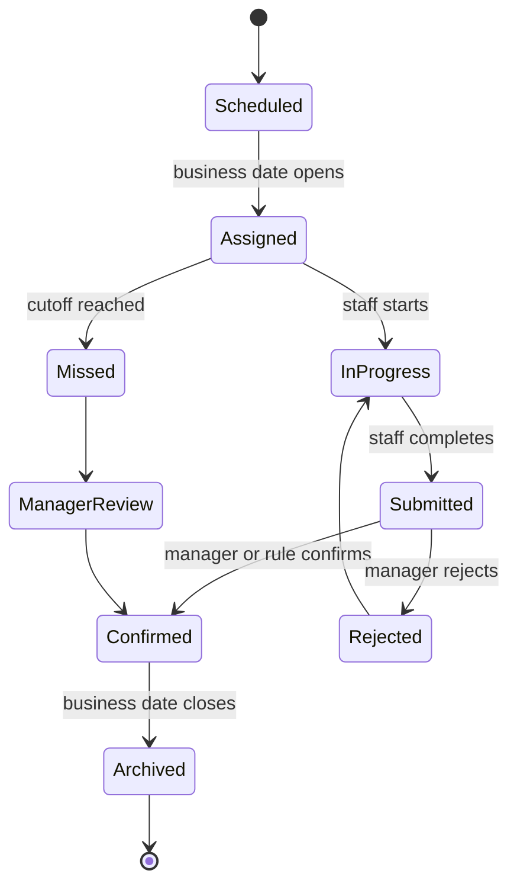
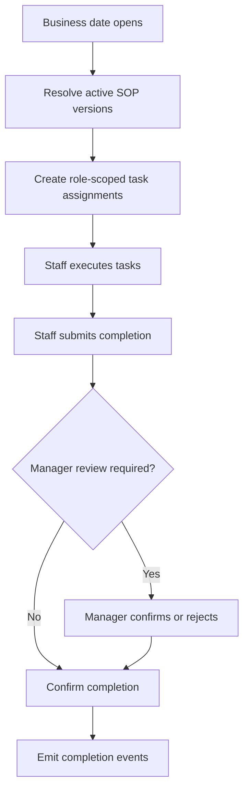

# SOP Engine

## Purpose

The SOP Engine assigns, versions, tracks, and records restaurant standard operating procedure execution.

It powers today's SOP, task completion, closing readiness, inventory tasks, and bonus inputs.

## Problem

SOPs are often documented separately from execution.

If SOPs live only as static manuals, staff may not know what applies today. If tasks are created manually, standards drift. DOYA OS needs SOPs to become role-scoped, date-aware operating tasks.

## Solution

The SOP Engine turns SOP definitions into executable task assignments.

It resolves active SOPs by store, role, business date, service period, and module. It records completion, supports manager confirmation, and emits task state for other engines.

## User

Primary users affected:

- Kitchen staff execute kitchen SOP tasks.
- Hall staff execute hall SOP tasks.
- Managers review completion and exceptions.
- Owners review operating consistency.
- Bonus Engine consumes qualifying completion.

## Inputs

- Tenant ID.
- Store ID.
- Business date.
- Role.
- SOP definition.
- SOP version.
- Task schedule.
- Assignment rule.
- Staff completion.
- Manager confirmation.

## Outputs

- Today's SOP.
- SOP task assignment.
- Task completion status.
- Missing task alert.
- Manager confirmation state.
- SOP version reference.
- Audit event.

## State Machine

## Business Rules

- SOP tasks are generated from active SOP versions.
- Staff see only assigned SOP tasks.
- Managers may confirm, reject, or request correction.
- SOP version must be recorded on completion.
- Completed tasks cannot be silently changed after business date close.
- Missing required SOP tasks may block bonus or closing completion through Rule Engine.
- SOP edits must create new versions rather than rewriting historical execution.

## Algorithms

- Resolve active SOP by tenant, store, role, category, and business date.
- Generate task instances when the business date opens or service period begins.
- Calculate completion percentage by required task count.
- Detect missed tasks at configured cutoff.
- Attach SOP version to task completion.
- Emit task completion events to Vision Engine, Bonus Engine, and AI Manager Engine.

## Failure Cases

- No active SOP version.
- Duplicate task generation.
- Role assignment mismatch.
- Business date already closed.
- Staff completes task after cutoff.
- Manager rejects completed task without correction reason.
- SOP version changed during active business date.

## Database Dependencies

- Tenant.
- Store.
- User.
- Role.
- BusinessDate.
- SOP.
- SOPVersion.
- SOPCategory.
- SOPTask.
- SOPAssignment.
- TaskCompletion.
- ManagerReview.
- AuditEvent.

## API Dependencies

- `GET /sop-library/today`
- `GET /sop-library/categories`
- `GET /sop-library/sops/{id}`
- `POST /sop-library/tasks/{id}/complete`
- `POST /sop-library/tasks/{id}/confirm`
- `POST /sop-library/tasks/{id}/reject`

## Flow

## Architecture

The SOP Engine is a source of task truth. Other engines may consume task completion, but they should not create SOP completion records directly.

The engine depends on Settings for active roles, staff, store configuration, and localization.

## Future Extensions

- SOP authoring workflow.
- Training mode.
- Equipment-specific SOPs.
- Multi-language SOP content.
- Cross-store SOP templates.

## Related Documents

- [Engine Architecture](./README.md)
- [UX Screen Map](../03_UX/02_Screen_Map.md)
- [Bonus Engine](./04_Bonus_Engine.md)
- [Rule Engine](./08_Rule_Engine.md)
