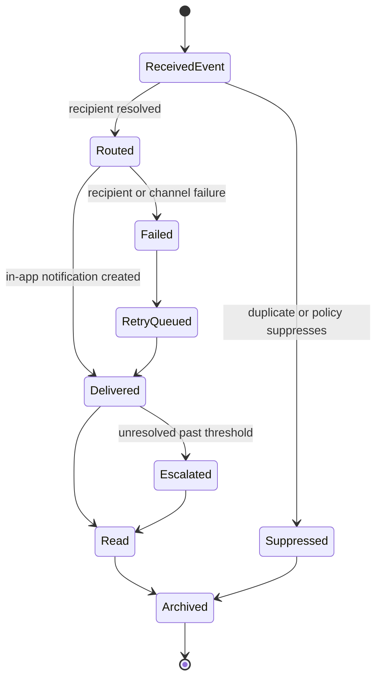
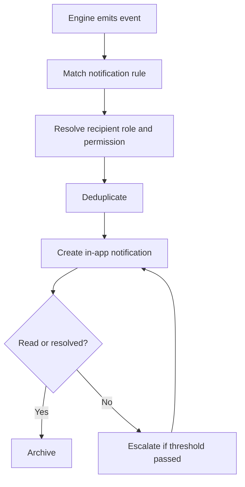

# Notification Engine

## Purpose

The Notification Engine routes role-aware operational notifications.

It ensures the right person sees the right alert at the right time without turning DOYA OS into a noisy messaging tool.

## Problem

Operational alerts lose value when they are duplicated, sent to the wrong role, or not tied to action.

Staff should receive task and correction prompts. Managers should receive failures and exceptions. Owners should receive decision-required alerts. The engine must respect role, store, severity, and business date.

## Solution

The Notification Engine consumes events from other engines and applies routing rules.

It creates in-app notifications for v1.0. External push, email, or chat channels are future extensions unless explicitly documented.

## User

Primary users affected:

- Kitchen and hall staff receive task and re-cleaning prompts.
- Managers receive failed inspections and inventory exceptions.
- Owners receive decision-required alerts.
- Administrators configure notification policies later.

## Inputs

- Engine event.
- Tenant ID.
- Store ID.
- Business date.
- Recipient role.
- Severity.
- Notification rule.
- Deduplication key.
- Delivery channel policy.

## Outputs

- Notification record.
- Delivery state.
- Read state.
- Escalation state.
- Deduplication result.
- Audit event for material alerts.

## State Machine

## Business Rules

- Notifications must be tied to an engine event.
- Staff notifications must be action-oriented, not analytical.
- Owners receive decision-required alerts, not every operational task update.
- Managers receive correction and exception queues.
- Duplicate notifications should be suppressed by source event and recipient.
- Escalation rules must be explicit and role-aware.
- Notification content must not expose data outside the user's permission scope.

## Algorithms

- Match engine event to notification rule.
- Resolve recipients by tenant, store, role, and permission.
- Deduplicate using event type, source record, recipient, and business date.
- Assign severity from source engine event and rule configuration.
- Escalate unresolved notifications after configured threshold.
- Mark read or archived based on user action or resolved source state.

## Failure Cases

- Recipient role not configured.
- User lacks permission for source record.
- Duplicate storm from repeated engine events.
- Missing notification rule.
- Delivery channel unavailable.
- Source record resolved before notification delivery.
- Escalation loop.

## Database Dependencies

- Tenant.
- Store.
- User.
- Role.
- BusinessDate.
- EngineEvent.
- NotificationRule.
- Notification.
- NotificationDelivery.
- NotificationReadState.
- AuditEvent.

## API Dependencies

- `GET /notifications`
- `POST /notifications/{id}/read`
- `POST /notifications/{id}/archive`
- `GET /notifications/unread-count`
- `POST /notifications/events`

## Flow

## Architecture

The Notification Engine is event-driven. Other engines should emit events; they should not directly decide every notification recipient.

In v1.0, notification delivery should remain in-app unless a later decision records external channels.

## Future Extensions

- Push notifications.
- Email.
- Chat integrations.
- Quiet hours.
- Escalation chains.
- Multi-store notification inbox.

## Related Documents

- [Engine Architecture](./README.md)
- [AI Closing Engine](./02_AI_Closing_Engine.md)
- [AI Manager Engine](./05_AI_Manager_Engine.md)
- [Rule Engine](./08_Rule_Engine.md)
