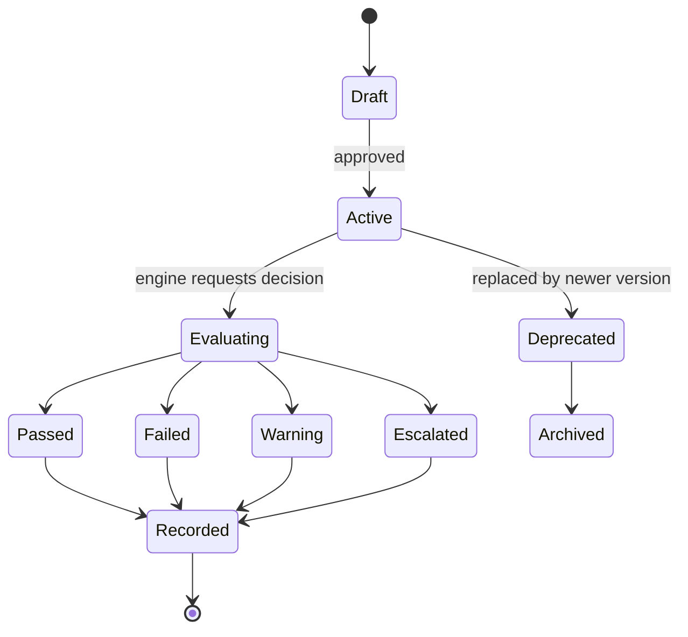
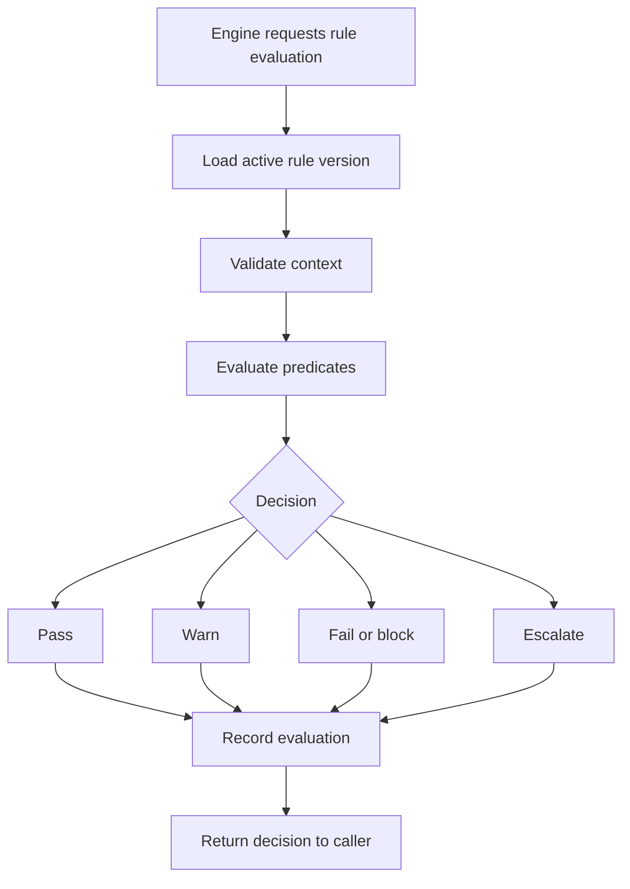

# Rule Engine

## Purpose

The Rule Engine evaluates shared business rules for DOYA OS engines.

It centralizes policy evaluation so inventory, closing, bonus, notifications, SOPs, and AI Manager do not implement inconsistent logic.

## Problem

Business rules appear across the platform: closing thresholds, bonus blockers, notification escalation, required SOPs, inventory risk, and review requirements.

If each engine implements rules independently, behavior becomes difficult to audit, test, and change.

## Solution

The Rule Engine evaluates versioned rules against scoped operating context.

It returns rule decisions with reasons, inputs, version references, and confidence in deterministic form where possible.

## User

Primary users affected:

- Engineers use Rule Engine decisions to keep behavior consistent.
- Product managers define rule intent.
- Managers and owners see rule outcomes in engine outputs.
- AI agents use rule outputs as grounded context.

## Inputs

- Tenant ID.
- Store ID.
- Business date.
- Rule set.
- Rule version.
- Engine context.
- Source records.
- Actor role.
- Evaluation timestamp.

## Outputs

- Rule decision.
- Pass, fail, block, warn, or escalate result.
- Reason codes.
- Source references.
- Rule version.
- Evaluation record.
- Audit event for rule changes.

## State Machine

## Business Rules

- Rules must be versioned.
- Rule evaluations must record source references.
- Active business-date evaluations should use the active rule version for that period.
- Historical outputs must remain tied to the rule version used at evaluation time.
- Rule changes must create audit events.
- Rules should be deterministic unless explicitly documented as AI-assisted.
- Rule Engine must not perform user actions directly; it returns decisions to calling engines.

## Algorithms

- Load active rule version for tenant, store, module, and business date.
- Validate required context fields.
- Evaluate predicates in deterministic order.
- Return first blocking failure and all warning reasons where configured.
- Persist evaluation result with rule version and source references.
- Support idempotent re-evaluation when source records change.

## Failure Cases

- No active rule version.
- Conflicting active versions.
- Missing required context.
- Source record unavailable.
- Circular rule dependency.
- Rule evaluation timeout.
- Rule changed during active workflow.
- Caller attempts unsupported action based on rule result.

## Database Dependencies

- Tenant.
- Store.
- BusinessDate.
- RuleSet.
- RuleVersion.
- RulePredicate.
- RuleEvaluation.
- RuleDecision.
- SourceReference.
- User.
- Role.
- AuditEvent.

## API Dependencies

- `GET /rules`
- `GET /rules/{id}/versions`
- `POST /rules/{id}/evaluate`
- `POST /rules/{id}/activate`
- `POST /rules/{id}/deprecate`
- `GET /rules/evaluations/{id}`

## Flow

## Architecture

The Rule Engine is a shared domain service. It should not own inventory, closing, bonus, SOP, notification, or AI Manager state.

It provides decisions that other engines use to transition state, create alerts, or require review.

## Future Extensions

- Visual rule builder.
- Rule simulation.
- Tenant-specific override layers.
- Multi-store policy inheritance.
- AI-assisted rule explanation.

## Related Documents

- [Engine Architecture](./README.md)
- [Inventory Engine](./01_Inventory_Engine.md)
- [AI Closing Engine](./02_AI_Closing_Engine.md)
- [Bonus Engine](./04_Bonus_Engine.md)
- [Notification Engine](./07_Notification_Engine.md)
