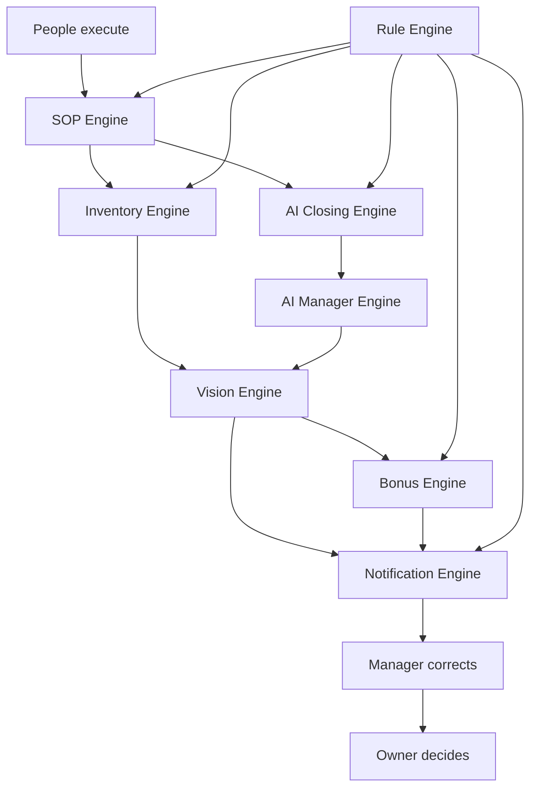

# DOYA OS Engine Architecture

## Purpose

This section defines the business engines that power DOYA OS.

Engines are internal platform capabilities that convert restaurant operating inputs into state, decisions, tasks, inspections, alerts, and records. They sit between UX workflows and database/API implementation.

## Problem

The UX Architecture defines what users see and do, but the product also needs durable internal engines that explain how business behavior is evaluated.

Without engine documentation:

- Frontend screens may invent business logic.
- Backend services may duplicate rules inconsistently.
- AI agents may generate workflows without review or state boundaries.
- Database schemas may store data without preserving operating meaning.
- Owners and managers may see outputs that cannot be traced back to inputs.

## Solution

DOYA OS v1.0 uses eight engines:

| Engine | Responsibility |
| --- | --- |
| [Inventory Engine](./01_Inventory_Engine.md) | Records stock signals and detects inventory risk. |
| [AI Closing Engine](./02_AI_Closing_Engine.md) | Inspects closing evidence and routes human review. |
| [Vision Engine](./03_Vision_Engine.md) | Synthesizes store operating state for owner and manager decisions. |
| [Bonus Engine](./04_Bonus_Engine.md) | Evaluates store level, cooperation score, unlock state, and share visibility. |
| [AI Manager Engine](./05_AI_Manager_Engine.md) | Produces daily reports, alerts, and recommendations with evidence. |
| [SOP Engine](./06_SOP_Engine.md) | Assigns, versions, and records SOP task execution. |
| [Notification Engine](./07_Notification_Engine.md) | Routes role-aware operational notifications. |
| [Rule Engine](./08_Rule_Engine.md) | Evaluates shared business rules used by other engines. |

## User

This documentation is for:

- Backend engineers designing services.
- Database engineers defining entities and state.
- API engineers defining contracts.
- AI engineers connecting inspection and recommendation systems.
- Product managers validating engine behavior.
- AI coding agents using this documentation as implementation context.

## Flow

The engine layer follows the product philosophy:

The diagram shows shared engine dependencies. The Rule Engine is a policy evaluator, not a user-facing module.

## Architecture

Engines should be implemented as backend domain services with clear inputs, outputs, state transitions, audit events, and API boundaries.

Shared architecture requirements:

- Every engine is tenant, store, role, and business-date aware.
- Engine outputs must be traceable to input records.
- Material state changes must produce audit events.
- AI-generated outputs must include evidence and review state.
- Engines must expose deterministic state transitions where possible.
- Engines must not store UI-only concepts as business truth.

## Future Extensions

Future engine documentation may add finance, supplier, forecasting, customer recovery, delivery integration, POS integration, attendance, payroll, and accounting engines.

Those domains are excluded from v1.0.

## Related Documents

- [Documentation Style Guide](../STYLE_GUIDE.md)
- [Vision Bible](../00_Vision/README.md)
- [UX Architecture Bible](../03_UX/README.md)
- [Inventory Engine](./01_Inventory_Engine.md)
- [AI Closing Engine](./02_AI_Closing_Engine.md)
- [Vision Engine](./03_Vision_Engine.md)
- [Bonus Engine](./04_Bonus_Engine.md)
- [AI Manager Engine](./05_AI_Manager_Engine.md)
- [SOP Engine](./06_SOP_Engine.md)
- [Notification Engine](./07_Notification_Engine.md)
- [Rule Engine](./08_Rule_Engine.md)
