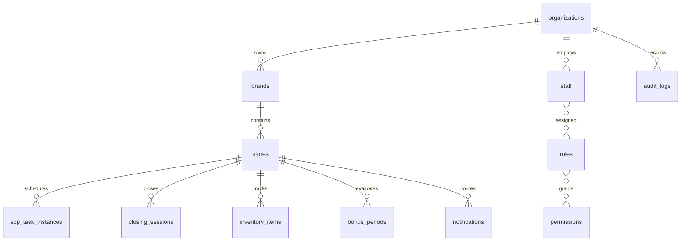

# Data Model Overview

## Purpose

This document defines the global database model conventions for DOYA OS v1.0.

It explains why the schema is tenant-aware, store-aware, audit-aware, and designed for Supabase Row Level Security from the beginning.

## Problem

DOYA OS stores operational truth, not only UI state.

The database must support multi-brand restaurant groups, role-scoped staff experiences, AI inspection evidence, inventory intelligence, bonus evaluation, SOP execution, notifications, and immutable audit trails. If these concepts are not modeled consistently, engines and APIs will produce conflicting state.

## Solution

Use PostgreSQL/Supabase as the system of record.

Global conventions:

- Every table uses `id uuid primary key`.
- Use `organization_id` on tenant-owned records.
- Use `brand_id` when the record is brand-scoped.
- Use `store_id` when the record affects store operations.
- Use `business_date date` for restaurant operating date.
- Use `created_at timestamptz not null`.
- Use `updated_at timestamptz` on mutable records.
- Use `created_by uuid` when a human or service actor creates the record.
- Use `deleted_at timestamptz` for soft-delete where historical references must survive.
- Use enum-like constrained text values before introducing custom PostgreSQL enums.
- Store AI and rule output with source references and version identifiers.

## User

This overview is for database architects, backend engineers, security reviewers, and AI coding agents.

## Entities

Required v1.0 entities:

| Domain | Entities |
| --- | --- |
| Tenant | `organizations`, `brands`, `stores` |
| Access | `staff`, `roles`, `permissions` |
| SOP | `sop_tasks`, `sop_task_instances` |
| AI Closing | `closing_sessions`, `closing_photo_submissions`, `vision_reviews` |
| Inventory | `inventory_items`, `inventory_inbound_batches`, `inventory_daily_weights`, `inventory_waste_logs`, `inventory_predictions` |
| Bonus | `bonus_periods`, `bonus_rules`, `bonus_pool_snapshots`, `personal_kpi_snapshots` |
| Notification | `notifications` |
| Audit | `audit_logs` |

## Fields

Common field standards:

| Field | Type | Applies to | Purpose |
| --- | --- | --- | --- |
| `id` | uuid | all tables | Stable primary key. |
| `organization_id` | uuid | tenant-owned tables | RLS tenant boundary. |
| `brand_id` | uuid | brand-scoped tables | Brand grouping. |
| `store_id` | uuid | operational tables | Store boundary. |
| `business_date` | date | daily operations | Restaurant operating date. |
| `created_at` | timestamptz | all tables | Record creation. |
| `updated_at` | timestamptz | mutable tables | Last update. |
| `created_by` | uuid | human or service-created records | Actor attribution. |
| `deleted_at` | timestamptz | soft-deleted tables | Retain history while hiding active views. |

## Relationships

## Required Indexes

Global index patterns:

- Primary key index on every `id`.
- Foreign key indexes on `organization_id`, `brand_id`, `store_id`, and `staff_id`.
- Composite operational indexes on `(store_id, business_date)`.
- Partial indexes on active records using `where deleted_at is null`.
- Status indexes on workflow tables where queues are filtered by state.

## Constraints

Global constraints:

- UUID primary keys are mandatory.
- Foreign keys must preserve tenant consistency.
- Store-scoped records must belong to a store under the same organization.
- Status values must be constrained.
- Operational records must not be hard-deleted when referenced by audit or engine output.

## Audit Requirements

Audit all sensitive actions:

- Staff role changes.
- Permission changes.
- SOP completion correction.
- Closing review approval or rejection.
- Inventory correction.
- Bonus rule change.
- Bonus status override.
- Notification escalation.
- RLS-sensitive administrative action.

## RLS Considerations

RLS policies must be designed before migrations are implemented.

Every operational table should be readable only when the actor has organization and store access. Staff roles must receive the minimum data required for their workflow.

## Future SaaS Extensions

Future SaaS requirements:

- Multi-brand organization administration.
- Billing ownership.
- Regional franchise access.
- Cross-store analytics.
- External integrations with scoped service roles.

## Flow

1. Resolve authenticated Supabase user.
2. Resolve `staff` identity and role assignments.
3. Apply organization and store scope.
4. Apply table-specific RLS policy.
5. Record sensitive writes in `audit_logs`.

## Architecture

The database model is the boundary between product truth and application behavior. Engines can calculate state, but source records and audit events must remain queryable and traceable.

## Future Extension

This overview should be updated when a new domain becomes part of the core schema.

## Related Documents

- [Database Architecture](./README.md)
- [Multi-Tenant Model](./02_Multi_Tenant_Model.md)
- [Supabase RLS Policies](./12_Supabase_RLS_Policies.md)
