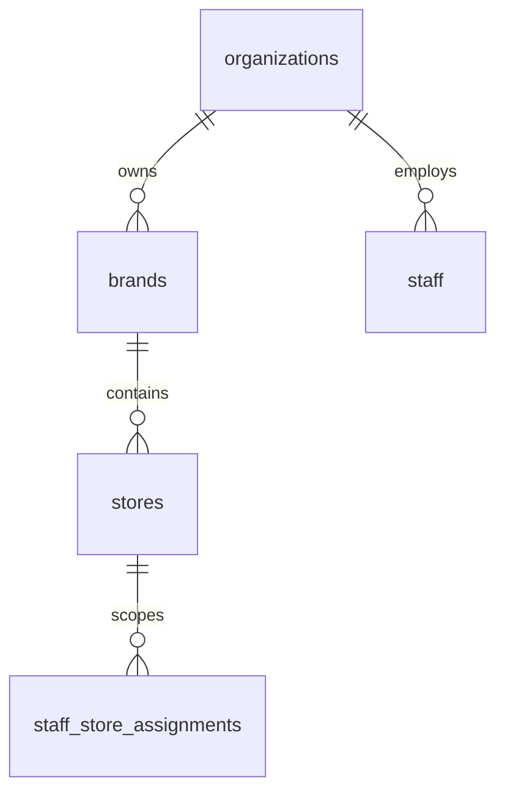

# Multi-Tenant Model

## Purpose

This document defines the organization, brand, and store model for DOYA OS v1.0.

The multi-tenant model is the root boundary for SaaS isolation, RLS, audit logs, and future multi-store operations.

## Problem

Restaurants may operate as a single store today and become a multi-brand, multi-store group later.

If the first schema assumes one store per account, future expansion will require unsafe migrations. If the schema exposes cross-store data too early, RLS becomes difficult to reason about.

## Solution

Model tenancy as a hierarchy:

## User

This model affects owners, managers, staff, backend engineers, and Supabase policy authors.

## Entities

- `organizations`
- `brands`
- `stores`
- `staff_store_assignments`

## Fields

### `organizations`

| Field | Type | Notes |
| --- | --- | --- |
| `id` | uuid | Primary key. |
| `name` | text | Required. |
| `slug` | text | Unique active organization identifier. |
| `status` | text | `active`, `suspended`, `archived`. |
| `timezone` | text | Default operating timezone. |
| `created_at` | timestamptz | Required. |
| `updated_at` | timestamptz | Required. |
| `created_by` | uuid | References `staff.id` when available. |
| `deleted_at` | timestamptz | Soft-delete. |

### `brands`

| Field | Type | Notes |
| --- | --- | --- |
| `id` | uuid | Primary key. |
| `organization_id` | uuid | References `organizations.id`. |
| `name` | text | Required. |
| `slug` | text | Unique within organization. |
| `status` | text | `active`, `archived`. |
| `created_at` | timestamptz | Required. |
| `updated_at` | timestamptz | Required. |
| `created_by` | uuid | Actor. |
| `deleted_at` | timestamptz | Soft-delete. |

### `stores`

| Field | Type | Notes |
| --- | --- | --- |
| `id` | uuid | Primary key. |
| `organization_id` | uuid | Denormalized for RLS. |
| `brand_id` | uuid | References `brands.id`. |
| `name` | text | Required. |
| `code` | text | Unique within organization. |
| `timezone` | text | Store timezone. |
| `locale` | text | Default locale. |
| `status` | text | `active`, `paused`, `archived`. |
| `created_at` | timestamptz | Required. |
| `updated_at` | timestamptz | Required. |
| `created_by` | uuid | Actor. |
| `deleted_at` | timestamptz | Soft-delete. |

## Relationships

- One organization has many brands.
- One brand has many stores.
- One organization has many staff.
- Staff receive store access through assignments.
- Operational tables reference `store_id` and denormalize `organization_id`.

## Required Indexes

- `organizations(slug)` unique where `deleted_at is null`.
- `brands(organization_id, slug)` unique where `deleted_at is null`.
- `stores(organization_id, code)` unique where `deleted_at is null`.
- `stores(brand_id)` for brand filtering.
- `stores(organization_id, status)` for owner dashboards.

## Constraints

- `brands.organization_id` must reference an active organization.
- `stores.organization_id` must match the organization of `brand_id`.
- Slugs and codes must be stable after operational records exist.
- Hard delete is not allowed for organizations, brands, or stores with operational history.

## Audit Requirements

Audit:

- Organization creation, suspension, and archival.
- Brand creation and archival.
- Store creation, status change, timezone change, and localization change.
- Store reassignment across brands.

## RLS Considerations

- Owner can read all brands and stores in assigned organizations.
- Manager can read assigned stores.
- Kitchen and Hall can read only assigned store metadata needed for task context.
- Organization and store writes require Owner or scoped administrative permission.

## Future SaaS Extensions

- Multi-region organization hierarchy.
- Franchisee and franchisor access.
- Billing account ownership.
- Brand-level templates.
- Cross-brand reporting.

## Flow

1. User authenticates.
2. Staff identity resolves to organization.
3. Role assignment resolves store access.
4. Queries filter by allowed `organization_id` and `store_id`.

## Architecture

The multi-tenant model should be referenced by every operational table. Do not rely only on joins for tenant isolation when denormalized `organization_id` improves RLS safety.

## Future Extension

Future tenant features should extend this hierarchy rather than replacing it.

## Related Documents

- [Data Model Overview](./01_Data_Model_Overview.md)
- [RBAC Model](./03_RBAC_Model.md)
- [Supabase RLS Policies](./12_Supabase_RLS_Policies.md)
