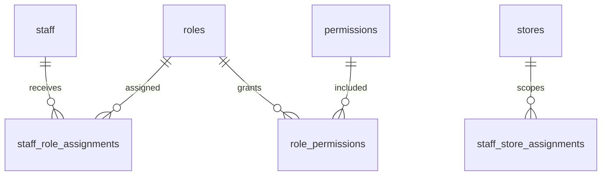

# RBAC Model

## Purpose

This document defines role-based access control for DOYA OS v1.0.

RBAC determines what Owners, Managers, Kitchen staff, and Hall staff may see, create, update, approve, or decide.

## Problem

DOYA OS cannot depend on frontend visibility for security.

Kitchen and Hall staff must not see manager review queues or owner decision surfaces. Managers need operational authority within store scope. Owners need broad tenant visibility. Supabase RLS must enforce these boundaries at the database layer.

## Solution

Use role and permission tables with store-scoped assignments.

## User

This model affects all authenticated users and all backend/RLS policy authors.

## Entities

- `staff`
- `roles`
- `permissions`
- `staff_role_assignments`
- `staff_store_assignments`
- `role_permissions`

## Fields

### `roles`

| Field | Type | Notes |
| --- | --- | --- |
| `id` | uuid | Primary key. |
| `organization_id` | uuid | References `organizations.id`; nullable only for system seed roles. |
| `key` | text | `OWNER`, `MANAGER`, `KITCHEN`, `HALL`. |
| `name` | text | Display name. |
| `scope` | text | `organization`, `store`. |
| `is_system` | boolean | Protects default roles. |
| `created_at` | timestamptz | Required. |
| `updated_at` | timestamptz | Required. |
| `deleted_at` | timestamptz | Soft-delete for custom roles. |

### `permissions`

| Field | Type | Notes |
| --- | --- | --- |
| `id` | uuid | Primary key. |
| `key` | text | Stable permission key. |
| `description` | text | Human-readable meaning. |
| `module` | text | `dashboard`, `closing`, `inventory`, `bonus`, `sop`, `settings`, `audit`. |
| `created_at` | timestamptz | Required. |

### `staff_role_assignments`

| Field | Type | Notes |
| --- | --- | --- |
| `id` | uuid | Primary key. |
| `organization_id` | uuid | RLS boundary. |
| `staff_id` | uuid | References `staff.id`. |
| `role_id` | uuid | References `roles.id`. |
| `store_id` | uuid | Nullable for organization-level owner role. |
| `status` | text | `active`, `revoked`. |
| `created_at` | timestamptz | Required. |
| `created_by` | uuid | Actor. |
| `revoked_at` | timestamptz | Optional. |

## Relationships

- Staff can have multiple roles.
- Roles grant permissions through `role_permissions`.
- Staff store access is explicit.
- Organization-level Owner role can read all stores in the organization.

## Required Indexes

- `roles(organization_id, key)` unique where active.
- `permissions(key)` unique.
- `staff_role_assignments(staff_id, store_id, status)`.
- `staff_role_assignments(organization_id, role_id)`.
- `role_permissions(role_id, permission_id)` unique.

## Constraints

- System roles cannot be deleted.
- Only Owner can assign Owner or Manager roles.
- Store-scoped roles require `store_id`.
- Role assignment organization must match staff organization.
- Permission keys must be stable and not overloaded.

## Audit Requirements

Audit:

- Role assignment.
- Role revocation.
- Permission changes.
- Custom role creation or change.
- Attempted privilege escalation.

## RLS Considerations

- Owner can manage roles and permissions inside organization.
- Manager can read staff and roles for assigned store, but cannot grant Owner.
- Kitchen and Hall can read their own role assignment only.
- RLS helper functions should resolve effective permissions from active assignments.

## Future SaaS Extensions

- Custom roles.
- Brand-level roles.
- Regional manager roles.
- Temporary delegated access.
- External consultant access.

## Flow

1. Supabase auth user maps to `staff.auth_user_id`.
2. Active role assignments are resolved.
3. Store scope is evaluated.
4. Permission keys are checked by RLS policies and backend services.

## Architecture

RBAC should be evaluated centrally. Application screens, APIs, and RLS policies must use the same role and permission model.

## Future Extension

Future custom roles should be additive and must not break system role semantics.

## Related Documents

- [Multi-Tenant Model](./02_Multi_Tenant_Model.md)
- [Store Staff Model](./04_Store_Staff_Model.md)
- [Supabase RLS Policies](./12_Supabase_RLS_Policies.md)
