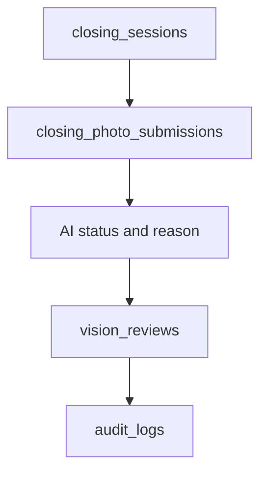

# AI Closing Model

## Purpose

This document defines the database model for AI Closing and Vision review records.

It supports closing sessions, photo submissions, AI inspection state, human review, and owner or manager review history.

## Problem

AI Closing needs evidence, state, and accountability.

If photos and AI results are stored without review state, managers cannot correct issues. If review records are overwritten, owners cannot audit what happened.

## Solution

Store closing state in session and submission tables. Store review decisions in `vision_reviews` so AI and human decisions remain traceable.

## User

This model affects Kitchen staff, Hall staff, Managers, Owners, AI services, and audit reviewers.

## Entities

- `closing_sessions`
- `closing_photo_submissions`
- `vision_reviews`
- `staff`
- `stores`
- `audit_logs`

## Fields

### `closing_sessions`

| Field | Type | Notes |
| --- | --- | --- |
| `id` | uuid | Primary key. |
| `organization_id` | uuid | RLS boundary. |
| `store_id` | uuid | References `stores.id`. |
| `business_date` | date | Required. |
| `area` | text | `kitchen`, `hall`. |
| `status` | text | `open`, `submitted`, `passed`, `failed`, `review_required`, `closed`. |
| `opened_at` | timestamptz | Required. |
| `closed_at` | timestamptz | Optional. |
| `created_at` | timestamptz | Required. |
| `updated_at` | timestamptz | Required. |
| `created_by` | uuid | Staff actor or service actor. |

### `closing_photo_submissions`

| Field | Type | Notes |
| --- | --- | --- |
| `id` | uuid | Primary key. |
| `organization_id` | uuid | RLS boundary. |
| `store_id` | uuid | Denormalized for RLS. |
| `closing_session_id` | uuid | References `closing_sessions.id`. |
| `submitted_by` | uuid | References `staff.id`. |
| `category` | text | `floor_drain`, `refrigerator`, `stove_grease`, `tables_chairs`, `floor`, `counter_pos`. |
| `storage_path` | text | Supabase Storage path. |
| `ai_status` | text | `pending`, `pass`, `fail`, `review_required`, `error`. |
| `ai_confidence` | numeric | Optional bounded score. |
| `ai_reason` | text | Human-readable reason. |
| `prompt_version` | text | AI inspection prompt version. |
| `submitted_at` | timestamptz | Required. |
| `created_at` | timestamptz | Required. |

### `vision_reviews`

| Field | Type | Notes |
| --- | --- | --- |
| `id` | uuid | Primary key. |
| `organization_id` | uuid | RLS boundary. |
| `store_id` | uuid | References `stores.id`. |
| `business_date` | date | Required. |
| `review_type` | text | `closing`, `inventory`, `bonus`, `ai_manager`, `owner_decision`. |
| `source_table` | text | Source record table. |
| `source_id` | uuid | Source record ID. |
| `status` | text | `open`, `approved`, `rejected`, `corrected`, `resolved`. |
| `reviewed_by` | uuid | Staff actor. |
| `reviewed_at` | timestamptz | Optional. |
| `notes` | text | Optional. |
| `created_at` | timestamptz | Required. |
| `created_by` | uuid | Actor. |

## Relationships

- One closing session has many photo submissions.
- Photo submissions may produce one or more vision reviews.
- Vision reviews reference source records by table and ID.
- Closing sessions belong to one store and business date.

## Required Indexes

- `closing_sessions(store_id, business_date, area)` unique.
- `closing_sessions(store_id, business_date, status)`.
- `closing_photo_submissions(closing_session_id, category)`.
- `closing_photo_submissions(store_id, business_date)` if `business_date` is denormalized later.
- `vision_reviews(store_id, business_date, status)`.
- `vision_reviews(source_table, source_id)`.

## Constraints

- Closing session area must be constrained.
- Submission category must match session area.
- AI confidence must be between 0 and 1 when present.
- A session cannot be closed while required review records are open.
- Submitted photos should not be hard-deleted after review.

## Audit Requirements

Audit:

- Closing session close.
- AI fail changed by manager review.
- Human review approval or rejection.
- Re-cleaning correction.
- Owner decision based on closing result.

## RLS Considerations

- Owner can read all store closing records in organization.
- Manager can read and review assigned store records.
- Kitchen can create and read kitchen submissions for assigned store.
- Hall can create and read hall submissions for assigned store.
- Kitchen and Hall cannot read manager notes unless explicitly exposed.

## Future SaaS Extensions

- Storage retention policy.
- Video submissions.
- Equipment-specific categories.
- Cross-store failure trends.
- Offline upload queue metadata.

## Flow

## Architecture

The AI Closing model preserves both evidence and review decisions. It should not store only final pass/fail status.

## Future Extension

Future inspection models should extend the same source-record and review pattern.

## Related Documents

- [AI Closing Engine](../04_Engines/02_AI_Closing_Engine.md)
- [UX AI Closing](../03_UX/09_AI_Closing.md)
- [Audit Log Model](./10_Audit_Log_Model.md)
