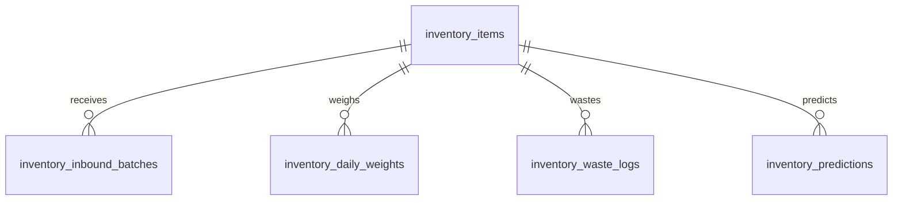

# Inventory Model

## Purpose

This document defines the database model for Inventory Intelligence.

It supports item configuration, inbound stock, daily weights, waste logs, and prediction snapshots for operational risk.

## Problem

Inventory records must be simple enough for kitchen staff to enter during operations and structured enough for managers and owners to trust risk alerts.

If the database stores only raw quantities, burn rate and reorder alerts cannot be audited. If it models full accounting inventory, v1.0 becomes too broad.

## Solution

Use item and transaction-style operational tables with prediction snapshots.

## User

This model affects Kitchen staff, Managers, Owners, Inventory Engine, Bonus Engine, and AI Manager.

## Entities

- `inventory_items`
- `inventory_inbound_batches`
- `inventory_daily_weights`
- `inventory_waste_logs`
- `inventory_predictions`

## Fields

### `inventory_items`

| Field | Type | Notes |
| --- | --- | --- |
| `id` | uuid | Primary key. |
| `organization_id` | uuid | RLS boundary. |
| `store_id` | uuid | References `stores.id`. |
| `name` | text | Required. |
| `sku` | text | Optional store item code. |
| `category` | text | Ingredient category. |
| `default_unit` | text | Required. |
| `reorder_threshold` | numeric | Optional. |
| `is_active` | boolean | Active item flag. |
| `created_at` | timestamptz | Required. |
| `updated_at` | timestamptz | Required. |
| `created_by` | uuid | Actor. |
| `deleted_at` | timestamptz | Soft-delete. |

### `inventory_inbound_batches`

| Field | Type | Notes |
| --- | --- | --- |
| `id` | uuid | Primary key. |
| `organization_id` | uuid | RLS boundary. |
| `store_id` | uuid | References `stores.id`. |
| `inventory_item_id` | uuid | References `inventory_items.id`. |
| `business_date` | date | Required. |
| `quantity` | numeric | Required. |
| `unit` | text | Required. |
| `received_by` | uuid | References `staff.id`. |
| `received_at` | timestamptz | Required. |
| `notes` | text | Optional. |
| `created_at` | timestamptz | Required. |
| `created_by` | uuid | Actor. |

### `inventory_daily_weights`

| Field | Type | Notes |
| --- | --- | --- |
| `id` | uuid | Primary key. |
| `organization_id` | uuid | RLS boundary. |
| `store_id` | uuid | References `stores.id`. |
| `inventory_item_id` | uuid | References `inventory_items.id`. |
| `business_date` | date | Required. |
| `quantity` | numeric | Required. |
| `unit` | text | Required. |
| `recorded_by` | uuid | References `staff.id`. |
| `recorded_at` | timestamptz | Required. |
| `status` | text | `submitted`, `confirmed`, `corrected`, `voided`. |
| `created_at` | timestamptz | Required. |
| `updated_at` | timestamptz | Required. |

### `inventory_waste_logs`

| Field | Type | Notes |
| --- | --- | --- |
| `id` | uuid | Primary key. |
| `organization_id` | uuid | RLS boundary. |
| `store_id` | uuid | References `stores.id`. |
| `inventory_item_id` | uuid | References `inventory_items.id`. |
| `business_date` | date | Required. |
| `quantity` | numeric | Required. |
| `unit` | text | Required. |
| `reason` | text | Standardized or configured reason. |
| `recorded_by` | uuid | References `staff.id`. |
| `recorded_at` | timestamptz | Required. |
| `created_at` | timestamptz | Required. |

### `inventory_predictions`

| Field | Type | Notes |
| --- | --- | --- |
| `id` | uuid | Primary key. |
| `organization_id` | uuid | RLS boundary. |
| `store_id` | uuid | References `stores.id`. |
| `inventory_item_id` | uuid | References `inventory_items.id`. |
| `business_date` | date | Required. |
| `prediction_type` | text | `burn_rate`, `reorder`, `waste_variance`. |
| `value` | numeric | Prediction value. |
| `severity` | text | `info`, `warning`, `critical`. |
| `source_record_ids` | jsonb | Source references. |
| `generated_at` | timestamptz | Required. |
| `created_at` | timestamptz | Required. |

## Relationships

- One store has many inventory items.
- One inventory item has many inbound batches, daily weights, waste logs, and predictions.
- Predictions reference source records through `source_record_ids`.

## Required Indexes

- `inventory_items(store_id, name)` unique where `deleted_at is null`.
- `inventory_inbound_batches(store_id, business_date)`.
- `inventory_daily_weights(store_id, business_date, inventory_item_id)` unique for active submitted record.
- `inventory_waste_logs(store_id, business_date, inventory_item_id)`.
- `inventory_predictions(store_id, business_date, severity)`.

## Constraints

- Quantities must be greater than or equal to zero.
- Units must match supported item units.
- Operational entries must reference active items.
- Corrected entries must preserve audit trail.
- Predictions must cite source records.

## Audit Requirements

Audit:

- Inventory item creation or deactivation.
- Daily weight correction.
- Inbound batch correction.
- Waste log correction.
- Prediction override or manager confirmation.

## RLS Considerations

- Owner can read all inventory records in organization.
- Manager can read and correct assigned store inventory records.
- Kitchen can create daily weights, inbound batches, and waste logs for assigned store.
- Hall has no inventory access in v1.0.

## Future SaaS Extensions

- Supplier entities.
- Recipe-level depletion.
- POS-linked sales depletion.
- Cost tracking.
- Cross-store inventory benchmarks.

## Flow

## Architecture

The inventory model stores operational stock truth. Accounting valuation and POS depletion are excluded from v1.0.

## Future Extension

Supplier and accounting extensions should reference inventory items rather than replacing them.

## Related Documents

- [Inventory Engine](../04_Engines/01_Inventory_Engine.md)
- [UX Inventory](../03_UX/10_Inventory.md)
- [Audit Log Model](./10_Audit_Log_Model.md)
