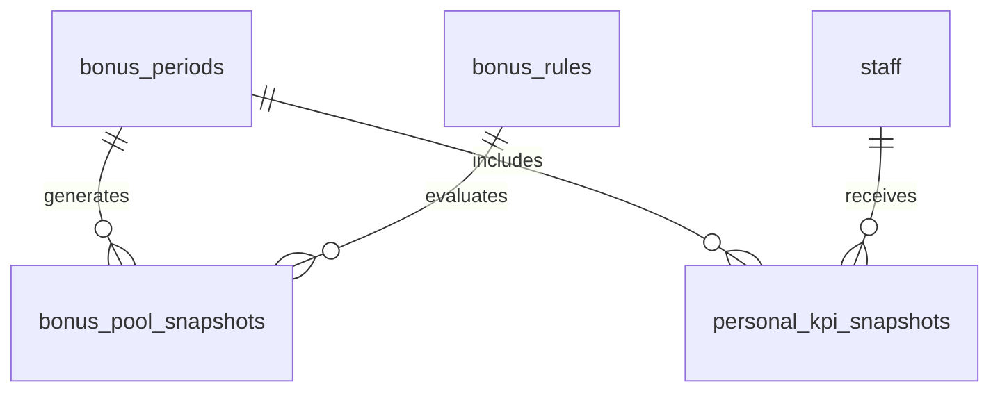

# Bonus Model

## Purpose

This document defines the database model for the Bonus Engine.

It supports bonus periods, rule configuration, store-level pool snapshots, and personal KPI snapshots without becoming payroll.

## Problem

Bonus state must be explainable and reproducible.

If bonus outputs are calculated only at read time, owners and staff cannot audit historical eligibility. If bonus records store payroll amounts, v1.0 exceeds product scope.

## Solution

Store rules and evaluated snapshots separately.

## User

This model affects Owners, Managers, Kitchen staff, Hall staff, Bonus Engine, Rule Engine, and Audit Log Model.

## Entities

- `bonus_periods`
- `bonus_rules`
- `bonus_pool_snapshots`
- `personal_kpi_snapshots`

## Fields

### `bonus_periods`

| Field | Type | Notes |
| --- | --- | --- |
| `id` | uuid | Primary key. |
| `organization_id` | uuid | RLS boundary. |
| `store_id` | uuid | References `stores.id`. |
| `period_start` | date | Required. |
| `period_end` | date | Required. |
| `status` | text | `open`, `locked`, `archived`. |
| `created_at` | timestamptz | Required. |
| `updated_at` | timestamptz | Required. |
| `created_by` | uuid | Actor. |

### `bonus_rules`

| Field | Type | Notes |
| --- | --- | --- |
| `id` | uuid | Primary key. |
| `organization_id` | uuid | RLS boundary. |
| `store_id` | uuid | Nullable for organization-wide rule. |
| `name` | text | Required. |
| `version` | integer | Monotonic version. |
| `rule_config` | jsonb | Rule predicates and weights. |
| `status` | text | `draft`, `active`, `retired`. |
| `effective_from` | date | Required. |
| `effective_to` | date | Optional. |
| `created_at` | timestamptz | Required. |
| `updated_at` | timestamptz | Required. |
| `created_by` | uuid | Actor. |

### `bonus_pool_snapshots`

| Field | Type | Notes |
| --- | --- | --- |
| `id` | uuid | Primary key. |
| `organization_id` | uuid | RLS boundary. |
| `store_id` | uuid | References `stores.id`. |
| `bonus_period_id` | uuid | References `bonus_periods.id`. |
| `bonus_rule_id` | uuid | References `bonus_rules.id`. |
| `store_level` | numeric | Store level progress. |
| `cooperation_score` | numeric | Cooperation score. |
| `unlock_status` | text | `locked`, `eligible`, `unlocked`, `blocked`. |
| `blockers` | jsonb | Source blocker references. |
| `generated_at` | timestamptz | Required. |
| `created_at` | timestamptz | Required. |

### `personal_kpi_snapshots`

| Field | Type | Notes |
| --- | --- | --- |
| `id` | uuid | Primary key. |
| `organization_id` | uuid | RLS boundary. |
| `store_id` | uuid | References `stores.id`. |
| `bonus_period_id` | uuid | References `bonus_periods.id`. |
| `staff_id` | uuid | References `staff.id`. |
| `role_id` | uuid | References `roles.id`. |
| `share_percentage` | numeric | Visible share percentage when configured. |
| `kpi_breakdown` | jsonb | Source KPI values. |
| `visibility_status` | text | `hidden`, `visible`, `locked`. |
| `generated_at` | timestamptz | Required. |
| `created_at` | timestamptz | Required. |

## Relationships

- One store has many bonus periods.
- One bonus rule can produce many pool snapshots.
- One bonus period has many personal KPI snapshots.
- Personal KPI snapshots reference staff and roles.

## Required Indexes

- `bonus_periods(store_id, period_start, period_end)` unique.
- `bonus_rules(organization_id, store_id, status, effective_from)`.
- `bonus_pool_snapshots(bonus_period_id, generated_at desc)`.
- `personal_kpi_snapshots(bonus_period_id, staff_id)` unique for latest active snapshot policy.

## Constraints

- Period end must be after period start.
- Rule versions are immutable after activation.
- Share percentage must be between 0 and 100.
- Payroll amounts are not stored in v1.0.
- Snapshots must reference the rule version used.

## Audit Requirements

Audit:

- Bonus rule activation.
- Bonus rule retirement.
- Bonus status override.
- Pool snapshot confirmation.
- Personal share visibility change.

## RLS Considerations

- Owner can read and manage bonus rules and snapshots.
- Manager can read store progress and blockers.
- Kitchen and Hall can read only their own visible `personal_kpi_snapshots` and store-level progress allowed by UX.
- Staff cannot read other staff personal KPI snapshots.

## Future SaaS Extensions

- Payroll export.
- Payout approval workflow.
- Multi-store bonus plans.
- Rule simulation.
- Compensation integrations.

## Flow

## Architecture

Bonus snapshots make bonus results reproducible. Rules define eligibility; snapshots preserve evaluated output.

## Future Extension

Payroll integration should reference snapshots and should not change v1.0 operational bonus records.

## Related Documents

- [Bonus Engine](../04_Engines/04_Bonus_Engine.md)
- [UX Bonus](../03_UX/11_Bonus.md)
- [Rule Engine](../04_Engines/08_Rule_Engine.md)
