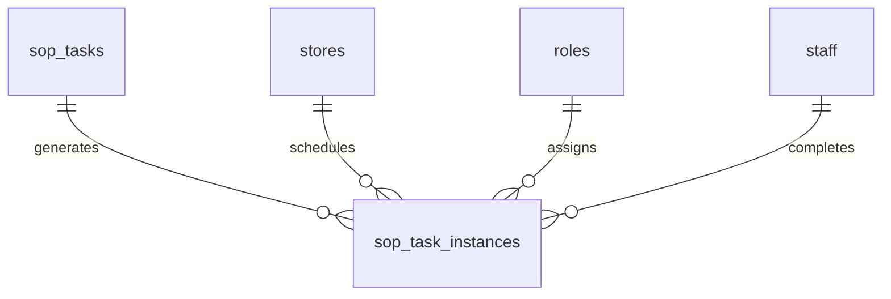

# SOP Model

## Purpose

This document defines the SOP database model for DOYA OS v1.0.

It supports reusable SOP task definitions and business-date-specific task instances.

## Problem

SOPs must be both documented and executable.

Static SOP content does not prove execution. Task instances without source definitions cannot preserve standards or version history.

## Solution

Separate reusable SOP task definitions from generated task instances.

## User

This model affects Kitchen staff, Hall staff, Managers, Owners, SOP Engine, Bonus Engine, and AI Manager.

## Entities

- `sop_tasks`
- `sop_task_instances`

## Fields

### `sop_tasks`

| Field | Type | Notes |
| --- | --- | --- |
| `id` | uuid | Primary key. |
| `organization_id` | uuid | RLS boundary. |
| `store_id` | uuid | Nullable for organization template; store-specific when overridden. |
| `role_key` | text | `MANAGER`, `KITCHEN`, `HALL`. |
| `category` | text | `opening`, `closing`, `cleaning`, `inventory`. |
| `title` | text | Required. |
| `instructions` | text | Required. |
| `version` | integer | Required. |
| `is_required` | boolean | Required. |
| `status` | text | `draft`, `active`, `retired`. |
| `created_at` | timestamptz | Required. |
| `updated_at` | timestamptz | Required. |
| `created_by` | uuid | Actor. |
| `deleted_at` | timestamptz | Soft-delete. |

### `sop_task_instances`

| Field | Type | Notes |
| --- | --- | --- |
| `id` | uuid | Primary key. |
| `organization_id` | uuid | RLS boundary. |
| `store_id` | uuid | References `stores.id`. |
| `sop_task_id` | uuid | References `sop_tasks.id`. |
| `business_date` | date | Required. |
| `assigned_role_id` | uuid | References `roles.id`. |
| `assigned_staff_id` | uuid | Optional specific staff assignment. |
| `status` | text | `assigned`, `in_progress`, `submitted`, `confirmed`, `rejected`, `missed`. |
| `completed_by` | uuid | References `staff.id`. |
| `completed_at` | timestamptz | Optional. |
| `reviewed_by` | uuid | Manager actor. |
| `reviewed_at` | timestamptz | Optional. |
| `created_at` | timestamptz | Required. |
| `updated_at` | timestamptz | Required. |

## Relationships

- One SOP task definition generates many task instances.
- Task instances belong to a store and business date.
- Task instances can be assigned to a role or staff member.
- Completion and review actors reference staff.

## Required Indexes

- `sop_tasks(organization_id, store_id, role_key, category, status)`.
- `sop_tasks(organization_id, title, version)` unique where active policy applies.
- `sop_task_instances(store_id, business_date, assigned_role_id)`.
- `sop_task_instances(store_id, business_date, status)`.
- `sop_task_instances(sop_task_id, business_date)`.

## Constraints

- Active SOP task versions must be immutable.
- Required task instances cannot be deleted after business date opens.
- Status transitions must follow SOP Engine state machine.
- Completed task instance must have `completed_by` and `completed_at`.
- Rejected task instance must have manager review metadata.

## Audit Requirements

Audit:

- SOP task activation.
- SOP task retirement.
- SOP task instance rejection.
- Manager correction.
- Completion after cutoff.

## RLS Considerations

- Owner can read and manage SOP tasks.
- Manager can read SOP tasks and review task instances for assigned store.
- Kitchen can read and update only Kitchen task instances assigned to their store.
- Hall can read and update only Hall task instances assigned to their store.

## Future SaaS Extensions

- SOP templates by brand.
- Multi-language SOP content.
- Training mode.
- Equipment-specific SOPs.
- SOP approval workflow.

## Flow

## Architecture

The SOP model is the execution backbone for staff tasks. Other engines consume task state but should not bypass task instances.

## Future Extension

Future SOP content management should add versioned content tables rather than rewriting completed task history.

## Related Documents

- [SOP Engine](../04_Engines/06_SOP_Engine.md)
- [UX Screen Map](../03_UX/02_Screen_Map.md)
- [Bonus Model](./07_Bonus_Model.md)
