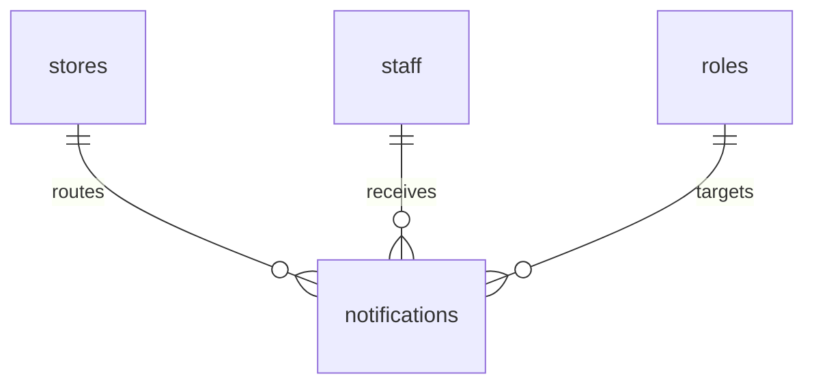

# Notification Model

## Purpose

This document defines the database model for role-aware notifications.

It supports in-app operational notifications for tasks, failures, manager review, owner decisions, and escalations.

## Problem

Notifications become noise when they are not tied to source records, roles, or resolution state.

The database must preserve routing, read state, source reference, and escalation context.

## Solution

Use a single `notifications` table with source references and recipient scope.

## User

This model affects all roles and the Notification Engine.

## Entities

- `notifications`
- `staff`
- `roles`
- `stores`
- `audit_logs`

## Fields

### `notifications`

| Field | Type | Notes |
| --- | --- | --- |
| `id` | uuid | Primary key. |
| `organization_id` | uuid | RLS boundary. |
| `store_id` | uuid | References `stores.id`. |
| `business_date` | date | Optional for operational notifications. |
| `recipient_staff_id` | uuid | Nullable when role-scoped. |
| `recipient_role_id` | uuid | Nullable when staff-specific. |
| `source_table` | text | Source table name. |
| `source_id` | uuid | Source record. |
| `type` | text | `task`, `closing_fail`, `inventory_risk`, `bonus_blocker`, `owner_decision`. |
| `severity` | text | `info`, `warning`, `critical`. |
| `title` | text | Required. |
| `body` | text | Required. |
| `status` | text | `unread`, `read`, `archived`, `resolved`, `escalated`. |
| `created_at` | timestamptz | Required. |
| `read_at` | timestamptz | Optional. |
| `resolved_at` | timestamptz | Optional. |

## Relationships

- Notification references a store.
- Notification targets a staff member or role.
- Notification references source record by table and ID.
- Notification state changes may write audit logs when operationally sensitive.

## Required Indexes

- `notifications(recipient_staff_id, status, created_at desc)`.
- `notifications(recipient_role_id, store_id, status)`.
- `notifications(store_id, business_date, severity)`.
- `notifications(source_table, source_id)`.
- Partial index on unread notifications.

## Constraints

- Notification must have `recipient_staff_id` or `recipient_role_id`.
- Severity and status values must be constrained.
- Source table and source ID are required for operational notifications.
- Staff must not receive notifications outside assigned store scope.

## Audit Requirements

Audit:

- Critical notification escalation.
- Owner decision notification resolution.
- Manager correction notification resolution.
- Manual archival of unresolved critical notification.

## RLS Considerations

- Owner can read all notifications in organization.
- Manager can read notifications for assigned stores.
- Kitchen and Hall can read only notifications assigned to themselves or their role within assigned store.
- Staff cannot read notifications for other stores or unrelated roles.

## Future SaaS Extensions

- Push delivery state.
- Email delivery state.
- Notification preferences.
- Quiet hours.
- Escalation chains.

## Flow

## Architecture

Notifications should not be the source of operational truth. They point to source records owned by engines.

## Future Extension

External notification channels should use delivery tables linked to `notifications.id`.

## Related Documents

- [Notification Engine](../04_Engines/07_Notification_Engine.md)
- [Supabase RLS Policies](./12_Supabase_RLS_Policies.md)
- [Audit Log Model](./10_Audit_Log_Model.md)
