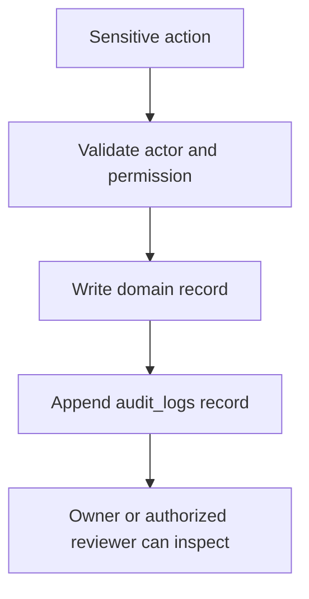

# Audit Log Model

## Purpose

This document defines the audit log model for DOYA OS v1.0.

Audit logs preserve accountability for operationally sensitive actions.

## Problem

DOYA OS depends on human review, AI inspection, correction, and owner decisions.

If sensitive actions are not audited, the system cannot explain who changed what, when, why, and from which source state.

## Solution

Use append-only `audit_logs` records for sensitive actions across all engines and configuration areas.

## User

This model affects Owners, Managers, security reviewers, auditors, and backend engineers.

## Entities

- `audit_logs`
- Source domain tables referenced by `source_table` and `source_id`.

## Fields

### `audit_logs`

| Field | Type | Notes |
| --- | --- | --- |
| `id` | uuid | Primary key. |
| `organization_id` | uuid | RLS boundary. |
| `store_id` | uuid | Nullable for organization-level actions. |
| `actor_staff_id` | uuid | Staff actor when human. |
| `actor_type` | text | `staff`, `system`, `ai`, `service`. |
| `action` | text | Stable action key. |
| `source_table` | text | Affected table. |
| `source_id` | uuid | Affected record ID. |
| `before_state` | jsonb | Optional sanitized prior state. |
| `after_state` | jsonb | Optional sanitized resulting state. |
| `reason` | text | Required for overrides and corrections. |
| `metadata` | jsonb | Additional context. |
| `created_at` | timestamptz | Required append time. |

## Relationships

- Audit logs belong to organization and optionally store.
- Audit logs reference source record by table and ID.
- Audit logs reference human staff actor when applicable.

## Required Indexes

- `audit_logs(organization_id, created_at desc)`.
- `audit_logs(store_id, created_at desc)`.
- `audit_logs(actor_staff_id, created_at desc)`.
- `audit_logs(source_table, source_id)`.
- `audit_logs(action, created_at desc)`.

## Constraints

- Audit logs are append-only.
- Audit logs cannot be soft-deleted in v1.0.
- Operational overrides must include `reason`.
- Sensitive before/after state must avoid storing secrets.
- Source table and source ID are required for record-specific actions.

## Audit Requirements

Actions requiring audit:

- Role and permission changes.
- Staff activation, deactivation, and store assignment.
- SOP task rejection or correction.
- AI closing review approval or rejection.
- Inventory correction.
- Bonus rule activation and override.
- Notification critical escalation.
- Owner decision recording.
- RLS-sensitive administrative action.

## RLS Considerations

- Owner can read audit logs in organization.
- Manager can read audit logs for assigned store when related to operations.
- Kitchen and Hall cannot browse audit logs directly.
- Service role can insert audit logs.
- Client-side updates and deletes must be denied.

## Future SaaS Extensions

- Immutable archive storage.
- Audit export.
- Compliance retention policies.
- Security event stream.
- Admin-only audit search.

## Flow

## Architecture

Audit logs should be written by trusted backend paths, database triggers, or controlled service-role functions.

The application should not allow users to edit audit logs.

## Future Extension

Future compliance features should build on `audit_logs` rather than replacing the audit model.

## Related Documents

- [Data Model Overview](./01_Data_Model_Overview.md)
- [Supabase RLS Policies](./12_Supabase_RLS_Policies.md)
- [Indexes and Constraints](./11_Indexes_And_Constraints.md)
