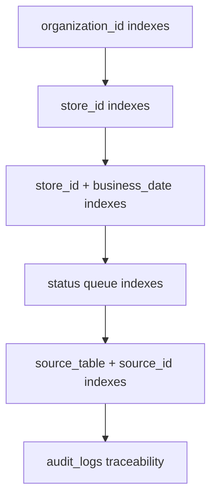

# Indexes and Constraints

## Purpose

This document defines required indexes and constraints for the DOYA OS v1.0 database.

It gives future migration authors a performance and integrity checklist without writing migrations yet.

## Problem

Operational systems fail when data integrity is pushed entirely into application code.

DOYA OS needs tenant isolation, store scope, business-date queries, role checks, queue filtering, and audit traceability to be fast and correct at the database level.

## Solution

Use predictable PostgreSQL indexes and constraints across all v1.0 tables.

## User

This document is for database engineers, backend engineers, Supabase policy authors, and AI coding agents.

## Entities

Applies to:

- `organizations`
- `brands`
- `stores`
- `staff`
- `roles`
- `permissions`
- `sop_tasks`
- `sop_task_instances`
- `closing_sessions`
- `closing_photo_submissions`
- `vision_reviews`
- `inventory_items`
- `inventory_inbound_batches`
- `inventory_daily_weights`
- `inventory_waste_logs`
- `inventory_predictions`
- `bonus_periods`
- `bonus_rules`
- `bonus_pool_snapshots`
- `personal_kpi_snapshots`
- `notifications`
- `audit_logs`

## Fields

Indexes and constraints should prioritize:

- UUID primary keys.
- Tenant boundaries.
- Store and business-date access.
- Status queues.
- Actor references.
- Source references.
- Active records excluding soft-deleted rows.

## Relationships

## Required Indexes

Global required index patterns:

| Pattern | Tables | Reason |
| --- | --- | --- |
| `id` primary key | all tables | Stable lookup. |
| `organization_id` | tenant-owned tables | RLS and admin views. |
| `store_id` | operational tables | Store-scoped queries. |
| `(store_id, business_date)` | daily operation tables | Dashboard and engine queries. |
| `(store_id, business_date, status)` | workflow tables | Review queues. |
| `(source_table, source_id)` | reviews, notifications, audit logs | Traceability. |
| partial active index | soft-delete tables | Hide deleted records efficiently. |

Table-specific required indexes:

| Table | Index |
| --- | --- |
| `organizations` | unique active `slug`. |
| `brands` | unique active `(organization_id, slug)`. |
| `stores` | unique active `(organization_id, code)`. |
| `staff` | unique `(organization_id, auth_user_id)` where auth exists. |
| `roles` | unique `(organization_id, key)` where active. |
| `permissions` | unique `key`. |
| `sop_task_instances` | `(store_id, business_date, assigned_role_id)`, `(store_id, business_date, status)`. |
| `closing_sessions` | unique `(store_id, business_date, area)`. |
| `closing_photo_submissions` | `(closing_session_id, category)`. |
| `vision_reviews` | `(store_id, business_date, status)`, `(source_table, source_id)`. |
| `inventory_daily_weights` | unique active `(store_id, business_date, inventory_item_id)`. |
| `inventory_predictions` | `(store_id, business_date, severity)`. |
| `bonus_periods` | unique `(store_id, period_start, period_end)`. |
| `personal_kpi_snapshots` | `(bonus_period_id, staff_id)`. |
| `notifications` | `(recipient_staff_id, status, created_at desc)`. |
| `audit_logs` | `(organization_id, created_at desc)`, `(source_table, source_id)`. |

## Constraints

Required integrity constraints:

- Foreign keys for all entity references.
- Status value checks for workflow tables.
- Quantity checks for inventory values.
- Date range checks for bonus periods.
- Confidence score range check for AI inspection.
- Organization consistency between parent and child records.
- Soft-delete unique indexes for active records.
- Append-only behavior for `audit_logs`.

## Audit Requirements

Constraints that fail due to attempted sensitive actions should be captured at the service layer as audit-worthy security events when relevant.

Audit logs should not depend on application-only best effort for core sensitive writes.

## RLS Considerations

RLS predicates require supporting indexes on:

- `organization_id`
- `store_id`
- staff assignment tables
- role assignment tables
- recipient staff and role fields for notifications

Without these indexes, RLS-safe queries can become slow under multi-store scale.

## Future SaaS Extensions

Future scale work may add:

- Partitioning by organization or business date.
- Audit log archival partitions.
- Read replicas for analytics.
- Materialized views for owner dashboards.
- Vector indexes for AI evidence search if documented later.

## Flow

1. Define entity relationships.
2. Define RLS predicate shape.
3. Add supporting indexes for predicate fields.
4. Add uniqueness and status constraints.
5. Add audit coverage for sensitive mutation paths.

## Architecture

Indexes and constraints are part of business correctness. They should be reviewed with schema changes, not added only after performance issues.

## Future Extension

Index strategy should be revisited after real query plans exist.

## Related Documents

- [Data Model Overview](./01_Data_Model_Overview.md)
- [Supabase RLS Policies](./12_Supabase_RLS_Policies.md)
- [Audit Log Model](./10_Audit_Log_Model.md)
