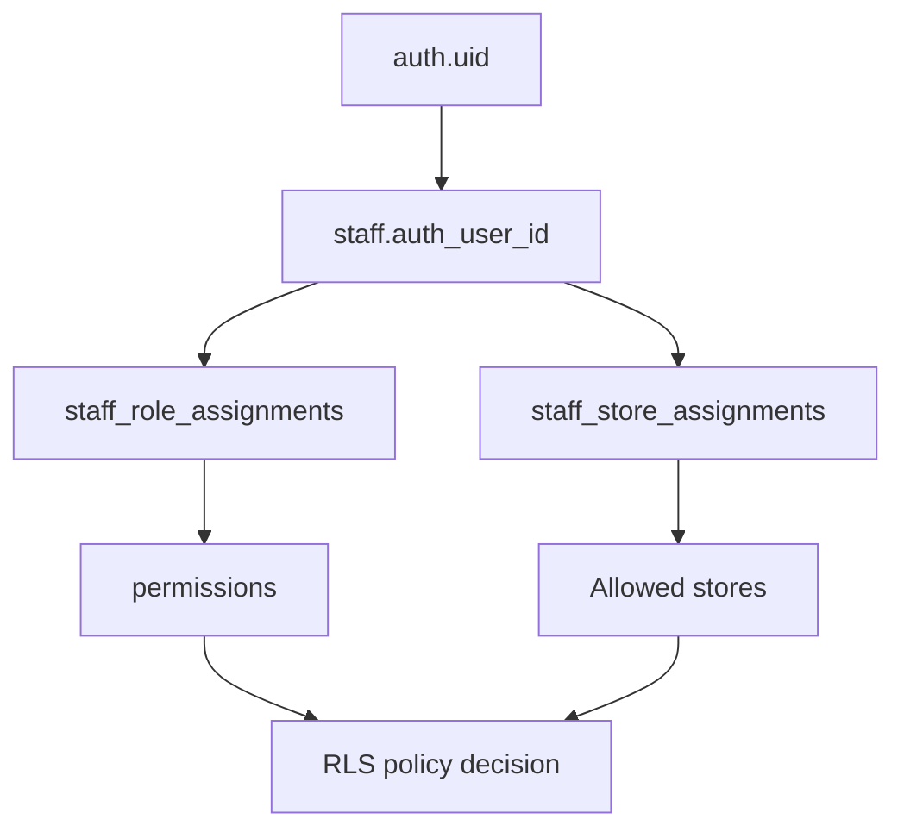

# Supabase RLS Policies

## Purpose

This document defines the Supabase Row Level Security policy design for DOYA OS v1.0.

It describes policy intent, role boundaries, and table access expectations without writing SQL policies yet.

## Problem

DOYA OS cannot rely on frontend route guards or API filtering alone.

Kitchen and Hall staff must not access manager review details. Managers must not see stores outside their assignment. Owners must see organization-wide data. Supabase RLS must enforce this at the database layer.

## Solution

Use RLS on every tenant-owned and operational table.

Policy evaluation should be based on:

- Supabase authenticated user.
- `staff.auth_user_id`.
- Active staff status.
- Active role assignments.
- Active store assignments.
- Table-specific operation.

## User

This document is for Supabase implementers, backend engineers, security reviewers, and AI coding agents.

## Entities

RLS applies to all v1.0 tables, including:

- `organizations`
- `brands`
- `stores`
- `staff`
- `roles`
- `permissions`
- `sop_tasks`
- `sop_task_instances`
- `closing_sessions`
- `closing_photo_submissions`
- `vision_reviews`
- `inventory_items`
- `inventory_inbound_batches`
- `inventory_daily_weights`
- `inventory_waste_logs`
- `inventory_predictions`
- `bonus_periods`
- `bonus_rules`
- `bonus_pool_snapshots`
- `personal_kpi_snapshots`
- `notifications`
- `audit_logs`

## Fields

RLS predicates depend on:

- `organization_id`
- `store_id`
- `staff_id`
- `recipient_staff_id`
- `recipient_role_id`
- `role_id`
- `status`
- `deleted_at`

## Relationships

## Required Indexes

RLS helper queries require:

- `staff(auth_user_id)`.
- `staff_role_assignments(staff_id, store_id, status)`.
- `staff_store_assignments(staff_id, store_id, status)`.
- `role_permissions(role_id, permission_id)`.
- Operational table indexes on `organization_id` and `store_id`.

## Constraints

RLS assumptions:

- Every authenticated user must map to one active staff record before accessing tenant data.
- Operational writes require active role assignment.
- Staff role must match target workflow.
- Deleted or inactive records should be hidden from normal client queries.

## Audit Requirements

Audit:

- Denied sensitive access attempts when detectable at service layer.
- RLS helper function changes.
- Role or permission changes.
- Service-role writes that bypass normal client RLS.

## RLS Considerations

Role policy summary:

| Role | Read access | Write access |
| --- | --- | --- |
| Owner | Organization, brands, stores, settings, reports, audit summaries. | Manage settings, roles, rules, owner decisions. |
| Manager | Assigned store operations, reviews, inventory, SOPs, notifications. | Correct, approve, reject, confirm within assigned store. |
| Kitchen | Own store kitchen tasks, inventory entries, kitchen closing submissions, own bonus share. | Create assigned kitchen entries and submissions. |
| Hall | Own store hall tasks, hall closing submissions, review target, own bonus share. | Create assigned hall checklist and closing submissions. |

Table policy guidance:

- `organizations`: Owner read; restricted writes.
- `brands`: Owner read/write; Manager read only when assigned store belongs to brand.
- `stores`: Owner all; Manager assigned; staff assigned minimal read.
- `staff`: Owner all; Manager assigned store read; staff own record.
- `roles`, `permissions`: Owner manage; Manager limited read; staff own assignment only.
- `sop_task_instances`: role-scoped read/write for assigned tasks.
- `closing_photo_submissions`: staff create own area; Manager review assigned store; Owner read.
- `inventory_*`: Kitchen create assigned entries; Manager manage assigned store; Owner read.
- `bonus_*`: Owner full; Manager store progress; staff own share only.
- `notifications`: recipient or manager/owner scope.
- `audit_logs`: Owner read; Manager operational store read; staff no direct browse.

## Future SaaS Extensions

- Brand-level manager role.
- Regional manager role.
- External auditor read-only role.
- Service accounts with scoped integration permissions.
- Tenant-specific policy overrides.

## Flow

1. User authenticates through Supabase.
2. RLS helper resolves `staff.id`.
3. Helper resolves active roles and store assignments.
4. Table policy checks organization, store, role, permission, and operation.
5. Query returns only permitted rows.

## Architecture

RLS should be considered a product behavior. It defines what each restaurant role can know and do.

Use service-role access only in trusted backend functions where audit logging is guaranteed.

## Future Extension

Future policies should be added through documented permission keys, not one-off role checks.

## Related Documents

- [RBAC Model](./03_RBAC_Model.md)
- [Multi-Tenant Model](./02_Multi_Tenant_Model.md)
- [Indexes and Constraints](./11_Indexes_And_Constraints.md)
- [Audit Log Model](./10_Audit_Log_Model.md)
