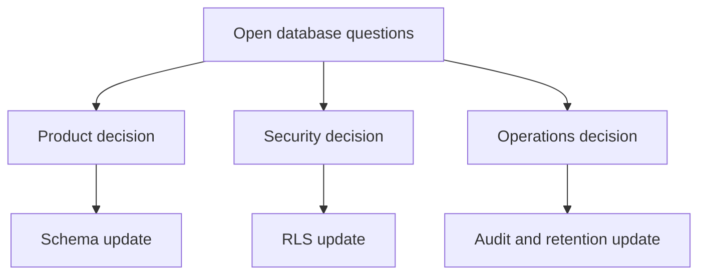

# Database Open Questions

## Purpose

This document records unresolved database architecture questions for DOYA OS v1.0.

It prevents schema assumptions from becoming hidden implementation decisions.

## Problem

The v1.0 database model is production-oriented, but several details require product, operations, security, and engineering decisions before migrations are written.

If these questions are skipped, the database may overfit early assumptions about stores, staff, AI evidence, bonus visibility, and retention.

## Solution

Open questions:

| Area | Question | Why it matters |
| --- | --- | --- |
| Tenant model | Is v1.0 one organization with one brand, or must multiple brands be active immediately? | Affects onboarding, RLS tests, and owner dashboard scope. |
| Staff identity | Can one Supabase auth user belong to multiple organizations? | Affects `staff.auth_user_id` uniqueness. |
| Roles | Can one staff member hold Kitchen and Hall roles in the same store? | Affects role assignment and task visibility. |
| Business date | Should business date be a dedicated table or plain `date` field for v1.0? | Affects close/reopen workflow and constraints. |
| Closing photos | What is the retention period for Supabase Storage objects? | Affects privacy, cost, and audit policy. |
| AI evidence | Should AI prompt/model versions be separate database tables in v1.0? | Affects AI Manager traceability. |
| Vision reviews | Should source references use polymorphic fields or separate foreign keys per domain? | Affects integrity versus flexibility. |
| Inventory units | Are unit conversions global, organization-specific, or item-specific? | Affects inventory calculations and constraints. |
| Bonus visibility | Can staff see personal share before bonus unlock? | Affects RLS policy and snapshot visibility. |
| Notifications | Are v1.0 notifications only in-app? | Affects notification delivery tables. |
| Audit logs | Should audit logs store full before/after state or minimal diffs? | Affects storage and privacy. |
| Soft delete | Which settings tables require restore behavior? | Affects deletion strategy. |

## User

This document is for product managers, database architects, backend engineers, security reviewers, and AI coding agents.

## Entities

Questions affect:

- `organizations`
- `brands`
- `stores`
- `staff`
- `roles`
- `sop_task_instances`
- `closing_photo_submissions`
- `vision_reviews`
- `inventory_items`
- `bonus_pool_snapshots`
- `personal_kpi_snapshots`
- `notifications`
- `audit_logs`

## Fields

Field-level decisions still requiring confirmation:

- `auth_user_id` uniqueness scope.
- `business_date` representation.
- AI `prompt_version` and `model_version` storage.
- `source_table` and `source_id` polymorphic references.
- `share_percentage` visibility.
- `before_state` and `after_state` audit detail.

## Relationships

## Required Indexes

Index questions:

- Whether `business_dates` should exist as an indexed entity.
- Whether `vision_reviews(source_table, source_id)` is sufficient for all review lookups.
- Whether audit logs need partitioning before v1.0 launch.

## Constraints

Constraint questions:

- Whether polymorphic source references should be replaced with strict foreign keys in high-risk domains.
- Whether staff can have multiple active role assignments in one store.
- Whether bonus rules can change during an active period.

## Audit Requirements

Unresolved audit questions:

- Retention period.
- Full state versus minimal diff.
- Visibility to managers.
- Export requirements.
- Handling service-role writes.

## RLS Considerations

Unresolved RLS questions:

- Whether external auditors exist in v1.0.
- Whether owners can delegate organization-wide read access.
- Whether managers can view audit logs for staff actions outside their shifts.
- Whether staff can see historical personal KPI snapshots after deactivation.

## Future SaaS Extensions

These questions should be resolved before:

- Multi-brand onboarding.
- Multi-organization user access.
- External integrations.
- Audit export.
- Payroll or accounting extensions.

## Flow

1. Identify the affected model.
2. Resolve the decision with product, operations, backend, and security.
3. Update this document.
4. Update the relevant model document.
5. Record major decisions in `docs/decisions/`.
6. Write migrations only after documentation is updated.

## Architecture

Open questions are architecture work, not missing implementation details. They should be resolved before schema migrations depend on a behavior.

## Future Extension

This document should shrink as decisions are made and expand only when new database-affecting scope is introduced.

## Related Documents

- [Database Architecture](./README.md)
- [Data Model Overview](./01_Data_Model_Overview.md)
- [Supabase RLS Policies](./12_Supabase_RLS_Policies.md)
- [UX Open Questions](../03_UX/15_Open_Questions.md)
- [Vision Bible Review Summary](../00_Vision/00_Review_Summary.md)
