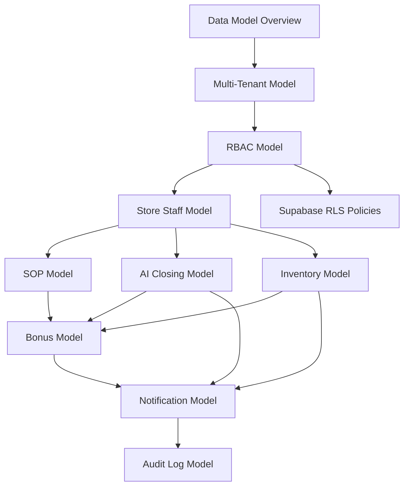

# DOYA OS Database Architecture

## Purpose

This section defines the DOYA OS v1.0 database architecture.

It translates the Vision Bible, UX Architecture, and Engine Architecture into PostgreSQL/Supabase data models. It is documentation only. It does not define SQL migrations or application code.

## Problem

DOYA OS depends on trustworthy operational data: tenant boundaries, store scope, role permissions, SOP execution, AI inspection, inventory signals, bonus state, notifications, and audit history.

If the database is designed as isolated feature tables, the system will lose operational meaning. If tenant and role boundaries are added later, Supabase Row Level Security will be difficult to apply safely.

## Solution

The v1.0 database architecture uses:

- UUID primary keys.
- Multi-tenant organization, brand, and store hierarchy.
- Role-based access control for Owner, Manager, Kitchen, and Hall.
- Store-scoped operational records.
- Business-date aware workflow tables.
- Soft-delete strategy where operational history must be retained.
- Audit logs for operationally sensitive actions.
- Supabase Row Level Security as a first-class design constraint.

## User

This documentation is for:

- Database architects.
- Backend engineers.
- Supabase implementers.
- Security reviewers.
- Product managers validating data ownership.
- AI coding agents generating future schema and policies.

## Flow

Read this section in order:

1. [Data Model Overview](./01_Data_Model_Overview.md)
2. [Multi-Tenant Model](./02_Multi_Tenant_Model.md)
3. [RBAC Model](./03_RBAC_Model.md)
4. [Store Staff Model](./04_Store_Staff_Model.md)
5. [AI Closing Model](./05_AI_Closing_Model.md)
6. [Inventory Model](./06_Inventory_Model.md)
7. [Bonus Model](./07_Bonus_Model.md)
8. [SOP Model](./08_SOP_Model.md)
9. [Notification Model](./09_Notification_Model.md)
10. [Audit Log Model](./10_Audit_Log_Model.md)
11. [Indexes and Constraints](./11_Indexes_And_Constraints.md)
12. [Supabase RLS Policies](./12_Supabase_RLS_Policies.md)
13. [Open Questions](./13_Open_Questions.md)

## Architecture

The database is designed around operational ownership:

- `organizations` own brands and stores.
- `brands` group stores under a restaurant brand.
- `stores` scope daily operations.
- `staff`, `roles`, and `permissions` define access.
- Operational tables include `organization_id`, `store_id`, or both when needed for RLS.
- Sensitive state transitions write to `audit_logs`.

## Future Extension

Future versions may add POS integration, attendance, payroll, accounting, supplier ordering, delivery platform data, and multi-region franchise controls.

Those domains are excluded from v1.0 and should not be pre-modeled beyond extension-safe foreign keys and audit patterns.

## Related Documents

- [Documentation Style Guide](../STYLE_GUIDE.md)
- [Vision Bible](../00_Vision/README.md)
- [UX Architecture Bible](../03_UX/README.md)
- [Engine Architecture](../04_Engines/README.md)
- [Supabase RLS Policies](./12_Supabase_RLS_Policies.md)
