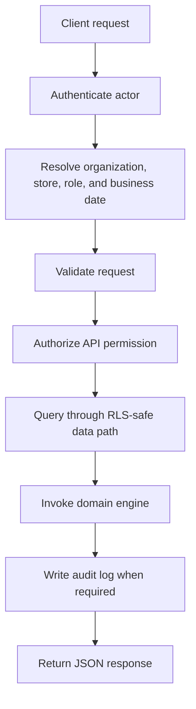

# API Principles

## Purpose

This document defines the API design principles for DOYA OS v1.0.

It explains how APIs should behave before implementation begins so future services, routes, and clients remain consistent.

## Problem

DOYA OS APIs will support restaurant operations during live service. Ambiguous contracts can cause duplicate writes, unsafe AI state transitions, role leaks, and inconsistent audit trails.

The API must be predictable enough for frontend engineers and AI coding agents to implement without guessing.

## Solution

Use REST-first JSON APIs with explicit resource ownership, clear mutation semantics, and consistent envelopes.

Rules:

- Model API paths around product resources, not UI components.
- Use plural resource names.
- Use UUID path identifiers.
- Use ISO 8601 timestamps.
- Use `businessDate` for restaurant operating date.
- Use cursor pagination for list endpoints.
- Use a consistent error envelope for all failures.
- Treat every operational mutation as audit-worthy.
- Treat every AI workflow as async unless it is explicitly documented as read-only.
- Enforce RBAC in the API layer and RLS in the database layer.

## User

This document is for backend engineers, frontend engineers, API reviewers, AI engineers, and AI coding agents.

## Flow



The API layer does not replace engine logic or database security. It coordinates them.

## Architecture

### Base contract

All v1.0 examples assume this shape:

```text
/api/v1/{domain}/{resource}
```

The final deployment path may vary, but the versioned domain contract must remain stable.

### Resource identity

All persisted resources use UUIDs:

```json
{
  "id": "7a3ce73e-9b2b-4e89-9b7e-89f5c39bb91a"
}
```

### Time and dates

Use:

- `createdAt`, `updatedAt`, `submittedAt`, `generatedAt` as ISO 8601 timestamps.
- `businessDate` as `YYYY-MM-DD`.
- Server time as the source of truth for audit and workflow transitions.

### Mutations

Operational mutations must:

- Validate actor permission.
- Validate store scope.
- Validate state transition.
- Write or trigger audit logging.
- Return the resulting resource or accepted async job.

### Idempotency

Idempotency is required for upload, submit, and async job creation endpoints that a mobile or restaurant-floor device may retry.

Clients should send:

```text
Idempotency-Key: client-generated-uuid
```

The API should return the first successful result for duplicate safe retries.

## Future Extension

Future API principles may add webhooks, external service tokens, public integration scopes, OpenAPI-generated clients, and long-running export jobs.

These extensions must preserve tenant isolation, role scope, and auditability.

## Related Documents

- [Authentication and RBAC](./02_Authentication_And_RBAC.md)
- [Error Model](./03_Error_Model.md)
- [Pagination, Filtering, and Sorting](./04_Pagination_Filtering_Sorting.md)
- [Supabase RLS Policies](../05_Database/12_Supabase_RLS_Policies.md)
