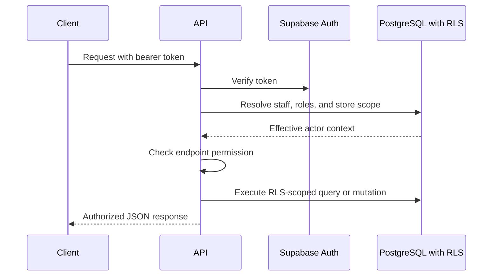

# Authentication and RBAC

## Purpose

This document defines API authentication and role-based authorization for DOYA OS v1.0.

It explains how requests identify the actor, organization, store scope, and allowed operation.

## Problem

Frontend route guards are not security.

Kitchen and Hall staff must not access manager review queues, owner decisions, settings, audit logs, or other staff data through direct API calls. Managers must be limited to assigned stores. Owners need organization-wide visibility.

## Solution

Use authenticated Supabase users mapped to `staff` records and active role assignments.

Authorization runs in two layers:

- API layer checks the endpoint permission, role, store, and state transition.
- Database RLS filters and rejects data access at the table layer.

## User

This document is for backend engineers, Supabase implementers, frontend engineers, security reviewers, and AI coding agents.

## Flow

## Architecture

### Actor context

Every request must resolve:

| Field | Meaning |
| --- | --- |
| `actorStaffId` | Authenticated staff record. |
| `organizationId` | Tenant boundary. |
| `storeIds` | Stores the actor can access. |
| `roleKeys` | Effective roles such as `OWNER`, `MANAGER`, `KITCHEN`, `HALL`. |
| `permissionKeys` | Effective permission set. |

### Role summary

| Role | API access |
| --- | --- |
| Owner | Organization, store, reports, settings, bonus rules, audit summaries, owner decisions. |
| Manager | Assigned store operations, closing review, inventory correction, SOP review, notifications. |
| Kitchen | Assigned kitchen SOPs, kitchen closing submissions, inventory entries, own bonus share. |
| Hall | Assigned hall SOPs, hall closing submissions, review target, own bonus share. |

### Service actor

AI jobs, rule evaluation, notification routing, and audit inserts may require trusted service access.

Service access must:

- Be unavailable to browser clients.
- Use narrow internal permissions.
- Preserve source actor when the job was triggered by a human.
- Write audit records for sensitive changes.

## Future Extension

Future versions may add brand-level roles, regional managers, external auditors, supplier users, and integration service accounts.

New roles must be permission-based and must not bypass RLS.

## Related Documents

- [RBAC Model](../05_Database/03_RBAC_Model.md)
- [Supabase RLS Policies](../05_Database/12_Supabase_RLS_Policies.md)
- [Audit Log API](./13_Audit_Log_API.md)
