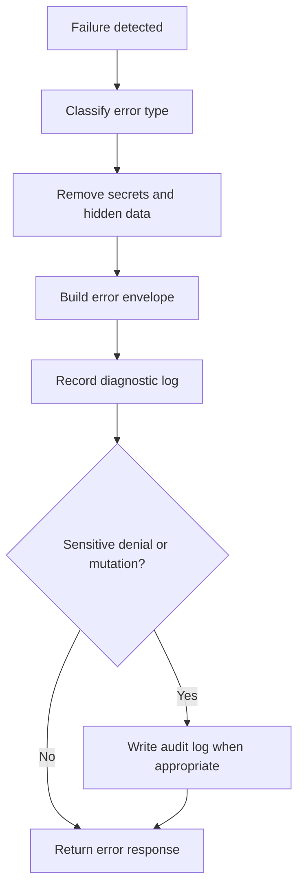

# Error Model

## Purpose

This document defines the DOYA OS API error model.

It gives clients a consistent way to display failures, retry safe operations, and preserve diagnostic context.

## Problem

Operational workflows fail for different reasons: invalid state, missing evidence, denied role access, duplicate submissions, AI job failures, and database constraints.

If each endpoint returns errors differently, restaurant staff will see confusing messages and engineers will lose observability.

## Solution

All API failures use a consistent JSON error envelope.

```json
{
  "error": {
    "code": "closing_submission_missing_photo",
    "message": "A required closing photo is missing.",
    "details": {
      "category": "refrigerator"
    },
    "requestId": "req_01HZY2Y8M9YBT9G84G5C3A1P6W",
    "timestamp": "2026-06-28T10:15:30Z"
  }
}
```

## User

This document is for backend engineers, frontend engineers, QA reviewers, support operators, and AI coding agents.

## Flow



## Architecture

### HTTP status guidance

| Status | Use |
| --- | --- |
| `400` | Invalid request shape or unsupported parameter. |
| `401` | Missing or invalid authentication. |
| `403` | Authenticated actor lacks permission. |
| `404` | Resource not found or not visible to actor. |
| `409` | State conflict, duplicate submission, or version conflict. |
| `422` | Domain validation failure. |
| `429` | Rate limit exceeded. |
| `500` | Unexpected server failure. |
| `503` | Dependency unavailable, including AI processing dependency. |

### Error code rules

Error codes must be:

- Stable.
- Lowercase snake case.
- Specific to the failure.
- Safe to expose to clients.

### Validation errors

Field-level validation uses `details.fields`:

```json
{
  "error": {
    "code": "validation_failed",
    "message": "The request contains invalid fields.",
    "details": {
      "fields": {
        "businessDate": "Must be a valid YYYY-MM-DD date.",
        "quantity": "Must be greater than or equal to zero."
      }
    },
    "requestId": "req_01HZY2Y8M9YBT9G84G5C3A1P6W",
    "timestamp": "2026-06-28T10:15:30Z"
  }
}
```

## Future Extension

Future versions may add localized client messages, machine-readable remediation actions, and structured support diagnostics.

The public envelope must remain stable.

## Related Documents

- [API Principles](./01_API_Principles.md)
- [Pagination, Filtering, and Sorting](./04_Pagination_Filtering_Sorting.md)
- [Audit Log API](./13_Audit_Log_API.md)
