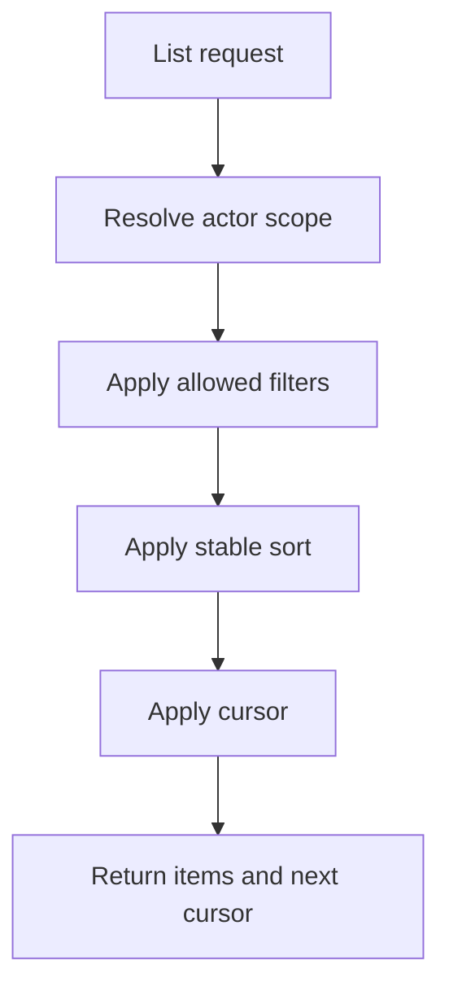

# Pagination, Filtering, and Sorting

## Purpose

This document defines pagination, filtering, and sorting conventions for DOYA OS APIs.

It ensures list endpoints remain fast, stable, and safe under multi-store SaaS growth.

## Problem

Restaurant operations create many time-based records: notifications, submissions, inventory entries, audit logs, alerts, and task instances.

Offset pagination can become slow and inconsistent as records are inserted during service. Filters can also leak data if they are applied before authorization.

## Solution

Use cursor-based pagination for list endpoints.

Filtering and sorting must happen inside the authorized organization and store scope. Clients cannot expand scope by changing filters.

## User

This document is for backend engineers, frontend engineers, database engineers, and AI coding agents.

## Flow



## Architecture

### Query parameters

Standard list parameters:

| Parameter | Meaning |
| --- | --- |
| `limit` | Maximum number of records. Default `25`, maximum `100`. |
| `cursor` | Opaque cursor returned by the previous response. |
| `sort` | Stable sort key, usually `createdAt` or `businessDate`. |
| `direction` | `asc` or `desc`. Default depends on endpoint. |
| `storeId` | Optional store filter when actor can access multiple stores. |
| `businessDate` | Optional operating date filter. |
| `status` | Optional workflow status filter. |

### Response shape

```json
{
  "data": [
    {
      "id": "b1e6be85-20a1-4d9f-b973-25c9dc9f4729"
    }
  ],
  "page": {
    "limit": 25,
    "nextCursor": "opaque_cursor_value",
    "hasMore": true
  }
}
```

### Cursor rules

Cursor values must be:

- Opaque to clients.
- Bound to the effective filter and sort shape.
- Stable when records are inserted after the current page.
- Invalidated with a clear `400` error when filter or sort does not match.

### Sorting rules

Sorts must include a stable tie-breaker, usually `id`.

Recommended sort defaults:

| Resource | Default sort |
| --- | --- |
| Notifications | `createdAt desc` |
| Audit logs | `createdAt desc` |
| Closing history | `businessDate desc` |
| Inventory entries | `businessDate desc` |
| SOP tasks | `businessDate asc`, then required task order |

## Future Extension

Future versions may add saved filters, server-defined views, export jobs, and analytics query endpoints.

These should use separate contracts rather than overloading operational list APIs.

## Related Documents

- [API Principles](./01_API_Principles.md)
- [Error Model](./03_Error_Model.md)
- [Indexes and Constraints](../05_Database/11_Indexes_And_Constraints.md)
