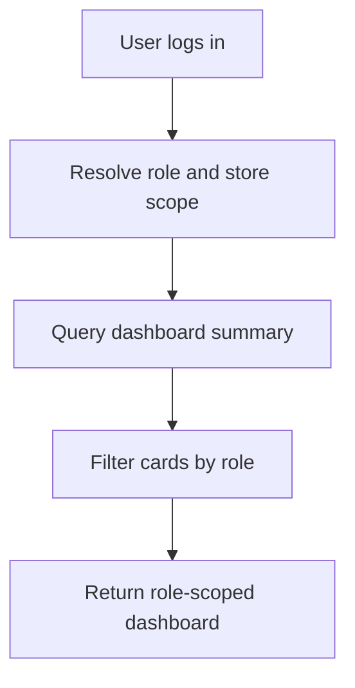

# Dashboard API

## Purpose

This document defines the Dashboard API for DOYA OS v1.0.

The Dashboard API returns the role-scoped operating summary that each user sees after login.

## Problem

Dashboard data can easily become a generic KPI surface. DOYA OS must avoid that.

Owners need decision context. Managers need today's operational queues. Staff need only tasks, required actions, pass or fail status, store level progress, and personal share visibility when applicable.

## Solution

Expose dashboard endpoints that aggregate engine outputs without exposing hidden role data.

## User

Primary users:

- Owner.
- Manager.
- Kitchen staff.
- Hall staff.

## Primary Users

| Role | Dashboard purpose |
| --- | --- |
| Owner | Decide what needs attention across store health, AI alerts, inventory risk, and bonus unlock. |
| Manager | Correct failed inspections, inventory exceptions, and incomplete tasks. |
| Kitchen | Execute today's kitchen tasks and see status. |
| Hall | Execute today's hall tasks and see status. |

## Required Endpoints

| Method | Endpoint | Purpose |
| --- | --- | --- |
| `GET` | `/dashboard` | Return role-scoped dashboard summary. |
| `GET` | `/dashboard/today` | Return today's operating state for the active role. |
| `GET` | `/dashboard/store-health` | Return owner and manager store health summary. |
| `GET` | `/dashboard/action-queue` | Return required actions for the actor. |

## Request Shape

```text
GET /dashboard?storeId={uuid}&businessDate=2026-06-28
```

Fields:

| Field | Required | Notes |
| --- | --- | --- |
| `storeId` | Required when actor can access multiple stores | Must be visible to actor. |
| `businessDate` | Optional | Defaults to current store business date. |

## Response Shape

```json
{
  "data": {
    "storeId": "2d0d19a5-1f0f-4c1f-b890-8f6d54cf8d02",
    "businessDate": "2026-06-28",
    "role": "MANAGER",
    "summary": {
      "closingStatus": "review_required",
      "inventoryRisk": "warning",
      "bonusUnlockStatus": "blocked",
      "openActionCount": 4
    },
    "cards": [
      {
        "key": "failed_closing_reviews",
        "title": "Failed closing reviews",
        "status": "action_required",
        "count": 2,
        "target": "/ai-closing/human-review"
      }
    ],
    "generatedAt": "2026-06-28T10:15:30Z"
  }
}
```

## Authorization Rules

- Owner can view dashboards for all stores in the organization.
- Manager can view assigned store dashboards.
- Kitchen can view only kitchen task and status cards for assigned store.
- Hall can view only hall task and status cards for assigned store.
- Hidden dashboard cards must not be returned, even if the frontend route is unavailable.

## Validation Rules

- `storeId` must be a UUID.
- `businessDate` must be a valid operating date.
- Actor must have active staff status.
- Actor must have access to the requested store.

## Side Effects

Read endpoints do not mutate operational state.

The API may record non-sensitive access telemetry outside the audit log when observability is implemented.

## Error Cases

| Code | Meaning |
| --- | --- |
| `dashboard_store_not_visible` | Actor cannot access requested store. |
| `dashboard_business_date_invalid` | Business date is malformed or outside supported range. |
| `dashboard_context_unavailable` | Required engine summary is unavailable. |

## Audit Requirements

Dashboard reads are not audited by default.

Audit is required if a future owner decision is recorded from the dashboard.

## Rate Limiting Considerations

- Dashboard refreshes should be rate limited by actor and store.
- Staff dashboard refreshes may be more frequent during operations.
- Owner multi-store summaries should use stricter limits and cached engine snapshots.

## Flow



## Architecture

The Dashboard API reads from SOP, AI Closing, Inventory, Bonus, AI Manager, Notification, and Vision-style summaries. It should not contain business rules that belong in engines.

## Future Extension

- Multi-store owner dashboard.
- Saved owner decision queue.
- Dashboard materialized views.
- Cross-store health comparison.

## Related Documents

- [UX Dashboard](../03_UX/08_Dashboard.md)
- [AI Manager API](./06_AI_Manager_API.md)
- [AI Closing API](./07_AI_Closing_API.md)
- [Inventory API](./08_Inventory_API.md)
- [Bonus API](./09_Bonus_API.md)
