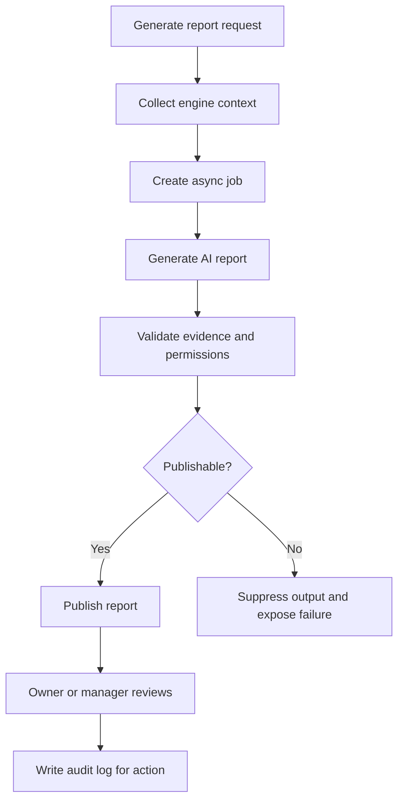

# AI Manager API

## Purpose

This document defines the AI Manager API for DOYA OS v1.0.

The AI Manager API exposes daily reports, alerts, recommendations, evidence, and async generation status.

## Problem

AI output is unsafe when it is detached from evidence, prompt version, source records, review state, and permissions.

The API must make AI Manager useful without turning it into an autonomous operator or generic chatbot.

## Solution

Expose AI Manager as a reviewable report and recommendation system.

AI generation is async. Human users review, assign, accept, reject, or record decisions. Material actions are audited.

## User

Primary users:

- Owner.
- Manager.
- AI service actor.

## Primary Users

| Role | API use |
| --- | --- |
| Owner | Review report, alerts, recommendations, and decision-required items. |
| Manager | Review alerts and assign corrective actions. |
| Service | Generate reports and persist AI output lifecycle. |

## Required Endpoints

| Method | Endpoint | Purpose |
| --- | --- | --- |
| `GET` | `/ai-manager/daily-report` | Return the daily report for a store and business date. |
| `POST` | `/ai-manager/daily-report/generate` | Start async report generation. |
| `GET` | `/ai-manager/jobs/{jobId}` | Return async generation status. |
| `GET` | `/ai-manager/alerts` | List AI Manager alerts. |
| `GET` | `/ai-manager/recommendations` | List recommendations. |
| `GET` | `/ai-manager/evidence/{id}` | Return evidence bundle visible to actor. |
| `POST` | `/ai-manager/recommendations/{id}/accept` | Record accepted recommendation. |
| `POST` | `/ai-manager/recommendations/{id}/reject` | Record rejected recommendation. |
| `POST` | `/ai-manager/recommendations/{id}/assign-action` | Assign action to a role or staff member. |
| `POST` | `/ai-manager/alerts/{id}/mark-reviewed` | Mark alert as reviewed. |

## Request Shape

Report query:

```text
GET /ai-manager/daily-report?storeId={uuid}&businessDate=2026-06-28
```

Generation request:

```json
{
  "storeId": "2d0d19a5-1f0f-4c1f-b890-8f6d54cf8d02",
  "businessDate": "2026-06-28",
  "reason": "manager_requested_refresh"
}
```

Assign action request:

```json
{
  "assigneeType": "role",
  "assigneeRole": "MANAGER",
  "dueAt": "2026-06-28T18:00:00Z",
  "instructions": "Review refrigerator closing failures before end of day."
}
```

## Response Shape

Async generation response:

```json
{
  "data": {
    "jobId": "6c49fd74-6922-490c-bc41-c65ba5c28f33",
    "status": "queued",
    "submittedAt": "2026-06-28T10:15:30Z"
  }
}
```

Job status response:

```json
{
  "data": {
    "jobId": "6c49fd74-6922-490c-bc41-c65ba5c28f33",
    "status": "completed",
    "resultId": "71634453-7c86-4a0b-9aa7-794b582d53a7",
    "promptVersion": "ai-manager-daily-v1",
    "modelVersion": "documented-at-runtime",
    "completedAt": "2026-06-28T10:16:12Z"
  }
}
```

Daily report response:

```json
{
  "data": {
    "id": "71634453-7c86-4a0b-9aa7-794b582d53a7",
    "storeId": "2d0d19a5-1f0f-4c1f-b890-8f6d54cf8d02",
    "businessDate": "2026-06-28",
    "status": "published",
    "summary": "Closing review requires manager action. Inventory reorder risk is elevated.",
    "alerts": [],
    "recommendations": [],
    "generatedAt": "2026-06-28T10:16:12Z"
  }
}
```

## Authorization Rules

- Owner can read all reports, alerts, recommendations, and evidence for organization stores.
- Manager can read and act on assigned store reports.
- Kitchen and Hall cannot access AI Manager endpoints in v1.0.
- Service actors may generate and write AI outputs through trusted backend paths only.

## Validation Rules

- `storeId` and path IDs must be UUIDs.
- `businessDate` must be valid.
- Recommendation action must be allowed for actor role.
- Evidence returned must be visible under actor scope.
- AI generation must reference available source context.

## Side Effects

- Report generation creates an async job.
- Accept, reject, assign action, and mark reviewed mutate review state.
- Mutations may create notifications.
- Mutations must write audit logs.

## Error Cases

| Code | Meaning |
| --- | --- |
| `ai_manager_context_missing` | Required engine context is unavailable. |
| `ai_manager_job_in_progress` | A generation job already exists for the same scope. |
| `ai_manager_evidence_not_visible` | Actor cannot access evidence source. |
| `ai_manager_action_not_allowed` | Recommendation action is not permitted. |
| `ai_manager_generation_failed` | Async AI generation failed. |

## Audit Requirements

Audit:

- Report generation requested by a human.
- Recommendation accepted or rejected.
- Action assigned from a recommendation.
- Owner decision recorded from a recommendation.
- Service-role writes that publish or suppress AI output.

## Rate Limiting Considerations

- Generation endpoint must be rate limited by store and business date.
- List endpoints use standard pagination.
- Evidence reads should be limited to prevent bulk extraction.

## Flow



## Architecture

The API coordinates the AI Manager Engine. It does not embed prompt logic or autonomous business decisions in request handlers.

All AI outputs must preserve prompt version, model version, source references, review state, and evidence visibility.

## Future Extension

- Conversational owner briefing.
- Multi-store owner rollups.
- AI quality evaluation endpoints.
- Recommendation simulation before assignment.

## Related Documents

- [AI Manager Engine](../04_Engines/05_AI_Manager_Engine.md)
- [UX AI Manager](../03_UX/12_AI_Manager.md)
- [Error Model](./03_Error_Model.md)
- [Audit Log API](./13_Audit_Log_API.md)
