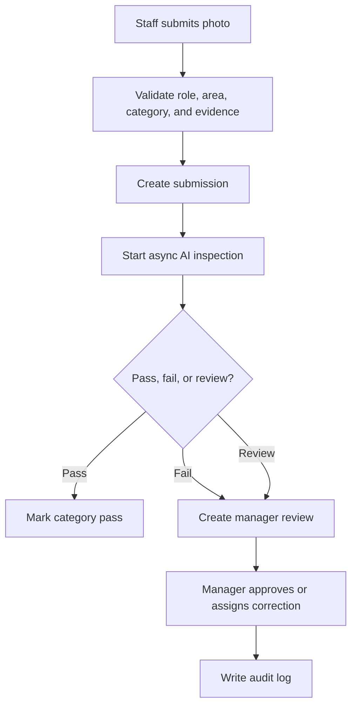

# AI Closing API

## Purpose

This document defines the AI Closing API for DOYA OS v1.0.

It supports closing tasks, photo submissions, async AI inspection, manager review, corrective action, and closing history.

## Problem

Closing cannot be trusted if staff only mark tasks complete. Photo evidence helps, but AI inspection must be reviewable and stateful.

The API must support fast staff submission during operations while preserving manager review and owner traceability.

## Solution

Use explicit closing resources for tasks, submissions, inspection jobs, human reviews, and history.

AI inspection is async. Staff can poll submission or job status. Managers handle fail and review-required states.

## User

Primary users:

- Kitchen staff.
- Hall staff.
- Manager.
- Owner.
- AI service actor.

## Primary Users

| Role | API use |
| --- | --- |
| Kitchen | Submit kitchen closing evidence and resubmissions. |
| Hall | Submit hall closing evidence and resubmissions. |
| Manager | Approve, reject, and assign re-cleaning. |
| Owner | Review closing history and unresolved risk. |

## Required Endpoints

| Method | Endpoint | Purpose |
| --- | --- | --- |
| `GET` | `/ai-closing/tasks` | Return assigned closing categories for actor. |
| `POST` | `/ai-closing/submissions` | Submit closing evidence and start async inspection. |
| `GET` | `/ai-closing/submissions/{id}` | Return submission and inspection state. |
| `GET` | `/ai-closing/inspection-jobs/{jobId}` | Return AI inspection job status. |
| `POST` | `/ai-closing/reviews/{id}/approve` | Approve pass or exception. |
| `POST` | `/ai-closing/reviews/{id}/reject` | Reject and require correction. |
| `POST` | `/ai-closing/reviews/{id}/assign-correction` | Assign re-cleaning or corrective action. |
| `GET` | `/ai-closing/history` | List closing sessions and outcomes. |

## Request Shape

Task query:

```text
GET /ai-closing/tasks?storeId={uuid}&businessDate=2026-06-28&area=kitchen
```

Submission request:

```json
{
  "storeId": "2d0d19a5-1f0f-4c1f-b890-8f6d54cf8d02",
  "businessDate": "2026-06-28",
  "area": "kitchen",
  "category": "refrigerator",
  "photo": {
    "storagePath": "stores/2d0d19a5/closing/2026-06-28/refrigerator.jpg",
    "contentType": "image/jpeg"
  }
}
```

Review rejection request:

```json
{
  "reason": "Visible residue remains on the refrigerator shelf.",
  "correctionInstructions": "Clean the shelf again and resubmit a photo before close."
}
```

## Response Shape

Submission response:

```json
{
  "data": {
    "submissionId": "67a18cbe-f9b0-43a2-84e8-402fa1f750c8",
    "inspectionJobId": "93d45a93-97c7-48af-a370-c8b94de1ab42",
    "aiStatus": "pending",
    "submittedAt": "2026-06-28T14:05:00Z"
  }
}
```

Inspection status response:

```json
{
  "data": {
    "jobId": "93d45a93-97c7-48af-a370-c8b94de1ab42",
    "status": "completed",
    "result": "review_required",
    "confidence": 0.72,
    "reason": "Photo quality is insufficient for a reliable pass.",
    "completedAt": "2026-06-28T14:05:18Z"
  }
}
```

## Authorization Rules

- Kitchen can submit only kitchen closing categories for assigned store.
- Hall can submit only hall closing categories for assigned store.
- Manager can review assigned store submissions.
- Owner can read closing history across organization stores.
- Staff cannot read manager notes unless exposed through task status.

## Validation Rules

- `area` must be `kitchen` or `hall`.
- `category` must belong to the selected area.
- `storagePath` must belong to allowed storage scope.
- A submission must reference the active business date unless manager override is documented.
- Duplicate submissions use idempotency semantics or return conflict.
- Review state transitions must follow the AI Closing Engine state machine.

## Side Effects

- Submitting evidence creates a closing photo submission.
- Submission starts an async inspection job.
- AI result may create a human review record.
- Review actions may create notifications and corrective actions.
- Operational mutations write audit logs.

## Error Cases

| Code | Meaning |
| --- | --- |
| `closing_task_not_assigned` | Actor is not assigned to the requested closing category. |
| `closing_invalid_category` | Category does not match area or v1.0 scope. |
| `closing_submission_duplicate` | Active submission already exists. |
| `closing_inspection_unavailable` | AI inspection service is unavailable. |
| `closing_review_state_conflict` | Review action does not match current state. |

## Audit Requirements

Audit:

- AI fail changed by manager review.
- Approval or rejection.
- Correction assignment.
- Late submission after manager confirmation.
- Owner decision based on closing outcome.

## Rate Limiting Considerations

- Submission endpoint must limit repeated upload attempts by actor, store, category, and business date.
- Inspection status polling should use short-term rate limits.
- History endpoint uses cursor pagination.

## Flow



## Architecture

The AI Closing API coordinates storage, AI inspection orchestration, human review, notifications, and audit logging. It must keep evidence and review decisions traceable.

## Future Extension

- Video evidence.
- Offline upload queue.
- Equipment-specific inspection categories.
- Cross-store closing quality trends.

## Related Documents

- [AI Closing Engine](../04_Engines/02_AI_Closing_Engine.md)
- [AI Closing Model](../05_Database/05_AI_Closing_Model.md)
- [UX AI Closing](../03_UX/09_AI_Closing.md)
- [Notification API](./12_Notification_API.md)
