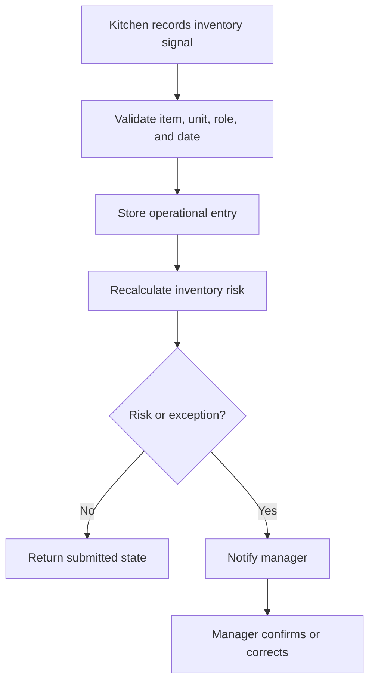

# Inventory API

## Purpose

This document defines the Inventory API for DOYA OS v1.0.

It supports inventory items, inbound stock, daily weights, waste logs, burn-rate summaries, reorder alerts, and manager exception handling.

## Problem

Inventory data must be fast for kitchen staff to enter and structured enough for managers and owners to trust.

The API must avoid becoming accounting, ERP, or supplier ordering in v1.0.

## Solution

Expose operational inventory endpoints around staff entries and manager review.

The Inventory Engine performs deterministic calculations. AI may summarize risk, but the API must expose source records and manager confirmation state.

## User

Primary users:

- Kitchen staff.
- Manager.
- Owner.
- AI Manager and Inventory Engine service actors.

## Primary Users

| Role | API use |
| --- | --- |
| Kitchen | Record daily weights, inbound stock, and waste. |
| Manager | Confirm and correct entries and exceptions. |
| Owner | Read inventory risk and reorder alerts. |

## Required Endpoints

| Method | Endpoint | Purpose |
| --- | --- | --- |
| `GET` | `/inventory/items` | List active inventory items visible to actor. |
| `POST` | `/inventory/inbound-stock` | Record inbound stock. |
| `POST` | `/inventory/daily-weight` | Record daily item weight. |
| `POST` | `/inventory/waste-log` | Record waste quantity and reason. |
| `GET` | `/inventory/burn-rate` | Return burn-rate summaries. |
| `GET` | `/inventory/reorder-alerts` | Return reorder and risk alerts. |
| `POST` | `/inventory/exceptions/{id}/confirm` | Confirm an exception. |
| `POST` | `/inventory/exceptions/{id}/correct` | Correct source data for an exception. |

## Request Shape

Daily weight request:

```json
{
  "storeId": "2d0d19a5-1f0f-4c1f-b890-8f6d54cf8d02",
  "businessDate": "2026-06-28",
  "inventoryItemId": "e7792657-7b3a-4562-93ef-64cc0cd652a6",
  "quantity": 18.5,
  "unit": "kg",
  "recordedAt": "2026-06-28T09:30:00Z",
  "notes": "Morning opening count."
}
```

Waste log request:

```json
{
  "storeId": "2d0d19a5-1f0f-4c1f-b890-8f6d54cf8d02",
  "businessDate": "2026-06-28",
  "inventoryItemId": "e7792657-7b3a-4562-93ef-64cc0cd652a6",
  "quantity": 1.2,
  "unit": "kg",
  "reason": "prep_error"
}
```

## Response Shape

Entry response:

```json
{
  "data": {
    "id": "80b0a843-cf8f-4dbe-93e3-f1e0bb6c457c",
    "status": "submitted",
    "businessDate": "2026-06-28",
    "createdAt": "2026-06-28T09:30:10Z"
  }
}
```

Reorder alert response:

```json
{
  "data": [
    {
      "id": "f6d0d3cc-62f7-4b2f-bc6a-3575e76322b7",
      "inventoryItemId": "e7792657-7b3a-4562-93ef-64cc0cd652a6",
      "severity": "warning",
      "projectedDaysRemaining": 1.8,
      "sourceRecordIds": [
        "80b0a843-cf8f-4dbe-93e3-f1e0bb6c457c"
      ],
      "generatedAt": "2026-06-28T10:15:30Z"
    }
  ],
  "page": {
    "limit": 25,
    "nextCursor": null,
    "hasMore": false
  }
}
```

## Authorization Rules

- Owner can read inventory summaries and risk across organization stores.
- Manager can read, confirm, and correct assigned store inventory records.
- Kitchen can create inbound stock, daily weight, and waste entries for assigned store.
- Hall has no inventory access in v1.0.

## Validation Rules

- Quantities must be greater than or equal to zero.
- `unit` must be supported by the inventory item.
- `inventoryItemId` must reference an active item in the store.
- Duplicate daily weight entries for the same item and business date must be rejected or corrected through manager flow.
- Corrections require a reason.

## Side Effects

- Entry creation may trigger burn-rate and reorder recalculation.
- Exceptions may create notifications.
- Manager corrections and confirmations write audit logs.

## Error Cases

| Code | Meaning |
| --- | --- |
| `inventory_item_inactive` | Item is inactive or deleted. |
| `inventory_unit_invalid` | Unit is not supported for the item. |
| `inventory_duplicate_daily_weight` | Daily weight already exists for item and business date. |
| `inventory_exception_state_conflict` | Exception cannot be confirmed or corrected in current state. |
| `inventory_negative_consumption_detected` | Correction would produce invalid consumption. |

## Audit Requirements

Audit:

- Inventory item creation, edit, and deactivation through Settings.
- Daily weight correction.
- Inbound batch correction.
- Waste log correction.
- Manager confirmation of risk or exception.

## Rate Limiting Considerations

- Staff entry endpoints should allow normal operating bursts.
- Correction endpoints should be stricter.
- Burn-rate and reorder list endpoints should use cached engine outputs.

## Flow



## Architecture

The Inventory API coordinates the Inventory Engine and inventory database tables. It must not expose accounting, supplier ordering, or POS-linked depletion in v1.0.

## Future Extension

- Supplier order recommendations.
- POS-linked theoretical consumption.
- Cost variance endpoints.
- Multi-store item benchmarks.

## Related Documents

- [Inventory Engine](../04_Engines/01_Inventory_Engine.md)
- [Inventory Model](../05_Database/06_Inventory_Model.md)
- [UX Inventory](../03_UX/10_Inventory.md)
- [Settings API](./11_Settings_API.md)
