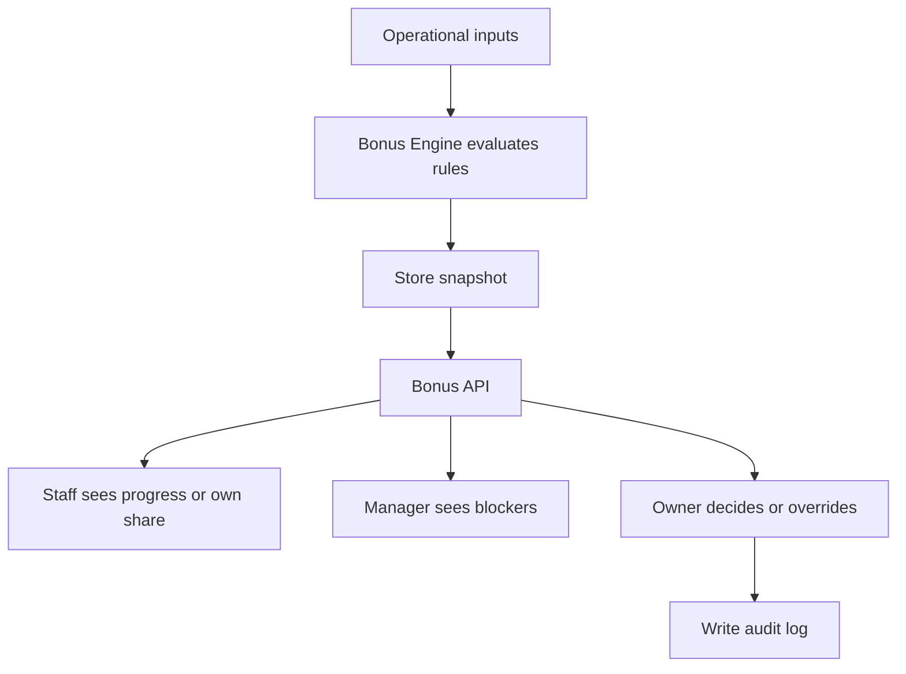

# Bonus API

## Purpose

This document defines the Bonus API for DOYA OS v1.0.

It exposes store level progress, cooperation score, bonus unlock state, bonus rules, blockers, and personal share visibility.

## Problem

Bonus data can create disputes when staff cannot understand eligibility, but DOYA OS v1.0 must not become payroll.

The API must expose operational bonus status and source blockers without exposing compensation systems.

## Solution

Expose bonus status as evaluated operational snapshots.

Rules and overrides are manager or owner concerns. Staff see only store progress and their own visible share percentage when configured.

## User

Primary users:

- Owner.
- Manager.
- Kitchen staff.
- Hall staff.
- Bonus Engine service actor.

## Primary Users

| Role | API use |
| --- | --- |
| Owner | Review unlock state, rules, blockers, and overrides. |
| Manager | Review store progress and blockers. |
| Kitchen | Read store progress and own share when visible. |
| Hall | Read store progress and own share when visible. |

## Required Endpoints

| Method | Endpoint | Purpose |
| --- | --- | --- |
| `GET` | `/bonus/status` | Return store bonus status for a period. |
| `GET` | `/bonus/rules` | Return active bonus rules visible to actor. |
| `GET` | `/bonus/my-share` | Return actor personal share visibility. |
| `GET` | `/bonus/blockers` | Return blockers for owner and manager review. |
| `POST` | `/bonus/rules/{id}/confirm` | Confirm active rule version. |
| `POST` | `/bonus/status/{id}/override` | Record owner override with reason. |

## Request Shape

Status query:

```text
GET /bonus/status?storeId={uuid}&periodStart=2026-06-01&periodEnd=2026-06-30
```

Override request:

```json
{
  "unlockStatus": "unlocked",
  "reason": "Owner approved after manager correction was completed before period close."
}
```

## Response Shape

Status response:

```json
{
  "data": {
    "bonusPeriodId": "e0a57251-1ed1-4b1d-806a-6885cf84c245",
    "storeId": "2d0d19a5-1f0f-4c1f-b890-8f6d54cf8d02",
    "storeLevel": 82.5,
    "cooperationScore": 91.0,
    "unlockStatus": "blocked",
    "blockerCount": 1,
    "generatedAt": "2026-06-28T10:15:30Z"
  }
}
```

My share response:

```json
{
  "data": {
    "visibilityStatus": "visible",
    "sharePercentage": 4.5,
    "bonusPeriodId": "e0a57251-1ed1-4b1d-806a-6885cf84c245"
  }
}
```

## Authorization Rules

- Owner can read and manage bonus status, rules, blockers, and overrides.
- Manager can read assigned store progress and blockers, but cannot perform owner overrides.
- Kitchen and Hall can read only store progress and their own share when visible.
- Staff cannot read other staff personal KPI snapshots.

## Validation Rules

- Period date range must be valid.
- Rule confirmation requires active rule version.
- Override requires Owner role and non-empty reason.
- Share visibility must come from the Bonus Engine snapshot.
- Payroll amounts must not be accepted or returned in v1.0.

## Side Effects

- Rule confirmation writes audit log.
- Status override writes audit log and may create notifications.
- Reads do not recalculate payroll or payout amounts.

## Error Cases

| Code | Meaning |
| --- | --- |
| `bonus_period_not_found` | Requested period does not exist or is not visible. |
| `bonus_rule_conflict` | Active rule version conflict exists. |
| `bonus_override_requires_owner` | Actor lacks owner authority. |
| `bonus_share_not_visible` | Personal share is hidden by rule or status. |
| `bonus_payroll_out_of_scope` | Request attempted payroll behavior excluded from v1.0. |

## Audit Requirements

Audit:

- Bonus rule confirmation.
- Bonus rule activation through Settings.
- Bonus status override.
- Personal share visibility change.
- Owner decision related to bonus unlock.

## Rate Limiting Considerations

- Staff share reads may refresh frequently but should be cached by period.
- Owner rule and override mutations should be low-volume and strictly limited.
- Blocker list uses cursor pagination if source blockers are large.

## Flow



## Architecture

The Bonus API reads evaluated snapshots and routes allowed decisions. It must not calculate payroll or store payout amounts in v1.0.

## Future Extension

- Payroll export.
- Rule simulation.
- Payout approval workflow.
- Multi-store bonus plans.

## Related Documents

- [Bonus Engine](../04_Engines/04_Bonus_Engine.md)
- [Bonus Model](../05_Database/07_Bonus_Model.md)
- [UX Bonus](../03_UX/11_Bonus.md)
- [Audit Log API](./13_Audit_Log_API.md)
