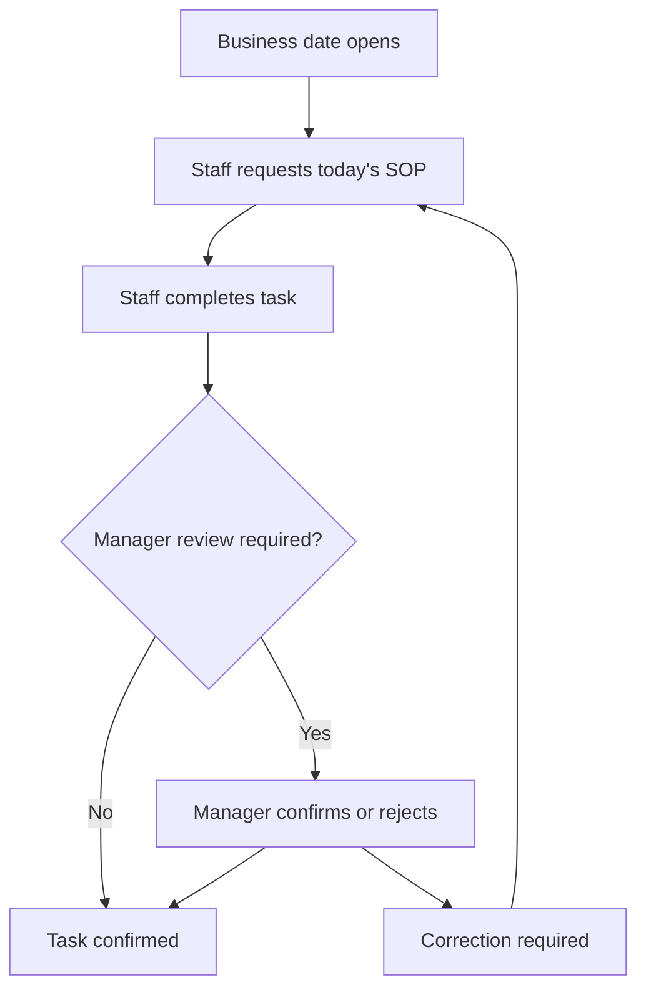

# SOP API

## Purpose

This document defines the SOP API for DOYA OS v1.0.

It supports today's SOP tasks, SOP library reading, task completion, and manager confirmation or rejection.

## Problem

SOPs are not useful if they remain static manuals outside daily execution.

The API must expose only the SOP work each role needs while preserving versioned task truth for audit, bonus, and AI Manager context.

## Solution

Expose SOP definitions and task instances through role-scoped endpoints.

Staff complete assigned tasks. Managers confirm or reject where review is required. Owners and managers may read broader SOP state according to scope.

## User

Primary users:

- Kitchen staff.
- Hall staff.
- Manager.
- Owner.
- SOP Engine service actor.

## Primary Users

| Role | API use |
| --- | --- |
| Kitchen | Read and complete kitchen SOP tasks. |
| Hall | Read and complete hall SOP tasks. |
| Manager | Review, confirm, reject, and monitor assigned store SOPs. |
| Owner | Read organization and store SOP state. |

## Required Endpoints

| Method | Endpoint | Purpose |
| --- | --- | --- |
| `GET` | `/sop-library/today` | Return today's role-scoped SOP task instances. |
| `GET` | `/sop-library/categories` | Return available SOP categories. |
| `GET` | `/sop-library/sops/{id}` | Return SOP definition visible to actor. |
| `POST` | `/sop-library/tasks/{id}/complete` | Mark assigned task submitted or completed. |
| `POST` | `/sop-library/tasks/{id}/confirm` | Manager confirms submitted task. |
| `POST` | `/sop-library/tasks/{id}/reject` | Manager rejects task and requires correction. |

## Request Shape

Today query:

```text
GET /sop-library/today?storeId={uuid}&businessDate=2026-06-28&category=closing
```

Complete task request:

```json
{
  "completedAt": "2026-06-28T13:20:00Z",
  "notes": "Completed before lunch service."
}
```

Reject task request:

```json
{
  "reason": "Checklist item was marked complete before the required photo was submitted.",
  "correctionInstructions": "Complete the missing step and resubmit."
}
```

## Response Shape

Today response:

```json
{
  "data": [
    {
      "taskInstanceId": "8f1b9c9d-e343-4017-88d4-2e41f426f859",
      "sopTaskId": "a65c4e84-eac5-463f-9a64-a47c2ccfd6a3",
      "title": "Record morning ingredient weights",
      "category": "inventory",
      "roleKey": "KITCHEN",
      "status": "assigned",
      "isRequired": true,
      "version": 1
    }
  ]
}
```

Task mutation response:

```json
{
  "data": {
    "taskInstanceId": "8f1b9c9d-e343-4017-88d4-2e41f426f859",
    "status": "submitted",
    "updatedAt": "2026-06-28T13:20:04Z"
  }
}
```

## Authorization Rules

- Owner can read SOP tasks and instances for organization stores.
- Manager can read and review assigned store SOP instances.
- Kitchen can read and complete only kitchen tasks assigned to their store.
- Hall can read and complete only hall tasks assigned to their store.
- Staff cannot confirm or reject their own task unless a documented role grants that permission.

## Validation Rules

- Task ID must reference an active task instance visible to actor.
- Completion must follow SOP Engine state transitions.
- Reject requires manager role and reason.
- Completed required tasks must preserve SOP version.
- Business date close prevents silent mutation.

## Side Effects

- Task completion updates `sop_task_instances`.
- Confirm or reject may affect bonus and dashboard status.
- Reject may create a notification.
- Sensitive review mutations write audit logs.

## Error Cases

| Code | Meaning |
| --- | --- |
| `sop_task_not_assigned` | Actor cannot complete the task. |
| `sop_task_state_conflict` | Requested transition is invalid. |
| `sop_business_date_closed` | Task can no longer be changed through normal staff flow. |
| `sop_rejection_reason_required` | Manager rejection is missing reason. |

## Audit Requirements

Audit:

- SOP task rejection.
- Manager correction.
- Completion after cutoff.
- SOP definition activation or retirement through Settings.

## Rate Limiting Considerations

- Staff task reads and completion endpoints should support normal operational use.
- Manager review mutations should be rate limited by actor and store.
- Today endpoint can be cached briefly by actor, store, business date, and role.

## Flow



## Architecture

The SOP API wraps SOP Engine task instances. Other engines consume SOP completion state but must not bypass the SOP API contract when user actions are involved.

## Future Extension

- SOP authoring endpoints.
- SOP templates by brand.
- Training mode.
- Multi-language SOP content.

## Related Documents

- [SOP Engine](../04_Engines/06_SOP_Engine.md)
- [SOP Model](../05_Database/08_SOP_Model.md)
- [UX Screen Map](../03_UX/02_Screen_Map.md)
- [Bonus API](./09_Bonus_API.md)
