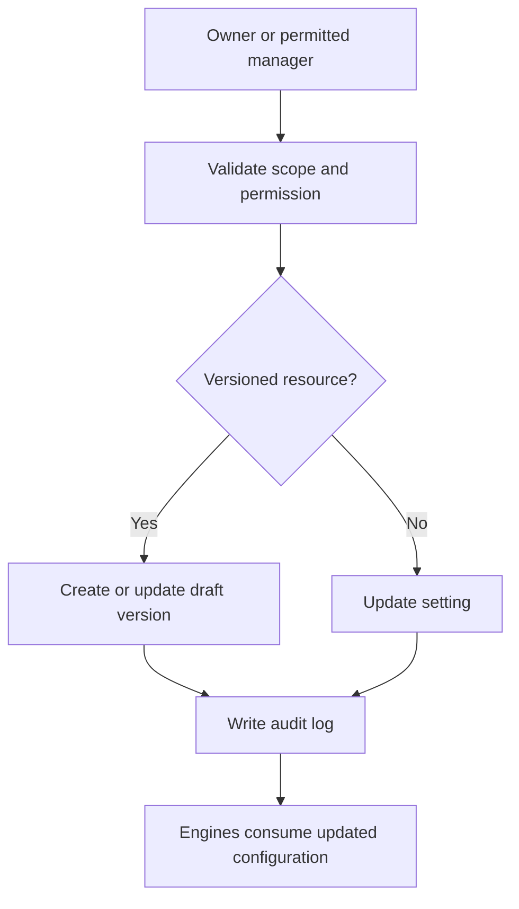

# Settings API

## Purpose

This document defines the Settings API for DOYA OS v1.0.

It supports staff, store, roles, bonus rules, inventory items, and localization settings.

## Problem

Settings mutate the configuration that engines depend on. Poorly controlled settings can break role scope, inventory calculations, bonus evaluation, and staff task visibility.

The API must make configuration explicit, permissioned, and auditable.

## Solution

Expose settings as restricted administrative resources.

Owner has organization-level control. Manager has limited assigned-store configuration access when allowed. Staff do not access Settings in v1.0.

## User

Primary users:

- Owner.
- Manager with limited store administration.
- Trusted service actor for internal validation.

## Primary Users

| Role | API use |
| --- | --- |
| Owner | Manage staff, roles, store settings, bonus rules, inventory items, and localization. |
| Manager | Manage limited assigned store data when permitted. |
| Kitchen and Hall | No Settings access in v1.0. |

## Required Endpoints

| Method | Endpoint | Purpose |
| --- | --- | --- |
| `GET` | `/settings/staff` | List staff visible to actor. |
| `POST` | `/settings/staff` | Create staff record or invite. |
| `PATCH` | `/settings/staff/{id}` | Update staff profile, status, or store assignment. |
| `GET` | `/settings/store` | Return store settings. |
| `PATCH` | `/settings/store` | Update store settings. |
| `GET` | `/settings/roles` | List roles and permissions visible to actor. |
| `PATCH` | `/settings/roles/{id}` | Update role configuration when allowed. |
| `GET` | `/settings/bonus-rules` | List bonus rule versions. |
| `PATCH` | `/settings/bonus-rules/{id}` | Update draft or retire bonus rule. |
| `GET` | `/settings/inventory-items` | List configurable inventory items. |
| `POST` | `/settings/inventory-items` | Create inventory item. |
| `PATCH` | `/settings/inventory-items/{id}` | Update or deactivate inventory item. |
| `PATCH` | `/settings/localization` | Update store localization settings. |

## Request Shape

Create inventory item request:

```json
{
  "storeId": "2d0d19a5-1f0f-4c1f-b890-8f6d54cf8d02",
  "name": "Fresh noodles",
  "category": "ingredient",
  "defaultUnit": "kg",
  "reorderThreshold": 10
}
```

Update staff request:

```json
{
  "displayName": "Kitchen Lead",
  "status": "active",
  "storeIds": [
    "2d0d19a5-1f0f-4c1f-b890-8f6d54cf8d02"
  ],
  "roleKeys": [
    "KITCHEN"
  ]
}
```

## Response Shape

```json
{
  "data": {
    "id": "e7792657-7b3a-4562-93ef-64cc0cd652a6",
    "storeId": "2d0d19a5-1f0f-4c1f-b890-8f6d54cf8d02",
    "name": "Fresh noodles",
    "defaultUnit": "kg",
    "isActive": true,
    "createdAt": "2026-06-28T10:15:30Z",
    "updatedAt": "2026-06-28T10:15:30Z"
  }
}
```

## Authorization Rules

- Owner can manage organization and store settings.
- Manager can access only documented assigned-store settings.
- Manager cannot grant Owner role or change organization-wide permissions.
- Kitchen and Hall cannot access Settings endpoints in v1.0.
- Service actors can validate configuration through trusted backend paths only.

## Validation Rules

- Role changes must not create privilege escalation.
- Store assignments must belong to actor organization.
- Inventory item names must be unique per active store scope.
- Bonus rule edits must preserve versioning rules.
- Localization changes must use supported locale keys.
- Deactivation must not hard-delete referenced operational records.

## Side Effects

- Settings mutations may affect future SOP generation, inventory calculations, bonus evaluation, and notification routing.
- Mutations must write audit logs.
- Some changes may create new configuration versions rather than overwriting active historical records.

## Error Cases

| Code | Meaning |
| --- | --- |
| `settings_permission_denied` | Actor lacks administrative permission. |
| `settings_role_escalation_denied` | Requested role change would escalate privileges. |
| `settings_inventory_item_duplicate` | Active inventory item already exists for store. |
| `settings_bonus_rule_immutable` | Active bonus rule version cannot be edited directly. |
| `settings_referenced_record_cannot_delete` | Record must be deactivated instead of deleted. |

## Audit Requirements

Audit:

- Staff activation, deactivation, role assignment, and store assignment.
- Role and permission changes.
- Store setting changes.
- Bonus rule activation, retirement, and version changes.
- Inventory item creation, edit, or deactivation.
- Localization changes affecting user-facing workflows.

## Rate Limiting Considerations

- Settings writes should be strictly limited by actor and organization.
- Staff listing uses cursor pagination.
- Configuration reads may be cached with short invalidation after writes.

## Flow



## Architecture

The Settings API is a controlled administrative surface. It is not a general write path for operational records.

Configuration that affects historical outcomes must be versioned or auditable.

## Future Extension

- Brand-level settings inheritance.
- Regional manager settings.
- Supplier configuration.
- External integration credentials through a separate secrets system.

## Related Documents

- [RBAC Model](../05_Database/03_RBAC_Model.md)
- [Store Staff Model](../05_Database/04_Store_Staff_Model.md)
- [Inventory Model](../05_Database/06_Inventory_Model.md)
- [Bonus Model](../05_Database/07_Bonus_Model.md)
