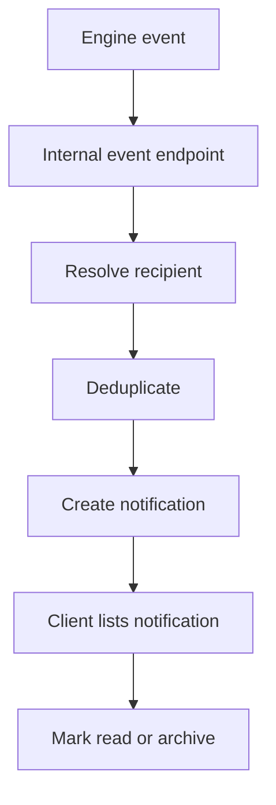

# Notification API

## Purpose

This document defines the Notification API for DOYA OS v1.0.

It supports role-aware in-app notifications, unread counts, read state, archival, and internal event intake.

## Problem

Notifications lose value when they are noisy, duplicated, or disconnected from source records.

The API must route operational alerts without exposing data outside a user's role and store scope.

## Solution

Expose notifications as read and state-transition resources for clients.

Engines emit internal notification events. The Notification Engine resolves recipients, deduplicates, and creates visible notifications.

## User

Primary users:

- Owner.
- Manager.
- Kitchen staff.
- Hall staff.
- Notification Engine service actor.

## Primary Users

| Role | API use |
| --- | --- |
| Owner | Read decision-required notifications across organization scope. |
| Manager | Read and resolve assigned store operational notifications. |
| Kitchen | Read task and correction notifications assigned to kitchen. |
| Hall | Read task and correction notifications assigned to hall. |
| Service | Create notifications from engine events. |

## Required Endpoints

| Method | Endpoint | Purpose |
| --- | --- | --- |
| `GET` | `/notifications` | List notifications visible to actor. |
| `GET` | `/notifications/unread-count` | Return unread count by role and store scope. |
| `POST` | `/notifications/{id}/read` | Mark notification read. |
| `POST` | `/notifications/{id}/archive` | Archive notification. |
| `POST` | `/notifications/events` | Internal event intake for trusted services. |

## Request Shape

List query:

```text
GET /notifications?storeId={uuid}&status=unread&limit=25
```

Internal event request:

```json
{
  "eventType": "closing_fail",
  "storeId": "2d0d19a5-1f0f-4c1f-b890-8f6d54cf8d02",
  "businessDate": "2026-06-28",
  "sourceTable": "closing_photo_submissions",
  "sourceId": "67a18cbe-f9b0-43a2-84e8-402fa1f750c8",
  "severity": "warning",
  "recipientRole": "MANAGER"
}
```

## Response Shape

List response:

```json
{
  "data": [
    {
      "id": "d5be5be8-11e7-4bc5-8190-89f01e992d3d",
      "type": "closing_fail",
      "severity": "warning",
      "title": "Closing review required",
      "body": "Kitchen refrigerator photo requires manager review.",
      "status": "unread",
      "source": {
        "table": "closing_photo_submissions",
        "id": "67a18cbe-f9b0-43a2-84e8-402fa1f750c8"
      },
      "createdAt": "2026-06-28T14:06:00Z"
    }
  ],
  "page": {
    "limit": 25,
    "nextCursor": null,
    "hasMore": false
  }
}
```

## Authorization Rules

- Owner can read all organization notifications.
- Manager can read notifications for assigned stores.
- Kitchen and Hall can read only notifications addressed to themselves or their role in assigned store.
- Only trusted services can call `/notifications/events`.
- Actor must have access to the source record before receiving source metadata.

## Validation Rules

- Notification ID must be visible to actor.
- Archive of unresolved critical notifications may require manager or owner role.
- Internal events must include source table, source ID, severity, store, and event type.
- Deduplication key must be derived from event type, source, recipient, and business date.

## Side Effects

- Read and archive mutate notification state.
- Internal events may create notifications or suppress duplicates.
- Critical escalations may write audit logs.

## Error Cases

| Code | Meaning |
| --- | --- |
| `notification_not_visible` | Actor cannot access notification. |
| `notification_source_not_visible` | Actor cannot access source record. |
| `notification_event_unauthorized` | Client attempted internal event endpoint. |
| `notification_archive_blocked` | Notification requires resolution before archival. |

## Audit Requirements

Audit:

- Critical notification escalation.
- Owner decision notification resolution.
- Manager correction notification resolution.
- Manual archival of unresolved critical notification.

Normal read state changes do not require audit unless tied to sensitive workflow completion.

## Rate Limiting Considerations

- Notification list and unread count may poll frequently and should be cached per actor.
- Internal event endpoint must be rate limited by service identity and dedupe key.
- Escalation processing should be protected from retry storms.

## Flow



## Architecture

Notifications are pointers to operational source records. The Notification API must not become the source of closing, inventory, bonus, or SOP truth.

## Future Extension

- Push notifications.
- Email delivery state.
- Notification preferences.
- Quiet hours.
- Escalation chains.

## Related Documents

- [Notification Engine](../04_Engines/07_Notification_Engine.md)
- [Notification Model](../05_Database/09_Notification_Model.md)
- [Error Model](./03_Error_Model.md)
- [Audit Log API](./13_Audit_Log_API.md)
