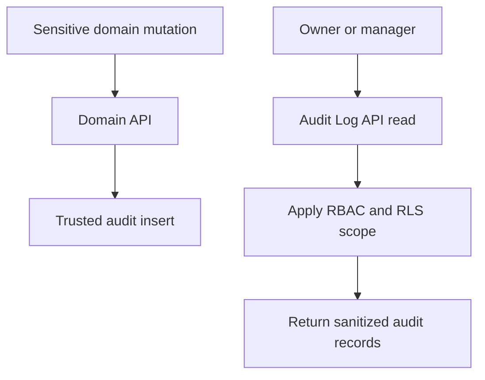

# Audit Log API

## Purpose

This document defines the Audit Log API for DOYA OS v1.0.

It exposes operationally sensitive history to authorized reviewers without allowing clients to mutate audit records.

## Problem

DOYA OS depends on AI inspection, human correction, owner decisions, role changes, and configuration updates.

If audit history is inaccessible, owners cannot understand what happened. If it is editable, the system cannot be trusted.

## Solution

Expose audit logs as read-only resources.

Audit writes happen through trusted backend paths, domain mutations, database triggers, or controlled service-role functions. Client-facing audit endpoints do not create, update, or delete audit logs.

## User

Primary users:

- Owner.
- Manager with assigned store audit visibility.
- Security reviewer.
- Backend and compliance tooling.

## Primary Users

| Role | API use |
| --- | --- |
| Owner | Review organization and store-sensitive actions. |
| Manager | Review assigned store operational audit events. |
| Kitchen and Hall | No direct audit browsing in v1.0. |
| Service | Insert audit logs only through internal trusted paths, not public API. |

## Required Endpoints

| Method | Endpoint | Purpose |
| --- | --- | --- |
| `GET` | `/audit-logs` | List audit logs visible to actor. |
| `GET` | `/audit-logs/{id}` | Return a single audit log visible to actor. |
| `GET` | `/audit-logs/source/{sourceTable}/{sourceId}` | List audit logs for a visible source record. |

## Request Shape

List query:

```text
GET /audit-logs?storeId={uuid}&action=closing.review.reject&limit=25
```

Source query:

```text
GET /audit-logs/source/closing_photo_submissions/67a18cbe-f9b0-43a2-84e8-402fa1f750c8
```

## Response Shape

```json
{
  "data": [
    {
      "id": "74fa76df-4234-4399-8a7e-88f43b2a4088",
      "organizationId": "a3ed3452-bf74-4f3a-b390-9009f50d669f",
      "storeId": "2d0d19a5-1f0f-4c1f-b890-8f6d54cf8d02",
      "actorType": "staff",
      "actorStaffId": "99a3da46-a341-4b96-b85d-6977a513847e",
      "action": "closing.review.reject",
      "sourceTable": "closing_photo_submissions",
      "sourceId": "67a18cbe-f9b0-43a2-84e8-402fa1f750c8",
      "reason": "Visible residue remains on the refrigerator shelf.",
      "createdAt": "2026-06-28T14:08:00Z"
    }
  ],
  "page": {
    "limit": 25,
    "nextCursor": null,
    "hasMore": false
  }
}
```

## Authorization Rules

- Owner can read audit logs in the organization.
- Manager can read assigned store operational audit logs.
- Kitchen and Hall cannot browse audit logs directly.
- Source audit lookup requires visibility into the source record.
- Audit log mutation endpoints are intentionally absent.

## Validation Rules

- `sourceTable` must be one of the documented operational source tables.
- `sourceId` must be a UUID.
- Filters must not widen actor organization or store scope.
- Sensitive before and after state must be sanitized before response.

## Side Effects

Read endpoints do not mutate state.

Audit reads may be included in security observability logs when implemented.

## Error Cases

| Code | Meaning |
| --- | --- |
| `audit_log_not_visible` | Actor cannot access audit record. |
| `audit_source_not_visible` | Actor cannot access source record. |
| `audit_source_table_invalid` | Source table is not audit-queryable. |
| `audit_mutation_not_allowed` | Client attempted unsupported audit mutation. |

## Audit Requirements

Audit log API reads are not audited by default.

Future compliance settings may audit export or bulk access. Normal v1.0 list reads should remain read-only and non-mutating.

## Rate Limiting Considerations

- Audit log list endpoints should be strictly paginated and rate limited.
- Source lookup should limit table names to allowlisted values.
- Future exports must be async jobs, not large synchronous responses.

## Flow



## Architecture

The Audit Log API is a visibility surface over `audit_logs`. It must not allow client writes because audit integrity depends on append-only controlled paths.

## Future Extension

- Audit export jobs.
- Immutable archive storage.
- Compliance retention controls.
- Security event stream.

## Related Documents

- [Audit Log Model](../05_Database/10_Audit_Log_Model.md)
- [Authentication and RBAC](./02_Authentication_And_RBAC.md)
- [Error Model](./03_Error_Model.md)
