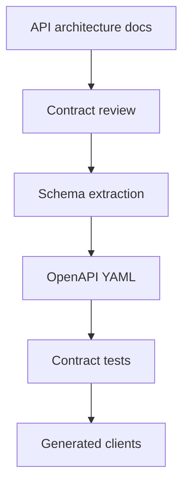

# OpenAPI Roadmap

## Purpose

This document defines how DOYA OS should evolve from architecture documentation to OpenAPI contracts.

It prevents premature YAML generation while preserving a clear path to machine-readable API specifications.

## Problem

Generating OpenAPI YAML before the architecture is stable can freeze weak contracts and hide unresolved product decisions.

At the same time, backend and frontend implementation will eventually need formal schemas, generated clients, and contract tests.

## Solution

Use a staged OpenAPI adoption path.

Architecture Markdown defines intent first. OpenAPI follows when endpoint shape, authorization, validation, and side effects are reviewed.

## User

This document is for backend engineers, frontend engineers, QA engineers, API reviewers, and AI coding agents.

## Flow

## Architecture

### Phase 1: Architecture source of truth

The current `docs/06_API/` Markdown files define:

- Resource intent.
- Endpoint inventory.
- Request and response examples.
- Authorization rules.
- Validation rules.
- Side effects.
- Error cases.
- Audit requirements.
- Rate limiting considerations.

### Phase 2: Schema decisions

Before OpenAPI YAML, the team must decide:

- Naming standard for JSON fields.
- Required and optional fields per response.
- Shared schema names.
- Error enum strategy.
- Async job schema shared across AI workflows.
- Pagination schema shared across list endpoints.

### Phase 3: OpenAPI v1 draft

Create OpenAPI only after Phase 2 decisions are recorded.

The first OpenAPI draft should include:

- Versioned base path.
- Shared authentication scheme.
- Shared error envelope.
- Shared pagination envelope.
- Shared async job schema.
- Domain endpoint schemas.

### Phase 4: Contract tests

Contract tests should verify:

- Required fields.
- Error envelope consistency.
- RBAC denial behavior.
- Cursor pagination shape.
- Async AI job lifecycle states.
- Audit side-effect expectations for mutations.

## Future Extension

Future versions may generate TypeScript clients, API mocks, Postman collections, and documentation previews from OpenAPI.

Generated artifacts should never replace the architecture documents as the reasoning source of truth.

## Related Documents

- [API Principles](./01_API_Principles.md)
- [Error Model](./03_Error_Model.md)
- [Pagination, Filtering, and Sorting](./04_Pagination_Filtering_Sorting.md)
- [Open Questions](./15_Open_Questions.md)
