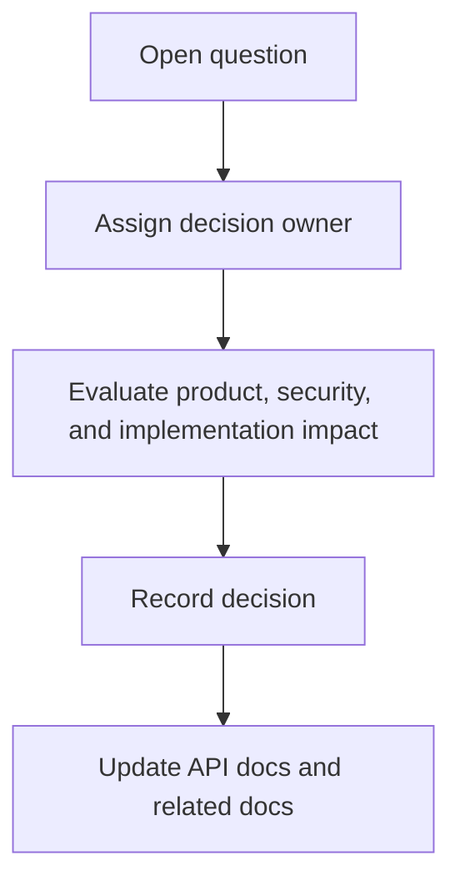

# API Open Questions

## Purpose

This document records open API architecture decisions for DOYA OS v1.0.

It keeps unresolved questions visible without weakening the production contract already defined in this section.

## Problem

Some API details require implementation research, product decisions, or security review.

If those questions are hidden, future contributors may invent incompatible behavior during implementation.

## Solution

Track unresolved decisions as explicit questions with recommended direction and affected documents.

## User

This document is for backend engineers, frontend engineers, product managers, AI engineers, security reviewers, and AI coding agents.

## Flow

## Architecture

### Question 1: API base path and deployment boundary

Recommended direction:

- Use `/api/v1` as the documented public backend contract.
- Keep internal service routes private and undocumented unless another service consumes them.

Affected documents:

- [API Principles](./01_API_Principles.md)

### Question 2: Async job persistence model

Recommended direction:

- Use a shared async job resource for AI Manager and AI Closing.
- Store job status, source record, requested actor, prompt or policy version, result reference, and failure reason.

Affected documents:

- [AI Manager API](./06_AI_Manager_API.md)
- [AI Closing API](./07_AI_Closing_API.md)
- [AI Closing Model](../05_Database/05_AI_Closing_Model.md)

### Question 3: Upload flow for closing photos

Recommended direction:

- Use a controlled pre-signed upload flow before `POST /ai-closing/submissions`.
- The submission endpoint should validate storage ownership and category before inspection starts.

Affected documents:

- [AI Closing API](./07_AI_Closing_API.md)

### Question 4: Idempotency storage

Recommended direction:

- Store idempotency keys for mutation endpoints that can be retried from staff devices.
- Scope keys by actor, organization, method, path, and request hash.

Affected documents:

- [API Principles](./01_API_Principles.md)
- [Inventory API](./08_Inventory_API.md)
- [AI Closing API](./07_AI_Closing_API.md)

### Question 5: Audit write mechanism

Recommended direction:

- Use trusted backend paths for initial implementation.
- Consider database triggers for high-risk tables after schema stabilizes.

Affected documents:

- [Audit Log API](./13_Audit_Log_API.md)
- [Audit Log Model](../05_Database/10_Audit_Log_Model.md)

### Question 6: Field naming convention

Recommended direction:

- Use camelCase in JSON responses and requests.
- Keep database names in snake_case.
- Document mapping in OpenAPI when generated.

Affected documents:

- [OpenAPI Roadmap](./14_OpenAPI_Roadmap.md)

### Question 7: Manager access to audit logs

Recommended direction:

- Managers can read assigned store operational audit logs, excluding owner-only decisions and organization-level security events.
- Owner has full organization audit visibility.

Affected documents:

- [Audit Log API](./13_Audit_Log_API.md)
- [Supabase RLS Policies](../05_Database/12_Supabase_RLS_Policies.md)

### Question 8: Rate limit policy values

Recommended direction:

- Document numeric limits after real usage assumptions are validated.
- Keep architecture-level rate limiting guidance in current docs until implementation planning.

Affected documents:

- All domain API documents.

## Future Extension

Resolved questions should move into the relevant source-of-truth document. Major tradeoffs should be recorded in `docs/decisions/`.

## Related Documents

- [API Architecture](./README.md)
- [Documentation Style Guide](../STYLE_GUIDE.md)
- [Database Open Questions](../05_Database/13_Open_Questions.md)
- [OpenAPI Roadmap](./14_OpenAPI_Roadmap.md)
