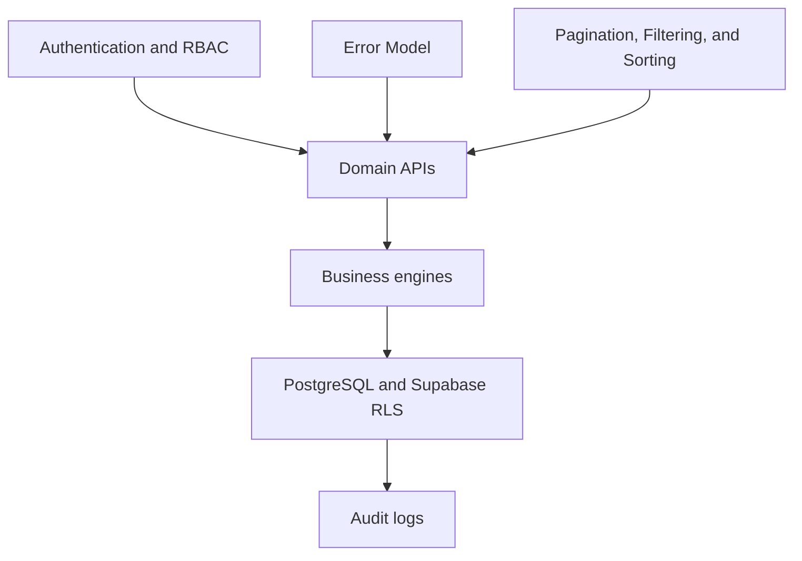

# DOYA OS API Architecture

## Purpose

This section defines the DOYA OS v1.0 API architecture.

It is the source of truth for REST resources, request and response contracts, authorization behavior, validation rules, operational side effects, audit requirements, and API evolution. It does not define application code, SQL migrations, or OpenAPI YAML.

## Problem

DOYA OS connects staff execution, AI inspection, manager correction, and owner decisions. If API contracts are designed screen by screen, the platform will duplicate rules, leak data across roles, and make AI workflows hard to audit.

The API must preserve tenant boundaries, store scope, business dates, role permissions, async AI state, and auditability from the first implementation.

## Solution

The v1.0 API uses a REST-first JSON architecture.

Core conventions:

- JSON request and response bodies.
- UUID identifiers for all persisted resources.
- ISO 8601 timestamps for all date-time values.
- Cursor-based pagination for lists.
- A consistent error envelope.
- RBAC enforcement at the API layer.
- Supabase Row Level Security enforcement at the database layer.
- Audit logs for every operational mutation.
- Async status resources for AI-related workflows.

## User

This documentation is for backend engineers, frontend engineers, database engineers, AI engineers, product managers, security reviewers, and AI coding agents.

## Flow

Read this section in order:

1. [API Principles](./01_API_Principles.md)
2. [Authentication and RBAC](./02_Authentication_And_RBAC.md)
3. [Error Model](./03_Error_Model.md)
4. [Pagination, Filtering, and Sorting](./04_Pagination_Filtering_Sorting.md)
5. [Dashboard API](./05_Dashboard_API.md)
6. [AI Manager API](./06_AI_Manager_API.md)
7. [AI Closing API](./07_AI_Closing_API.md)
8. [Inventory API](./08_Inventory_API.md)
9. [Bonus API](./09_Bonus_API.md)
10. [SOP API](./10_SOP_API.md)
11. [Settings API](./11_Settings_API.md)
12. [Notification API](./12_Notification_API.md)
13. [Audit Log API](./13_Audit_Log_API.md)
14. [OpenAPI Roadmap](./14_OpenAPI_Roadmap.md)
15. [Open Questions](./15_Open_Questions.md)

The API layer is a contract between role-aware UX, business engines, and the database system of record.

## Architecture

The API is organized by product domain:

| Domain | Responsibility |
| --- | --- |
| Dashboard | Role-scoped operating summary. |
| AI Manager | Daily reports, alerts, recommendations, and evidence. |
| AI Closing | Closing tasks, submissions, AI inspection, review, and history. |
| Inventory | Items, stock signals, burn rate, waste, and reorder risk. |
| Bonus | Store level, cooperation score, unlock state, rules, and share visibility. |
| SOP | Today's tasks, SOP library, task completion, and manager review. |
| Settings | Staff, store, roles, bonus rules, inventory items, and localization. |
| Notification | In-app notifications, read state, archival, and internal event intake. |
| Audit Log | Read-only operational traceability for authorized roles. |

Every endpoint must resolve authenticated actor, organization, store scope, role, permission, business date, and audit requirements before performing domain work.

## Future Extension

Future API documentation may add OpenAPI YAML, webhooks, external integrations, POS ingestion, supplier ordering, payroll export, accounting export, and delivery platform integrations.

Those domains are outside v1.0 unless a later decision record changes scope.

## Related Documents

- [Documentation Style Guide](../STYLE_GUIDE.md)
- [Vision Bible](../00_Vision/README.md)
- [UX Architecture Bible](../03_UX/README.md)
- [Engine Architecture](../04_Engines/README.md)
- [Database Architecture](../05_Database/README.md)
