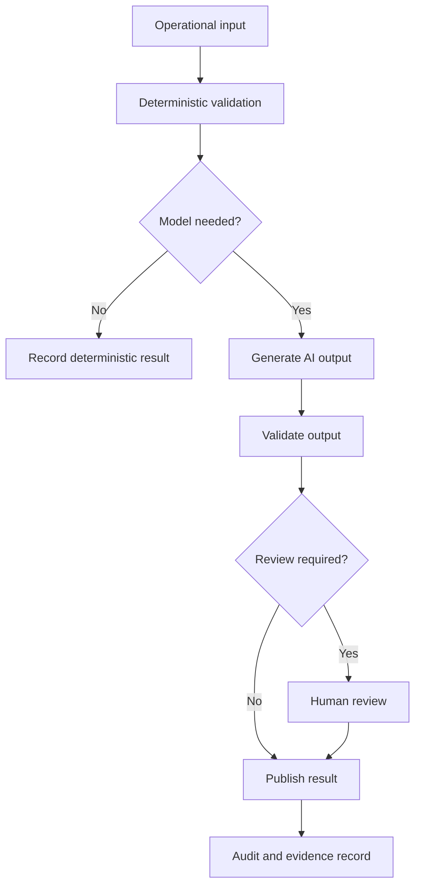

# AI Principles

## Purpose

This document defines the global AI principles for DOYA OS v1.0.

It tells contributors when AI may assist, when it must defer, and what evidence must be preserved.

## Problem

AI systems can produce confident output from incomplete evidence. In restaurant operations, that can unfairly blame staff, hide uncertainty, or create decisions that owners and managers cannot audit.

DOYA OS needs AI rules that are stricter than a generic assistant because the product affects daily work, correction, bonus eligibility, and owner decisions.

## Solution

AI in DOYA OS follows these principles:

- AI assists; humans make final operational decisions.
- AI outputs are signals, recommendations, or explanations, not hidden authority.
- Vision inspection returns `PASS`, `FAIL`, or `HUMAN_REVIEW`.
- Uncertain, low-quality, missing, conflicting, or high-impact cases route to human review.
- Irreversible operational decisions require human approval and audit.
- Lightweight deterministic checks happen before expensive model calls.
- Every AI output must be explainable, source-linked, versioned, and auditable.
- AI must never bypass RBAC, RLS, business-date scope, or store scope.

## User

This document is for AI engineers, backend engineers, API engineers, product managers, security reviewers, operators, and AI coding agents.

## Inputs

- Operational records from SOP, AI Closing, Inventory, Bonus, Notification, and Audit systems.
- Evidence files such as closing photos.
- Tenant, store, role, permission, and business-date context.
- Rule Engine decisions.
- Prompt and model version metadata.
- Human review outcomes.

## Outputs

- AI inspection results.
- Risk explanations.
- Alerts and recommendations.
- Review routing decisions.
- Evidence bundles.
- Evaluation records.
- Audit-worthy AI metadata.

## Model Strategy

Use the lowest-cost model capable of the task:

- Deterministic validation for schema, scope, file metadata, duplicate detection, and rule checks.
- Lightweight image preprocessing for quality and tamper signals.
- Vision-capable models for visual inspection only after preprocessing passes.
- Text models for summarization and recommendation synthesis only after source records are available.
- Stronger models for ambiguous, high-impact, or owner-facing summaries.

## Prompt Strategy

Prompts are architecture-controlled but not implemented in v1.0 documentation.

Prompt requirements:

- Include role, store, business date, task category, and allowed output schema.
- Require evidence references and uncertainty explanation.
- Forbid direct operational mutation.
- Require `HUMAN_REVIEW` when evidence is insufficient.
- Avoid persuasive or disciplinary language.

## Validation Strategy

Validate AI output before publication:

- Output matches allowed schema.
- Source references exist and are visible to the actor.
- Result state is allowed for the workflow.
- Confidence and reason fields are present where required.
- Recommendation action is permitted for the target role.
- No hidden chain-of-thought, secrets, or unrelated tenant data is exposed.

## Failure Modes

- Missing or stale context.
- Low-quality image evidence.
- Model timeout.
- Invalid structured output.
- Inconsistent result compared with deterministic rules.
- Prompt version mismatch.
- Evidence reference not visible under RLS.
- Cost limit exceeded.

## Human Review Rules

Human review is required when:

- Confidence falls below module threshold.
- Evidence quality is insufficient.
- The result affects correction, bonus, owner decision, or staff accountability.
- AI and deterministic checks disagree.
- The model output cannot cite source records.
- A user disputes or corrects the result.

## Cost Control Rules

- Do not call a vision or LLM model before deterministic validation.
- Cache reusable source summaries by store and business date.
- Batch owner-facing report generation where safe.
- Rate limit repeated AI jobs by store, business date, and actor.
- Record model cost metadata for later evaluation.

## Safety Rules

- AI must not make payroll, disciplinary, legal, pricing, supplier, or irreversible financial decisions.
- AI must not expose manager notes to staff unless a documented workflow allows it.
- AI must not invent source records.
- AI must not silently overwrite human review.
- AI must preserve tenant, store, role, and RLS boundaries.

## Database/API Dependencies

- `closing_photo_submissions`
- `vision_reviews`
- `inventory_predictions`
- `bonus_pool_snapshots`
- `personal_kpi_snapshots`
- `notifications`
- `audit_logs`
- `GET /ai-closing/inspection-jobs/{jobId}`
- `POST /ai-manager/daily-report/generate`
- `GET /ai-manager/jobs/{jobId}`

## Flow

## Architecture

AI modules sit between engines and review workflows. They do not replace engines, RLS, audit logs, or human authority.

## Future Extension

Future principles may add formal model governance, provider failover, tenant-specific AI policy, and cross-store model evaluation.

## Related Documents

- [Vision Bible](../00_Vision/README.md)
- [Core Principles](../00_Vision/04_Core_Principles.md)
- [AI Architecture](./README.md)
- [Human Review](./08_Human_Review.md)
- [Evaluation and Testing](./11_Evaluation_And_Testing.md)
